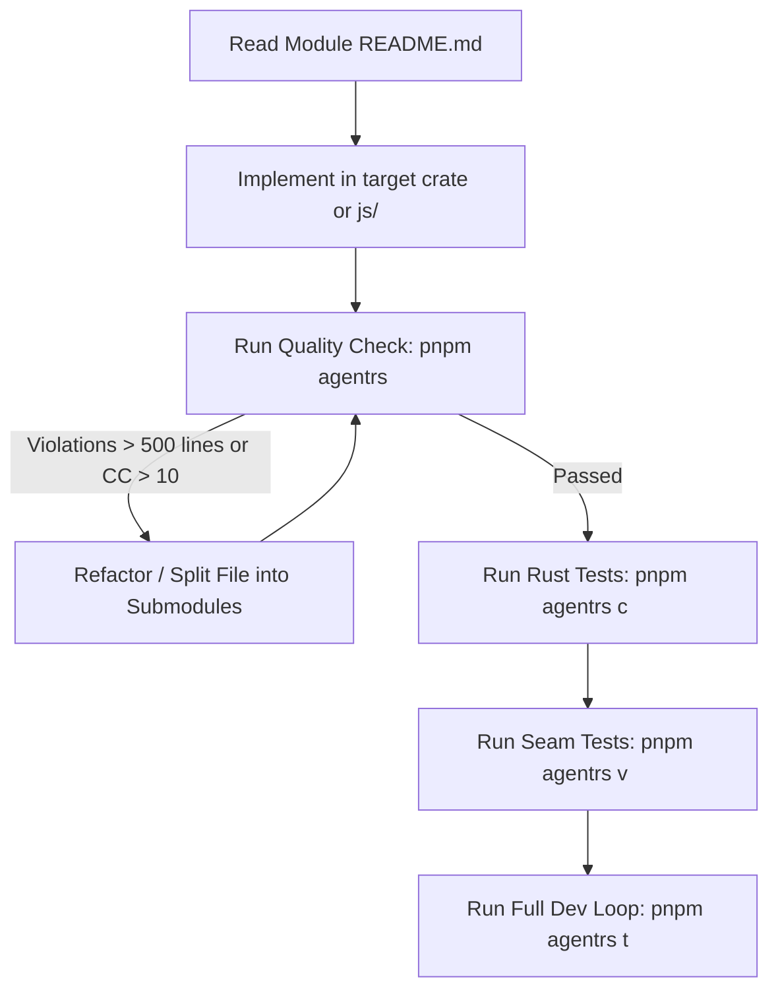

# Reference RS Agent Skill (`agent-rs`)

Dedicated high-level workflow, dev loop, and verification runner for **`packages/reference-rs`** (`@reference-ui/rust`).

---

## 0. Architecture: Working in `reference-rs`

`packages/reference-rs` combines pure Rust domain crates with high-performance Node-API (N-API) bindings and ergonomic TypeScript/JavaScript runtime wrappers.

```
packages/reference-rs/
├── Cargo.toml            # Rust workspace manifest
├── crates/               # Pure Rust domain crates (no Node dependencies)
│   ├── napi/             # N-API bridge crate (#[napi] bindings only)
│   └── <domain>/         # Focused domain crates
├── js/                   # TypeScript runtime wrappers & public API
├── tests/                # Seam Vitest suite (fixtures, contracts, wrappers)
└── native/               # Compiled .node binary artifacts
```

### Layer Responsibilities
1. **Domain Crates (`crates/*`)**: Pure Rust implementations of data structures, algorithms, and core domain logic. Zero Node or V8 dependencies.
2. **N-API Bridge (`crates/napi`)**: Thin, safe boundary using `napi-rs` to expose domain crates to JavaScript.
3. **TypeScript Runtime (`js/`)**: High-level developer-facing APIs, ergonomics, and type exports wrapping the `.node` addon.
4. **Scope Discipline**: When assigned to work on a specific crate or module, **do not touch out-of-scope crates**. Many legacy crates exist with different historical standards; keep changes tightly focused on your target scope.

---

## 1. Seam Testing Philosophy: Seams vs Internals

We test at two complementary levels:

| Layer | Runner | Command | Purpose |
| --- | --- | --- | --- |
| **Seam & Wrapper Tests** | Vitest | `pnpm agentrs v [pattern]` | Validates how Rust code survives packaging through N-API and public JS/TS wrappers. Fast end-to-end interface validation. |
| **Domain Unit Tests** | Cargo | `pnpm agentrs c [crate]` | Tests internal domain logic, data structures, and edge cases directly in pure Rust. |
| **Full Dev Loop** | Full Pipeline | `pnpm agentrs t` | Complete verification (build → cargo → vitest → quality) in under 5 seconds. |

---

## 2. Code Quality & Comment Policy (MANDATORY)

> [!IMPORTANT]
> **ZERO TOLERANCE FOR CODE VIOLATIONS — NOT AN OPTIONAL FLAG.**
> 1 Code violations cause immediate test/quality failure (exit code 1).
> After EVERY generation or modification step, run:
> ```bash
> pnpm agentrs q <path-to-modified-file>
> # or path shorthand:
> pnpm agentrs <path-to-modified-file>
> ```

### Guardrails & Limits

| Metric | Target | Soft Warning | Hard Failure | Action on Failure |
| :--- | :--- | :--- | :--- | :--- |
| **File Line Length** | $\le 250$ | **$> 365$ lines** | **$> 500$ lines** | *"Can you split this up, please?"* Modularize into cohesive submodules. |
| **Function Cyclomatic Complexity (McCabe)** | $\le 5$ | **$> 10$** | **$> 15$** | Refactor complex conditional branches into focused helper functions. |
| **Function Cognitive Complexity** | $\le 8$ | **$> 15$** | **$> 20$** | Flatten nested scopes, reduce deep match/if nesting. |
| **Function Length** | $\le 40$ lines | **$> 80$ lines** | **$> 120$ lines** | Break large functions into smaller steps. |
| **Top-of-File Commentary** | Required | — | **Missing** | Add short, precise docstring at the top of the file. |
| **Comment Verbosity** | Terse | **$> 15$ lines** | — | Eliminate filthy long comments; keep explanations terse. |
| **README Directory Antipattern** | Prohibited | — | **Directory list** | Remove filename tables from README; describe module architecture. |
| **Clippy Lints** | Clean | Warning | Error | Clippy strict rules configured in `clippy.toml`. |

### Comment & Documentation Standards

1. **Top-of-File Commentary (Mandatory)**:
   Every file must start with a short, precise comment string at the top describing what the file is and its role:
   - Rust: `//! <short precise description of file>`
   - TypeScript/JS: `/** <short precise description of file> */`
2. **No Filthy Long Comments**:
   We do not like long narrative essays or paragraphs in comments. Comments must be very terse and concise, strictly explaining non-obvious *why*, never obvious *what*.
3. **Module-level README.md Rules**:
   - The module-level `README.md` must describe what the overall module/crate is trying to achieve (architecture, responsibilities, mental model, boundaries).
   - **`README.md` must NEVER contain a directory list of filenames with short explanations.** Those explanations belong in the respective file at the top!

---

## 3. Overnight Concurrency & Load Balancer

During overnight processing, multiple autonomous agents work on `packages/reference-rs` concurrently. To prevent CPU starvation, port collisions, and corrupted `.node` binary builds, `agent-rs` coordinates via the shared **CPU Gate** (`/tmp/reference-ui-cpu-gate`):

- **`rs` queue class**: Allows up to 2 parallel test executions (`cargo test` / `vitest`). Extra runs wait in queue with live terminal telemetry (`[cpu-gate] Waiting for cpu gate (rs)...`).
- **`rs:build` queue class**: Exclusive lock for compiling the native N-API addon (`ensure-native`). Only 1 agent builds the native binary at a time, eliminating binary clobbering.
- **Matrix coordination**: Pauses `rs` tests when an `exclusive` matrix or Dagger pipeline runs, and vice-versa.
- **Darwin QoS Jailbreak**: Automatically jailbreaks Darwin background QoS (`PRI 31`) to unthrottled User Interactive Application priority (`PRI 46`) via `taskpolicy -a`.

---

## 4. CLI Usage Reference (`pnpm agentrs`)

The runner is mapped to `pnpm agentrs` (with shortcuts `pnpm agent:rs` and `pnpm rs`). All commands support ergonomic single-letter aliases.

```bash
# 1. Environment health, toolchain, and CPU gate locks:
pnpm agentrs s                                               # alias: status

# 2. Fast Seam Testing (Vitest against N-API and TS wrappers):
pnpm agentrs v                                               # alias: vt, vitest (runs all)
pnpm agentrs v tests/system/cases/smoke.test.ts              # target single test file
pnpm agentrs v -t "contract"                                 # filter by test describe/it pattern
pnpm agentrs v --watch                                       # watch mode

# 3. Fast Rust Testing (cargo test):
pnpm agentrs c                                               # alias: cargo, ct (runs workspace)
pnpm agentrs c system                                        # auto-detects crate (-p system)
pnpm agentrs c <crate> -t "<pattern>"                        # crate + test filter

# 4. Code Quality & Comment Check (MANDATORY after every generation):
pnpm agentrs q                                               # smart check (changed files or target)
pnpm agentrs q <file-or-dir>                                 # target specific file or directory
pnpm agentrs <path-to-file>                                  # path shorthand runs quality automatically
pnpm agentrs q --all                                         # inspect entire workspace
pnpm agentrs q --clippy                                      # include clippy JSON diagnostics

# 5. Build Native Addon:
pnpm agentrs b                                               # alias: build, ensure-native (exclusive lock)

# 6. Format Code:
pnpm agentrs f                                               # alias: fmt (cargo fmt + prettier)

# 7. Full Dev Loop (Native Build -> Cargo Test -> Vitest -> Quality Check):
pnpm agentrs t                                               # alias: test, all
pnpm agentrs                                                 # bare command runs full dev loop
```

---

## 5. Development Loop for Agents



1. **Keep files small**: Files must stay under 500 lines (warning at 365 lines: *"Can you split this up, please?"*).
2. **Keep functions simple**: Cyclomatic complexity $\le 10$, cognitive complexity $\le 15$, lines $\le 80$.
3. **Write top-of-file commentary**: Always place a short, precise description at the top of every file.
4. **Keep comments terse**: Explain *why*, not *what*.
5. **Verify both seams and internals**: Pure Rust tests (`pnpm agentrs c`) for domain logic, Vitest (`pnpm agentrs v`) for N-API seams and wrappers.
