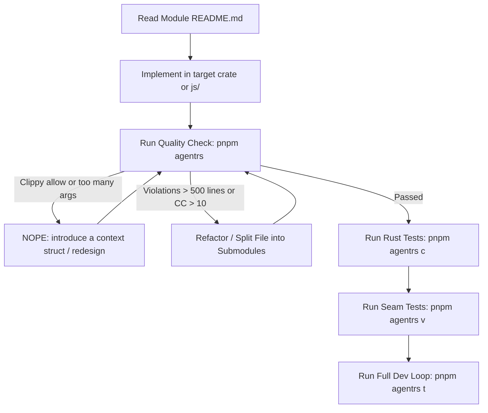

# Reference RS Agent Skill (`agent-rs`)

Dedicated high-level workflow, dev loop, and verification runner for **`packages/reference-rs`** (`@reference-ui/rust`).

---

## 0. Architecture: Working in `reference-rs`

`packages/reference-rs` combines pure Rust domain crates with high-performance Node-API (N-API) bindings and ergonomic TypeScript/JavaScript runtime wrappers.

```
packages/reference-rs/
├── Cargo.toml            # Rust workspace manifest
├── native/               # N-API bridge crate (#[napi] bindings only cdylib)
├── runtime/              # JS shared loader, native client, packaging tools
├── shared/               # Shared oxc helpers crate
└── modules/              # Product modules only
    ├── atomic/           # Atomic CSS compiler (was system; Rust crate + JS compile() + tests)
    ├── canon/            # Platform + dialect dictionary (@webref join)
    ├── base-system/      # Design-system definition (fragment spec)
    ├── typegen/          # Token unions / StyleProps .d.ts
    ├── tasty/            # Tasty module (Rust crate + JS API + tests)
    ├── atlas/            # Atlas module (Rust crate + JS API + tests)
    ├── styletrace/       # Styletrace module (Rust crate + JS API + tests)
    └── virtualrs/        # Virtual transforms crate & tests
```

### Layer & Module Responsibilities
1. **Modules (`modules/atomic/`, `modules/canon/`, `modules/base-system/`, `modules/typegen/`, `modules/tasty/`, `modules/atlas/`, `modules/styletrace/`, `modules/virtualrs/`)**: Products live under `modules/`. Each module is a self-contained product containing its pure Rust crate, JS/TS API wrappers, tests, and documentation.
2. **N-API Switchboard (`native/`)**: The sole `cdylib` native addon exposing module capabilities to Node.js via `napi-rs`.
3. **Runtime & Tools (`runtime/`)**: Addon loader, platform detection, packaging, and binary artifact distribution scripts.
4. **Scope Discipline**: When assigned to work on a specific module, keep changes focused on your target scope.

---

## 1. Testing Philosophy: Per-Module Harnesses

Do **not** hunt for one harness. Each module has different testing needs:

| Module | What a test is | Harness & Outputs | Command |
| --- | --- | --- | --- |
| **atomic** | `compile()` contract | **spec + committed snapshot**; do **not** rewrite every run. Golden updates via CLI `--update-goldens`. | `pnpm agentrs v atomic` |
| **canon** | dictionary membership & fail-closed join | Cargo unit tests on generated tables + Vitest join stations. Generator join is `pnpm canon`. | `pnpm agentrs c canon` / `pnpm agentrs v canon` |
| **base-system** | definition artefact | Cargo unit tests. Stub until `compile()` takes a base system. | `pnpm agentrs c base_system` |
| **typegen** | `.d.ts` unions | Cargo printer tests + Vitest `tsc --noEmit` consumers. Goldens: `TYPEGEN_UPDATE_GOLDENS=1 pnpm agentrs c typegen`. | `pnpm agentrs c typegen` / `v typegen` |
| **tasty** | scan types, emit modules, assert API | **spec + committed goldens** (`manifest.js`, `chunks.json`). Runtime emit goes to `.scratch/`. | `pnpm agentrs v tasty` |
| **atlas** | analyze an app, named assertions | **spec + committed** `analysis.json` / `diagnostics.json`; standing schema gauges. | `pnpm agentrs v atlas` |
| **virtualrs** | rewrite source | **spec + committed** `output/expected.tsx`. | `pnpm agentrs v virtualrs` |
| **styletrace** | wrapper graph / StyleProps names | Fixture in, names out. `VirtualWorkspace` for node_modules cases. | `pnpm agentrs v styletrace` |
| **native / runtime** | loader, exports exist | Smoke only. | `pnpm agentrs v runtime` |
| **Rust Domain Units** | Cargo unit tests | Pure Rust tests for algorithms and data structures. | `pnpm agentrs c [module]` |
| **Full Dev Loop** | Native Build -> Cargo -> Vitest -> Quality | Complete verification in under 5 seconds. | `pnpm agentrs t` |

---

## 2. Code Quality & Comment Policy (MANDATORY)

> [!IMPORTANT]
> **ZERO TOLERANCE FOR CODE VIOLATIONS — NOT AN OPTIONAL FLAG.**
> 1 Code violations cause immediate test/quality failure (exit code 1).
> After EVERY generation or modification step, run:
> ```bash
> pnpm agentrs q <path-to-modified-file>
> # or path shorthand:
> pnpm agentrs <path-to-modified-file>
> ```

### Stance

This is a compiler, not a toy. Write it the way Holzmann’s *Power of 10* wanted flight software written: small enough to analyze, honest about failure, zero silenced diagnostics. The tables below are the checks. This is the taste.

Four habits, not ten new commandments:

1. **Simple enough to analyze.** One pass, one node family, one idea. Early returns. Named match arms. If a human cannot hold the function in their head, it is too big.
2. **Failure is explicit.** `Result` and diagnostics, never `unwrap` in domain code. Tests sit next to the pass. Panicking is not a control-flow strategy.
3. **State is a type.** Shared walk/pass data lives on a context struct at the smallest honest scope. Eight arguments and a clone-party are the same smell as pointer soup.
4. **The analyzer is the reviewer.** Clippy and `pnpm agentrs q` are not optional style. If the tool is angry, rewrite. Holzmann’s last rule was zero warnings — including the ones you were sure were wrong.

Do not add extra ritual. Do not invent house rules on top of this. If the gate is quiet and the IR is honest, you are done.

### Guardrails & Limits

| Metric | Target | Soft Warning | Hard Failure | Action on Failure |
| :--- | :--- | :--- | :--- | :--- |
| **File Line Length** | $\le 250$ | **$> 365$ lines** | **$> 500$ lines** | *"Can you split this up, please?"* Modularize into cohesive submodules. |
| **Function Cyclomatic Complexity (McCabe)** | $\le 5$ | **$> 10$** | **$> 15$** | Refactor complex conditional branches into focused helper functions. |
| **Function Cognitive Complexity** | $\le 8$ | **$> 15$** | **$> 20$** | Flatten nested scopes, reduce deep match/if nesting. |
| **Function Length** | $\le 40$ lines | **$> 80$ lines** | **$> 120$ lines** | Break large functions into smaller steps. |
| **Function Arguments** | $\le 4$ | **$> 4$** | **$> 5$** | *"NOPE."* Introduce a context/session struct. **Never** `#[allow(clippy::too_many_arguments)]`. |
| **Top-of-File Commentary** | 2–6 sentences | 1 sentence | **Missing** / **essay ($> 20$ lines)** | Describe what the file does, takes, and emits. Not a one-liner, not an essay. |
| **Comment Verbosity** | Terse (inline) | **$> 15$ lines** (inline) | — | Inline comments stay terse. Headers are allowed to be a short paragraph. |
| **README Directory Antipattern** | Prohibited | — | **Directory list** | Remove filename tables from README; describe module architecture. |
| **Clippy Lints** | Clean | — | **`#[allow]`/`#[expect]`** | **BANNED.** Fix the architecture. See Clippy policy below. |

### Comment & Documentation Standards

1. **Top-of-File Commentary (Mandatory & Substantive)**:
   Every file starts with a real module description — typically **2–6 sentences**. Not a one-liner label, not an essay.
   - Rust: consecutive `//!` lines at the top of the file
   - TypeScript/JS: a `/** ... */` block at the top of the file
   - Say what the file **is**, what it **takes**, what it **emits**, and the non-obvious invariant or boundary.
   - A tiny type file can be 2 sentences. A walker, resolver, or lowering pass can be 4–6.
   - **No lazy stubs**: Do NOT write a 3–5 word placeholder (`//! Rhythm r units. See README.md.`). Write complete sentences.
   - Do **not** narrate every function. That belongs in the code.
2. **Inline comments stay terse**:
   Inside functions we still do not want filthy long comments. Explain non-obvious *why*, never obvious *what*. The file header is the one place a short paragraph is expected.
3. **Module-level README.md Rules**:
   - The module-level `README.md` must describe what the overall module/crate is trying to achieve (architecture, responsibilities, mental model, boundaries).
   - **`README.md` must NEVER contain a directory list of filenames with short explanations.** Those explanations belong in the respective file at the top!

### Architecture Over Cheating: Never Silence, Architect Properly

> [!CAUTION]
> **DO NOT CHEAT. NO COMPILER OR LINT SUPPRESSIONS.**
> `#[allow(clippy::…)]`, `#[expect(clippy::…)]`, and `#![allow(clippy::…)]` are **strictly banned** and fail the quality gate immediately.
> Do NOT attempt syntactic workarounds to bypass limits (such as packing 6+ loose arguments into ad-hoc tuples `(a, b, c, d, e, f)` or mechanical helper splits with the same parameter soup).
> **Architect properly**: When functions need multiple pieces of pass state, introduce a well-documented context/session data structure (e.g. `ExpressionWalk`, `ObjectWalk`, `ExtractContext`).

When quality or Clippy fires, **redesign**. Do not add an allow. Copying the same parameter list into every helper is not a design.

| Lint | What it actually means | Do this |
| :--- | :--- | :--- |
| **`too_many_arguments`** | The type is missing. Those args are one pass/walk session. | Introduce a context/session struct. Keep the current AST node as the function argument; put `prop` / `origin` / `important` / `wants` / `diagnostics` / `file` on the struct. |
| **`too_many_lines`** | The function is several steps wearing one name. | Split into helpers named after real compiler steps (a node family, a pass, a lowering). Not `foo_part2`. |
| **`cognitive_complexity`** | Nesting and match arms are doing too much in one scope. | Flatten with early returns. Extract match arms into helpers named after the node family. |
| **`type_complexity`** | An unnamed nested generic is a type. | Name it: a struct or a type alias. |
| **`large_enum_variant`** | One variant is blowing the enum size. | `Box` the fat variant. |
| **`result_large_err`** | The error payload is huge on every `Result`. | Shrink it (`Box`, a smaller error enum, or a shared error type). |
| **`large_stack_arrays`** | A giant array does not belong on the stack. | `Vec` or `Box<[T]>`. |
| **`redundant_clone` / `clone_on_copy`** | Ownership is sloppy. | Borrow, or stop cloning `Copy` values. |
| **`needless_pass_by_value`** | The callee does not need ownership. | Take `&T`. |
| **`unwrap_used` / `expect_used`** | Domain code is panicking. | Return `Result`/`Option`. Do not unwrap in library code. |
| **Anything else** | Clippy is pointing at a real issue. | Apply the Clippy suggestion. Still no `#[allow]`. |

Repeating the same 6+ arguments across `walk_*` helpers after a complexity split is still `too_many_arguments`. That is when you add the struct.

---

## 3. Overnight Concurrency & Load Balancer

During overnight processing, multiple autonomous agents work on `packages/reference-rs` concurrently. To prevent CPU starvation, port collisions, and corrupted `.node` binary builds, `agent-rs` coordinates via the shared **CPU Gate** (`/tmp/reference-ui-cpu-gate`):

- **`rs` queue class**: Allows up to 2 parallel test executions (`cargo test` / `vitest`). Extra runs wait in queue with live terminal telemetry (`[cpu-gate] Waiting for cpu gate (rs)...`).
- **`rs:build` queue class**: Exclusive lock for compiling the native N-API addon (`ensure-native`). Only 1 agent builds the native binary at a time, eliminating binary clobbering.
- **Matrix coordination**: Pauses `rs` tests when an `exclusive` matrix or Dagger pipeline runs, and vice-versa.
- **Darwin QoS Jailbreak**: Automatically jailbreaks Darwin background QoS (`PRI 31`) to unthrottled User Interactive Application priority (`PRI 46`) via `taskpolicy -a`.

---

## 4. CLI Usage Reference (`pnpm agentrs`)

The runner is mapped to `pnpm agentrs` (with shortcuts `pnpm agent:rs` and `pnpm rs`). All commands support ergonomic single-letter aliases.

```bash
# 1. Environment health, toolchain, and CPU gate locks:
pnpm agentrs s                                               # alias: status

# 2. Per-Module Vitest Seam Testing:
pnpm agentrs v                                               # runs all module test suites (isolated projects)
pnpm agentrs v atomic                                        # runs ONLY atomic tests (never runs tasty setup)
pnpm agentrs v tasty                                         # runs ONLY tasty tests
pnpm agentrs v atlas                                         # runs ONLY atlas tests
pnpm agentrs v styletrace                                    # runs ONLY styletrace tests
pnpm agentrs v atomic --update-goldens                       # rewrite committed goldens (atomic, atlas, tasty, virtualrs)
pnpm agentrs v <path-to-test>                                # target specific test file
pnpm agentrs v -t "<pattern>"                                # filter by describe/it pattern
pnpm agentrs v --watch                                       # watch mode

# 3. Fast Rust Testing (cargo test):
pnpm agentrs c                                               # alias: cargo, ct (runs workspace)
pnpm agentrs c atomic                                        # auto-detects crate (-p atomic)
pnpm agentrs c canon                                         # -p canon
pnpm agentrs c tasty                                         # -p tasty
pnpm agentrs c atlas                                         # -p atlas
pnpm agentrs c styletrace                                    # -p styletrace
pnpm agentrs c <crate> -t "<pattern>"                        # crate + test filter

# 4. Code Quality & Comment Check (MANDATORY after every generation):
pnpm agentrs q                                               # smart check (changed files or target)
pnpm agentrs q <file-or-dir>                                 # target specific file or directory
pnpm agentrs <path-to-file>                                  # path shorthand runs quality automatically
pnpm agentrs q --all                                         # inspect entire workspace
pnpm agentrs q --clippy                                      # include clippy JSON diagnostics

# 5. Build Native Addon:
pnpm agentrs b                                               # alias: build, ensure-native (exclusive lock)

# 6. Format Code:
pnpm agentrs f                                               # alias: fmt (cargo fmt + prettier)

# 7. Full Dev Loop (Native Build -> Cargo Test -> Vitest -> Quality Check):
pnpm agentrs t                                               # alias: test, all
pnpm agentrs                                                 # bare command runs full dev loop
```

---

## 5. Development Loop for Agents



1. **Write it like it has to be trusted**: small enough to analyze, explicit failure, pass state on a type, zero silenced lints.
2. **Keep files small**: Files must stay under 500 lines (warning at 365 lines: *"Can you split this up, please?"*).
3. **Keep functions simple**: Cyclomatic complexity $\le 10$, cognitive complexity $\le 15$, lines $\le 80$, arguments $\le 5$.
4. **Never silence Clippy**: No `#[allow(clippy::…)]`. Too many arguments means a context struct, not an allow.
5. **Write a real file header**: 2–6 sentences at the top describing what the file does, takes, and emits. Not a one-liner, not an essay.
6. **Keep inline comments terse**: Explain *why*, not *what*. The header is the paragraph; the body is not.
7. **Verify both seams and internals**: Pure Rust tests (`pnpm agentrs c`) for domain logic, Vitest (`pnpm agentrs v`) for N-API seams and wrappers.

---

## 6. Case index

Full-text index over neo cases + RS module surfaces (names, READMEs,
`specs/*.spec.ts`, hand-authored `keywords.json`, RS suite/case inventory).
Use it to find **module surfaces by feature**
instead of grepping — it also surfaces the neo cases that prove a surface.

```bash
pnpm agent:cases search "<query>" [--limit=N] [--json]  # search surfaces + cases
pnpm agent:cases list [--kind=neo|rs] [--json]          # list indexed docs (auto-rebuilds if stale)
pnpm agent:cases reindex [--json]                       # force rebuild
# direct: node .agents/case-index/cli.mjs search <query> | list [--kind=neo|rs] | reindex
```

Terms are stemmed (`queries` matches `query`) and typo-tolerant
(fuzzy+prefix, with "did you mean" on zero hits); `search` caps at 15
hits unless `--limit=N` raises it. Hand-authored `keywords.json`
enriches the index — schema: `.agents/case-index/SCHEMA.md`.

Example (RS surface hit):

```text
$ pnpm agent:cases search "barrels"
34.031  rs:atlas — Atlas Module [rs:atlas] (matched: barrel)
        packages/reference-rs/modules/atlas
25.581  rs:styletrace — Styletrace [rs:styletrace] (matched: barrel)
        packages/reference-rs/modules/styletrace

2 hit(s) for "barrels"
```
