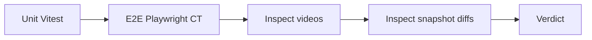

# Component Testing Skill (`test-component`)

Use this skill whenever you need to **verify whether a component passes logic, behavior, and visual/motion requirements**.

`test-component` is a **pure verification skill**. It does not manage feature development or refactoring; higher-level workflows call it as their verification gate.

---

## Where Tests Live

| Kind | Location | Runner |
| --- | --- | --- |
| Unit | Colocated next to source: `src/components/<Component>/*.test.ts(x)` | Vitest |
| Component E2E | `src/components/<Component>/__e2e__/<Component>.ct.spec.ts` | Playwright CT |
| Stories (CT fixtures) | `src/components/<Component>/<Component>.story.tsx` | Mounted by CT |
| Visual snapshots | `src/components/<Component>/__e2e__/__snapshots__/*.png` | Playwright `toHaveScreenshot` |

Unit tests sit beside the code they cover. `__e2e__` is separate because those files are Playwright component tests against a real browser, not Vitest files.

Matrix contract tests in `matrix/*/tests/e2e` are a different layer (cross-bundler/runtime). Do not put component CT there.

---

## What To Write Where

**Vitest (unit)** is for logic and functionality that does not need a browser:

- Pure functions, state machines, math, parsing, formatting, token merge
- SSR markup contracts (`renderToString`)
- Pointer/capability helpers, queue ordering, ID generation

Do **not** emulate the DOM in Vitest when you do not need to. Do not write JSDOM click/hover/focus theater for overlays, focus traps, or presence. If the assertion needs a real layout, pointer, keyboard, animation, or screenshot, it belongs in `__e2e__`.

**Playwright CT (`__e2e__`)** is where most "real" component tests live:

- Open/close, hover, Escape, outside click, focus return
- Presence enter/exit, anchoring, safe polygon travel
- Visual snapshots at settled states (resting / open / dismissed)
- Video of the interaction for motion review

---

## The Verification Loop



Always run **unit first**, then e2e, then inspect artifacts. From the repository root:

```bash
# Full loop for one component (unit → e2e + videos + snapshots):
pnpm ct Popover

# Unit only
pnpm ct Popover --unit

# E2E only
pnpm ct Popover --e2e

# Name filter (applied to both layers)
pnpm ct Popover -g "escape"
```

Never pass `--update-snapshots` during this loop. Snapshot writes are a separate, human-gated step (see below).

The runner unthrottles Darwin QoS (`PRI 46`), runs colocated Vitest under `packages/reference-lib`, then Playwright CT against `packages/reference-lib/playwright/playwright.config.ts`. There is **no need** for `pnpm dev:lib` on port 5000 — CT serves its own gallery on `http://localhost:3101`.

Human pairing: `pnpm playbook` opens the Playwright UI.

---

## Artifact Inspection (mandatory)

The runner prints absolute paths after e2e:

```text
✔ [PASSED] popover opens on trigger click and closes on outside click (845ms)
  🎥 Video:      /path/to/.../video.webm
  📸 Screenshot: /path/to/.../test-finished-1.png

✖ [FAILED] tooltip opens on hover ...
  🖼  Snapshot mismatch:
     expected: /path/to/.../expected.png
     actual:   /path/to/.../actual.png
     diff:     /path/to/.../diff.png
```

### Videos (`.webm`)

Call `view_file` on each `video.webm`. Check:

1. **Presence & exit** — overlay enters with its animation; on dismiss it finishes the exit before unmount (no snap/flicker).
2. **Anchoring** — position vs trigger, arrow alignment, no jitter on flip.
3. **Focus** — `:focus-visible` rings visible; focus returns to the trigger.
4. **Pointer travel** — hover overlays stay open across the safe area.
5. **Layout** — no unexpected shifts or scroll jumps.

### Visual snapshots (drift)

Snapshots are **settled-state** comparisons (`snap(page, 'open')`, stored as `open.png`). Animations are disabled for the comparison so the check is about layout/paint drift, not motion (motion is the video).

On mismatch: `view_file` the **diff**, then **actual**, then **expected**. Treat a failed snapshot as a **regression until the human says otherwise**. Fix the component. Do **not** update the baseline.

---

## Updating snapshots (human-gated)

Only update snapshots if they are genuinely updating styling, and it always has human verification.

`--update-snapshots` is forbidden unless all of the following are true:

1. The change is **genuine styling** — tokens, spacing, color, typography, chrome, or intended layout. Not a logic fix, flake, timeout, animation timing, font raster, or harness tweak.
2. You have shown the human **expected**, **actual**, and **diff** in chat (embed the images).
3. You have **stopped** and asked: *“This looks like an intentional styling update. Update the snapshot baselines?”*
4. The human has replied with an **explicit yes**. Silence, “looks fine”, or a later commit request is not approval.

Until that yes: do not run `--update-snapshots`, do not pass `--confirm`, do not copy pngs into `__snapshots__` by hand.

After an explicit yes:

```bash
pnpm ct <Component> --e2e --update-snapshots --confirm
```

`--confirm` is the machine record that the human already approved. The runner refuses `--update-snapshots` without it.

Then show the new baselines in chat and wait if the human wants a second look.

---

## Structured Verdict

Return:

1. **Unit** — passed/failed, what logic was covered.
2. **E2E** — total / passed / failed.
3. **Artifact paths** — videos, screenshots, snapshot expected/actual/diff.
4. **Motion notes** — timestamped observations from the video.
5. **Drift notes** — if snapshots failed, what changed (spacing, color, missing arrow, etc.).
6. **Handoff** — `pnpm playbook` for interactive debugging.

Do not update snapshot baselines as part of the verdict. That is a separate human-gated step.

---

## Authoring

### 1. Unit (`src/components/<Component>/*.test.ts`)

```ts
import { describe, expect, it } from 'vitest'
import { isHoverCapablePointer } from './hover'

describe('hover pointer capability', () => {
  it('treats mouse as hover-capable and touch as not', () => {
    expect(isHoverCapablePointer({ pointerType: 'mouse' })).toBe(true)
    expect(isHoverCapablePointer({ pointerType: 'touch' })).toBe(false)
  })
})
```

### 2. Story (`src/components/<Component>/<Component>.story.tsx`)

```tsx
import * as React from 'react'
import { Div, Button } from '@reference-ui/react'
import { ReferenceLibrary } from '../ReferenceLibrary'
import { Popover } from './index'

export const ClickToOpen = () => (
  <ReferenceLibrary>
    <Div p="4r" colorMode="dark">
      <Popover>
        <Popover.Trigger variant="primary">Open popover</Popover.Trigger>
        <Popover.Content placement="bottom-start" offset={8}>
          Popover title
        </Popover.Content>
      </Popover>
    </Div>
  </ReferenceLibrary>
)
```

### 3. E2E spec (`src/components/<Component>/__e2e__/<Component>.ct.spec.ts`)

Import `test`, `expect`, and `snap` from the CT fixture. Mount stories as `components/<Component>/<Component>/<StoryExportName>`. Snapshot settled frames; let the video cover motion.

```ts
import { test, expect, snap } from '../../../../playwright/ct'

test('popover opens on trigger click', async ({ mount, page }) => {
  const component = await mount('components/Popover/Popover/ClickToOpen')
  const trigger = component.getByRole('button', { name: 'Open popover' })
  const content = page.getByText('Popover title')

  await snap(page, 'resting')
  await trigger.click()
  await expect(content).toBeVisible()
  await page.waitForTimeout(300)
  await snap(page, 'open')

  await page.keyboard.press('Escape')
  await expect(content).not.toBeVisible()
})
```

---

## Developer Interactive UI (`playbook`)

```bash
pnpm playbook
```

Native Playwright UI with live story rendering, locators, and time-travel.
