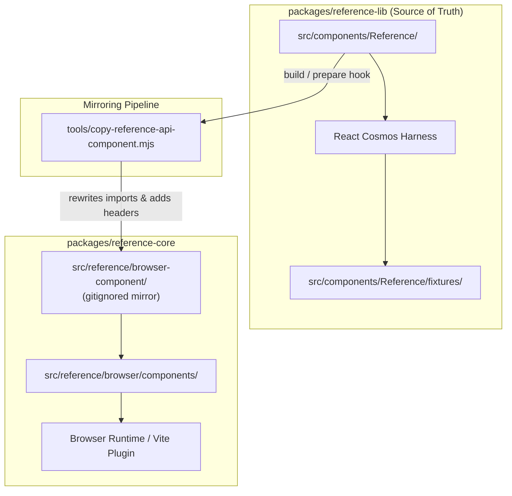

# Reference Component Architecture

This document describes how the `<Reference />` component is built, tested, and shared across packages in the Reference UI monorepo.

---

## 1. Overview & Purpose

The `<Reference />` component provides a rich, interactive documentation UI for TypeScript symbols (interfaces, type aliases, functions, etc.). It visualizes member tables, type signatures, JSDoc annotations, descriptions, and nested property definitions.

```tsx
import { Reference } from '@reference-ui/lib'

// Renders the live API documentation for ButtonProps
<Reference name="ButtonProps" />
```

---

## 2. Monorepo Distribution & Mirroring Pattern



### Why is `reference-lib` the Source of Truth?

1. **Interactive Component Harness**:
   `reference-lib` is equipped with a complete [React Cosmos](https://reactcosmos.org/) environment configured with Vite (`cosmos.config.json`).
   - Placing the component in `reference-lib` allows developers to build, test, and style `<Reference />` against mock fixtures (`src/components/Reference/fixtures/`) with live HMR and theme toggles (dark/light mode).
   - This isolates visual development from the complex multi-threaded worker pipeline of `reference-core`.

2. **Design System Integration**:
   `<Reference />` is styled using `@reference-ui/react` design tokens and primitives (`Div`, `Span`, `Button`, `Table`, etc.).

---

## 3. The Mirroring Script (`copy-reference-api-component.mjs`)

Because `@reference-ui/core` needs to bundle and serve the Reference UI component into client applications without circular runtime dependencies on `reference-lib`, the component tree is mirrored at build time into `reference-core`.

- **Source**: `packages/reference-lib/src/components/Reference`
- **Target**: `packages/reference-core/src/reference/browser-component` (gitignored in repo)
- **Script**: `packages/reference-core/tools/copy-reference-api-component.mjs`

### What the script does:
1. **Recursively copies** all files from `reference-lib/src/components/Reference` to `reference-core/src/reference/browser-component`.
2. **Rewrites imports**: Transforms `from '@reference-ui/types'` into relative imports pointing to `packages/reference-core/src/reference/browser/component-api.ts`.
3. **Appends header**: Injects `// @ts-nocheck` and a notice indicating that the file is an automated mirror and edits should be made in `reference-lib`.
4. **Lifecycle Hooks**: Triggered automatically via `prepare` (after `pnpm install`) and `prebuild` in `packages/reference-core/package.json`.

---

## 4. Component Structure

Inside `packages/reference-lib/src/components/Reference`:

| Path | Description |
| --- | --- |
| `Reference.tsx` | Main top-level entry point; wraps `ReferenceView` in a `ReferenceRuntimeProvider`. |
| `ReferenceView.tsx` | Subscribes to symbol metadata via `useSymbol(name)`, manages loading and error states. |
| `ReferenceStatus.tsx` | Renders loading spinners, error alerts, or "symbol not found" notices. |
| `components/ReferenceDocumentView.tsx` | Main container layout for a resolved symbol document. |
| `components/ReferenceMemberList.tsx` | Renders members tables, properties, and parameters. |
| `components/ReferenceMemberRow.tsx` | Individual table row for a member (name, type, tags, description). |
| `components/MemberName.tsx` | Renders property/method names with optional/required indicators. |
| `components/MemberType.tsx` | Displays formatted syntax-highlighted type representations. |
| `components/MemberDescription.tsx` | Renders parsed JSDoc descriptions and Markdown summaries. |
| `document/` | Dedicated symbol formatters (`ReferenceInterface.tsx`, `ReferenceTypeAlias.tsx`, etc.). |
| `fixtures/` | React Cosmos fixtures (`Overview.fixture.tsx`, `ReferencePrototype.fixture.tsx`, etc.). |
| `theme/` | Token and style configurations. |

---

## 5. Development Workflow

- **Editing UI / Components**: Always edit files under `packages/reference-lib/src/components/Reference/`.
- **Testing in Cosmos**: Run `pnpm run cosmos` inside `packages/reference-lib` to view and interact with fixtures in the browser.
- **Syncing to Core**: Run `pnpm --filter @reference-ui/core run prebuild` (or `node packages/reference-core/tools/copy-reference-api-component.mjs`) to update the mirror in `reference-core`.
