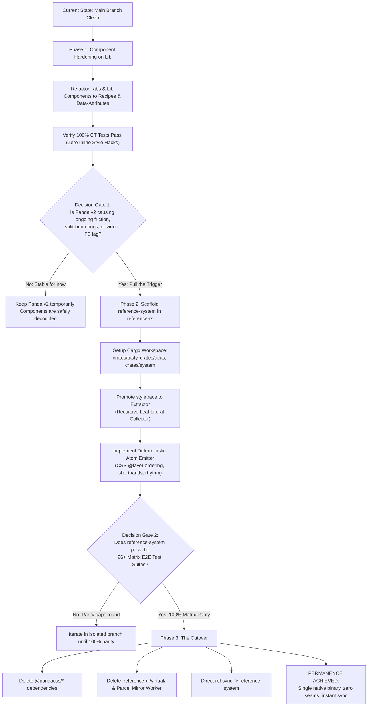

# Reference System: The Native Style Engine

> **The Mandate:** Complete vertical integration and architectural permanence.  
> **The Principle:** *"Be conservative in what you send, be liberal in what you accept"* (Postel's Law). If Reference UI offers style props, we support them with 100% robustness—including nested ternaries, composite shorthands, and sub-pixel rhythm units. No silent CSS dropouts. No external framework churn.

---

## Table of Contents

1. [Executive Summary & The Case for Permanence](#1-executive-summary--the-case-for-permanence)
2. [Panda v2 Deep Dive: What We Adopt vs. What We Throw Away](#2-panda-v2-deep-dive-what-we-adopt-vs-what-we-throw-away)
3. [The Core Architecture of `reference-system`](#3-the-core-architecture-of-reference-system)
4. [Eliminating the Virtual Filesystem Seam](#4-eliminating-the-virtual-filesystem-seam)
5. [The Matrix Safety Net: 26+ Suites of Ground Truth](#5-the-matrix-safety-net-26-suites-of-ground-truth)
6. [The Visual Decision Tree](#6-the-visual-decision-tree)
7. [Phased Implementation Roadmap](#7-phased-implementation-roadmap)
8. [Turnkey Implementation Prompt](#8-turnkey-implementation-prompt)

---

## 1. Executive Summary & The Case for Permanence

Reference UI was founded on enterprise stability, type safety, and zero-runtime friction.

For styling, we initially relied on external engines (Chakra UI, then Panda CSS). However, the history of this external lineage has been characterized by perpetual breaking churn across three generations:
- **Chakra v1 → Chakra v2:** Complete rewrite of theme contracts and style prop lifecycles.
- **Chakra v2 → Chakra v3:** Complete rewrite of components, dropping style props in favor of snippets and un-opinionated primitives.
- **Panda v1 → Panda v2:** Rewrite from Babel AST to native Rust, introducing a **split-brain architecture** where native Rust extraction and TypeScript runtime transforms fall out of sync, silently dropping styles for dynamic ternaries and composite shorthands.

### The Core Concept: Permanence
Enterprises do not rebuild their design systems every 18 months because an external open-source tool decided to reinvent its paradigm or chase social-media frontend trends.
- **Reference UI owns its parser (`reference-rs` / Tasty).**
- **Reference UI owns its component layer (`reference-lib`).**
- **Reference UI owns its design tokens (`atlas` / `tokens`).**

The remaining foreign body in the architecture is **Panda CSS** and the fragile **Virtual Filesystem Seam** (`.reference-ui/virtual/`) required to bridge it.

This document defines the blueprint for **`reference-system`**: a lean (~4,000–5,000 LOC), rock-solid atomic styling engine integrated directly into `packages/reference-rs`.

---

## 2. Panda v2 Deep Dive: What We Adopt vs. What We Throw Away

We have Panda v2 cloned directly in `vendor/panda`. Across its 12 Rust crates, there are **61,399 lines of Rust source code** and **68,003 lines of tests** (129,402 LOC total).

We do not have to reinvent the wheel from scratch. We can study what Panda built, adopt its best ideas, and ruthlessly eliminate its bloat and architectural flaws.

### A. Crate-by-Crate Assessment

| Panda Crate | Source LOC | Value to Reference UI | Verdict & Architectural Decision |
| :--- | :--- | :--- | :--- |
| **`pandacss_encoder`** | 665 | **HIGH** | **Adopt Core Idea:** The `Atom` struct `(prop, value, conditions, important, hash)` is an excellent, compact data model for atomic declarations. |
| **`pandacss_stylesheet`**| 8,990 | **HIGH** | **Adopt Core Idea:** The 5-layer cascade model (`@layer reset, base, tokens, recipes, utilities`), specificity sorting, and grouping rules by media/container queries. |
| **`pandacss_tokens`** | 2,749 | **MEDIUM** | **Adopt Concept:** Token dictionary categorization and CSS variable generation (`var(--colors-*)`). We will unify this directly with `atlas`. |
| **`pandacss_recipes`** | 461 | **HIGH** | **Adopt Core Idea:** `cva()` / `sva()` (slot recipes) with `base`, `variants`, `compoundVariants`, and `defaultVariants`. |
| **`pandacss_utility`** | 1,626 | **MEDIUM** | **Refactor:** Useful mapping of shorthands to longhands, but its separation from executable transforms caused the runtime split-brain. |
| **`pandacss_extractor`**| 11,650 | **LOW (Flawed)** | **Throw Away:** Full of loose heuristics in `literal.rs` and `style_tree.rs`. Replace with a clean **Recursive Leaf Literal Collector** built on our existing `styletrace` engine. |
| **`pandacss_codegen`** | 12,773 | **ZERO** | **Throw Away:** 80% of this crate is code generation for Vue SFC, Svelte 5, Solid JSX, Astro frontmatter, and Preact. Reference UI is exclusively enterprise React. |
| **`pandacss_project`** | 16,347 | **ZERO** | **Throw Away:** Contains in-place source file rewriting, watch graph caches, and cross-file tracking. Unnecessary with in-memory OXC AST traversal. |
| **`pandacss_config`** | 2,733 | **LOW** | **Throw Away:** Overly complex JSON schema validation for general-purpose users. Reference UI has its own strictly typed config in `reference-core`. |
| **`pandacss_shared`** | 1,949 | **MEDIUM** | **Extract:** Small string helpers (CSS escaping, hyphenation, fast hashing). |
| **`pandacss_fs`** | 805 | **ZERO** | **Throw Away:** Generic glob scanning. We already use `globwalk` and `fast-glob`. |
| **`pandacss_tracing`** | 651 | **LOW** | **Throw Away:** Basic wrapper around tracing spans. |

### B. What Panda Did Well (Keep)
1. **The `Atom` Concept:** Flattening every style declaration into `(property, value, condition_chain, important)` with a precomputed 64-bit `fx_hash` for instantaneous `FxHashSet` deduplication.
2. **Layered Cascade Ordering:** Structuring emitted CSS into `@layer reset, base, tokens, recipes, utilities` ensures that utilities always cleanly override recipes and base resets regardless of selector specificity.
3. **Condition Chains:** Representing responsive breakpoints (`sm`, `md`) and pseudo-states (`_hover`, `_focusVisible`) as ordered condition paths that nest neatly into `@media` or CSS pseudo-selectors.

### C. Where Panda Failed (Why We Must Do Better)
1. **The Fatal Split-Brain:** The Rust compiler in `pandacss_extractor` runs natively without access to JavaScript callbacks. Meanwhile, custom shorthand transforms were implemented in TypeScript (`createShorthandUtility`). At runtime, the browser executed a dumb string concatenator (`styled/css/css.js`) that generated `bd-b_3px_solid`, while the stylesheet compiler emitted `.bd-b-w_3px` and `.bd-b-s_solid`. **Classes rendered with zero matching CSS rules.**
2. **Heuristic AST Constant-Folding:** Panda attempted partial constant evaluation in Rust (`literal.rs:687`). When encountering runtime variables (`isLine`, `isSelected`), it converted `undefined` into `Literal::Null` and wrapped branches into unflattened `Conditional` variants, dropping valid styles.
3. **Multi-Framework Bloat:** Over 30,000 LOC are devoted to supporting Svelte runes, Vue templates, Solid signals, and Astro frontmatter. Reference UI builds enterprise web components on React. That bloat adds drag and instability.

---

## 3. The Core Architecture of `reference-system`

Instead of 61,000 LOC across 12 crates, `reference-system` will be a single, focused **~4,000–5,000 LOC crate** living inside a Cargo workspace in `packages/reference-rs`.

### A. The Modular Cargo Workspace

```
packages/reference-rs/
├── Cargo.toml (Workspace Root)
├── crates/
│   ├── tasty/       --> Pure TypeScript semantic graph, AST lowering (docs, MCP)
│   ├── atlas/       --> Design tokens, OKLCH color models, rhythm math
│   └── system/      --> The native style engine (styletrace + extractor + emitter)
└── native/          --> Unified N-API binary export (@reference-ui/rust)
```

### B. Component 1: In-Memory OXC Extractor (`extractor.rs`)
`reference-system` builds directly on our existing **`styletrace`** module (`packages/reference-rs/src/styletrace`), which already uses OXC to identify style-bearing JSX tags and trace prop forwarding down component boundaries.

**The Recursive Leaf Literal Collector:**
Instead of trying to evaluate runtime JavaScript logic, `reference-system` applies **Postel's Law**: extract every literal that could *ever* be requested at runtime:

```rust
pub fn collect_leaf_literals<'a>(expr: &'a Expression<'a>, out: &mut Vec<&'a str>) {
    match expr {
        Expression::StringLiteral(s) => out.push(s.value.as_str()),
        Expression::NumericLiteral(n) => out.push(...),
        Expression::ConditionalExpression(c) => {
            // Unconditionally extract both branches — regardless of nesting!
            collect_leaf_literals(&c.consequent, out);
            collect_leaf_literals(&c.alternate, out);
        }
        Expression::LogicalExpression(l) => {
            collect_leaf_literals(&l.right, out);
        }
        // undefined, null, or booleans are elisions — safely ignored
        _ => {}
    }
}
```
If a developer authors:
```tsx
borderBottom={isLine && horizontal ? isSelected ? '3px solid' : '3px solid transparent' : undefined}
```
The extractor immediately collects `'3px solid'` and `'3px solid transparent'`. Both rules are generated into `styles.css`. Whichever branch runs in React, the CSS rule is guaranteed to exist.

### C. Component 2: Token & Rhythm Resolver (`resolver.rs`)
- **Native Rhythm Units (`r`):** The rhythm multiplier (`r` -> `px` or `var(--spacing-root)`) is evaluated directly in Rust, eliminating the Panda v1 rhythm hole where `100r` was silently discarded.
- **Shorthand Decomposition:** Properties like `borderBottom: '3px solid'` or `border: '1px solid red'` are decomposed into width, style, and color longhands deterministically in Rust.
- **Atlas Tokens:** Resolves `ui.focus.ring` -> `var(--colors-ui-focus-ring)`.

### D. Component 3: Atomic Stylesheet Emitter (`emitter.rs`)
- Emits atomic rules into strict cascade layers:
  ```css
  @layer reset, base, tokens, recipes, utilities;
  ```
- Unconditional utility classes (`.bd-b-w_3px`) emit first, followed by pseudo-classes (`:hover`, `:focus-visible`), then grouped media queries (`@media`), and container queries (`@container`).
- Deterministic class naming: e.g. `bd-b_3px_solid` or short hashes (`_1a2b3c`).

### E. Component 4: Unified Runtime Bridge (Zero Split-Brain)
The exact same atom-formatting function:
```rust
pub fn format_atom(property: &str, value: &str) -> (String, String) // (className, cssRule)
```
is compiled via N-API and shared directly with the JavaScript runtime (`@reference-ui/styled/css`). 
When React calls `css({ borderBottom: '3px solid' })` at runtime, it calls the exact same logic that emitted the stylesheet. **A runtime class can never desynchronize from build-time CSS.**

---

## 4. Eliminating the Virtual Filesystem Seam

The **Reference ↔ Panda virtual filesystem seam** (`.reference-ui/virtual/`) is the single most complex and fragile subsystem in `reference-core` today.

### Current Pipeline (With Panda):
```
User Source Code (.tsx)
   │
   ▼
Parcel Watcher (@parcel/watcher)
   │
   ▼
Piscina Worker Thread Pool (Virtual Mirror)
   │
   ▼
Disk Write: .reference-ui/virtual/**/*.tsx (Rewritten by virtualrs)
   │
   ▼
Liquid Template Engine: Renders .reference-ui/panda.config.ts
   │
   ▼
Panda CLI / Worker: Scans .reference-ui/virtual on disk
   │
   ▼
Disk Write: .reference-ui/styled/*
   │
   ▼
Packager: Bundles and symlinks into node_modules/@reference-ui/*
```

### Future Pipeline (With `reference-system`):
```
User Source Code (.tsx)
   │
   ▼
In-Memory OXC AST Traversal (styletrace + extractor in Rust)
   │
   ▼
Direct Emission: .reference-ui/styled/styles.css
```

### What Gets Permanently Deleted:
1. `@parcel/watcher` dependency.
2. `Piscina` worker pools for virtual mirroring.
3. `panda.liquid` and generated `panda.config.ts`.
4. The entire `.reference-ui/virtual/` directory on disk.
5. Watcher race conditions and A/B file state desynchronizations during git branch switches.

Sync cold-start time drops from **3–5 seconds** down to **< 150 milliseconds**.

---

## 5. The Matrix Safety Net: 26+ Suites of Ground Truth

We have already codified the contracts of the entire design system under `matrix/`. Any PR or implementation of `reference-system` must pass this exact test suite:

| Matrix Package | Test Spec | What It Proves (Must Never Regress) |
| :--- | :--- | :--- |
| **`matrix/css`** | `tests/e2e/css-contract.spec.ts` | Atomic class generation, specificity, CSS class concatenation. |
| **`matrix/css-selectors`** | `tests/e2e/css-selectors-contract.spec.ts` | Complex pseudo-classes (`_hover`, `_focusVisible`), sibling and child selectors. |
| **`matrix/primitives`** | `tests/e2e/primitives-contract.spec.ts` | `<Box>`, `<Flex>`, `<Grid>`, style prop forwarding down component boundaries. |
| **`matrix/recipe`** | `tests/e2e/system-contract.spec.ts` | `cva()`, `sva()`, compound variants, high-level variant props on `styled()`. |
| **`matrix/spacing`** | `tests/e2e/system-contract.spec.ts` | Sub-pixel rhythm multiplier (`r` -> `px`), padding, margins, dimension shorthands. |
| **`matrix/responsive`** | `tests/e2e/system-contract.spec.ts`<br>`tests/e2e/viewport-contract.spec.ts` | Responsive container queries (`@container`), media queries, breakpoint arrays. |
| **`matrix/color-mode`** | `tests/e2e/system-contract.spec.ts` | Light/dark switching, semantic token resolution (`_dark`, `_light`). |
| **`matrix/tokens`** | `tests/e2e/system-contract.spec.ts` | OKLCH color space resolution, CSS variable generation (`--colors-*`). |
| **`matrix/system`** | `tests/e2e/system-contract.spec.ts`<br>`tests/e2e/system-font-contract.spec.ts` | Layer mounting (`@layer reset, base, tokens, recipes, utilities`), `globalCss`, `keyframes`. |
| **`matrix/chain/T1–T13`**| `tests/e2e/T1..T13-contract.spec.ts` | Multi-tier design system inheritance (`extends`), token overrides, layer isolation. |
| **`matrix/watch`** | `tests/e2e/watch-contract.spec.ts` | HMR and live atomic stylesheet regeneration during active editing. |

**Unit Test Baseline:**
- `packages/reference-core`: 656 passing unit tests.
- `packages/reference-lib`: 189 passing unit tests.
- `packages/reference-rs`: 144 Rust unit tests + generative proptests + Criterion benchmarks.

---

## 6. The Visual Decision Tree



---

## 7. Phased Implementation Roadmap

### Phase 1: Clean Component Contracts (Immediate)
- Refactor `Tabs.tsx` and any internal library components away from unreadable runtime JSX ternaries to **Recipes (`cva`)** and DOM data attributes.
- Ensure all 117 Component Tests (CT) pass cleanly with zero inline `style={{ ... }}` hacks.
- This insulates `@reference-ui/lib` from Panda bugs immediately.

### Phase 2: Engine Scaffolding in `packages/reference-rs` (Isolated Branch)
- Restructure `packages/reference-rs` into a Cargo workspace with `crates/system`.
- Port `styletrace` into the core extraction pipeline.
- Implement the recursive leaf literal collector.
- Implement the token and rhythm resolver.
- Implement the atomic stylesheet emitter with `@layer` sorting.

### Phase 3: Matrix Validation & Pipeline Integration
- Wire `reference-core` sync events directly to `reference-system`.
- Run the full test suite via `pnpm agent test --packages=@matrix/css,primitives,recipe,spacing,responsive,system`.
- Iterate until all 26+ Playwright specs pass with 0 regressions.

### Phase 4: Deprecation & Cutover
- Delete `.reference-ui/virtual/` and remove `@parcel/watcher` and `piscina`.
- Remove `@pandacss/*` from `packages/reference-core/package.json`.
- Merge to `main`. Permanence achieved.

---

## 8. Turnkey Implementation Prompt

*When ready to execute Phase 2 and 3, copy and paste this prompt into an agent or development session:*

```markdown
# TASK: Build `reference-system` Native Styling Engine in `packages/reference-rs`

You are tasked with implementing `reference-system`, the native atomic CSS engine for Reference UI, replacing `@pandacss/*` and eliminating the `.reference-ui/virtual` filesystem seam.

### Context & Safety Net
1. Read `REFERENCE_SYSTEM.md` in the repository root for the full architectural specification.
2. The safety net is the matrix test suite under `matrix/` (26+ Playwright e2e specs covering CSS, primitives, recipes, spacing, responsive queries, and tokens across Vite and Webpack).
3. Do not break existing public APIs (`tokens()`, `font()`, `globalCss()`, `keyframes()`, `cva()`, `<Box>`, style props).

### Execution Steps

#### Step 1: Cargo Workspace Restructuring
1. Configure `packages/reference-rs/Cargo.toml` as a Cargo workspace with member crates:
   - `crates/tasty` (existing Tasty code)
   - `crates/atlas` (existing Atlas code)
   - `crates/system` (new styling engine)
2. Ensure `native/` builds the unified N-API binary exposing `@reference-ui/rust/system`.

#### Step 2: Engine Implementation (`crates/system`)
1. **Scanner (`extractor.rs`):**
   - Leverage `styletrace` (OXC-based) to identify style-bearing JSX tags and `css()` calls.
   - Implement `collect_leaf_literals` to recursively extract all string/numeric literals from nested ternaries and logical expressions without bailing.
2. **Resolver (`tokens.rs`, `rhythm.rs`, `shorthands.rs`):**
   - Port rhythm multiplier (`r` -> `px`), shorthands (`borderBottom` -> width, style, color), and token variable resolution (`ui.focus.ring` -> `var(--colors-ui-focus-ring)`).
3. **Emitter (`stylesheet.rs`):**
   - Emit atomic rules into `@layer reset, base, tokens, recipes, utilities`.
   - Implement deterministic class hashing/naming (`.bd-b_3px_solid` or short hashes).
   - Support responsive `@container` and `@media` queries.
4. **Runtime Helper:**
   - Export the exact same atom hashing algorithm to `@reference-ui/styled/css` so runtime `css()` and build-time CSS are 100% synchronized.

#### Step 3: Matrix Validation & Seam Removal
1. Update `packages/reference-core/src/sync` to invoke `reference-system` directly instead of spawning Panda Piscina workers.
2. Delete `.reference-ui/virtual/` generation and `@parcel/watcher` mirror logic.
3. Run `pnpm agent test --packages=@matrix/css,primitives,recipe,spacing,responsive,system`.
4. Iterate until all matrix tests pass 100%.
5. Remove `@pandacss/*` from `packages/reference-core/package.json`.
```
