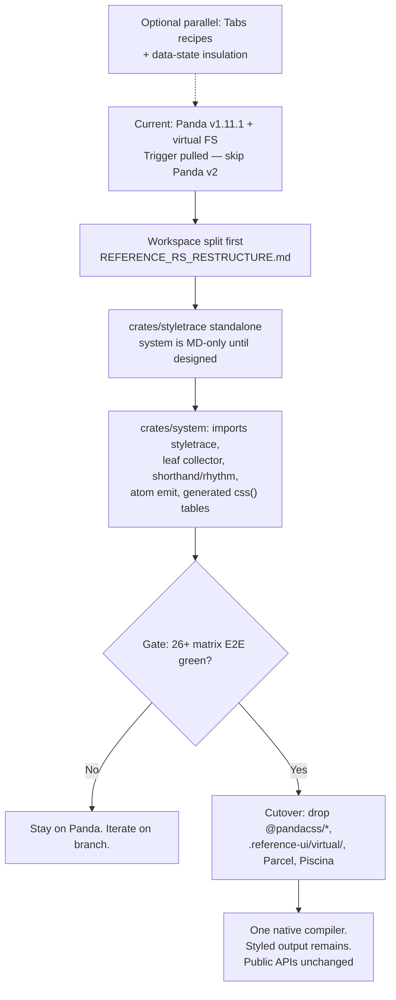

# Reference System: The Native Style Engine

> **The Mandate:** Complete vertical integration and architectural permanence.  
> **The Principle:** *"Be conservative in what you send, be liberal in what you accept"* (Postel's Law). If Reference UI offers style props, we support them with 100% robustness—including nested ternaries, composite shorthands, and sub-pixel rhythm units. No silent CSS dropouts. No external framework churn.

---

## Table of Contents

1. [Executive Summary & The Case for Permanence](#1-executive-summary--the-case-for-permanence)
2. [Forensic Autopsy of Panda v2 (Where It Fell Short)](#2-forensic-autopsy-of-panda-v2-where-it-fell-short)
3. [The Reference RS Benchmark: Systems Discipline in Practice](#3-the-reference-rs-benchmark-systems-discipline-in-practice)
4. [Styletrace as the Foundation of the Native Extractor](#4-styletrace-as-the-foundation-of-the-native-extractor)
5. [The Synthesis: What We Take from Panda vs. What We Do Better](#5-the-synthesis-what-we-take-from-panda-vs-what-we-do-better)
6. [The Component Triad: Recipes, Data Attributes, and Style Props](#6-the-component-triad-recipes-data-attributes-and-style-props)
7. [Eliminating the Virtual Filesystem Seam](#7-eliminating-the-virtual-filesystem-seam)
8. [The Matrix Safety Net: 26+ Suites of Ground Truth](#8-the-matrix-safety-net-26-suites-of-ground-truth)
9. [The Visual Decision Tree](#9-the-visual-decision-tree)
10. [Phased Implementation Roadmap](#10-phased-implementation-roadmap)
11. [Turnkey Implementation Prompt](#11-turnkey-implementation-prompt)
12. [Fine Print](#12-fine-print)

---

## 1. Executive Summary & The Case for Permanence

Reference UI was founded on enterprise stability, type safety, and zero-runtime friction.

For styling, we initially relied on external engines (Chakra UI, then Panda CSS). However, the history of this external lineage has been characterized by perpetual breaking churn across three generations:
- **Chakra v1 → Chakra v2:** Complete rewrite of theme contracts and style prop lifecycles.
- **Chakra v2 → Chakra v3:** Complete rewrite of components, dropping style props in favor of snippets and un-opinionated primitives.
- **Panda v1 → Panda v2:** Rewrite from Babel AST to native Rust, introducing a **split-brain architecture** where native Rust extraction and TypeScript runtime transforms fall out of sync, silently dropping styles for dynamic ternaries and composite shorthands.

### The Core Concept: Permanence
Enterprises do not rebuild their design systems every 18 months because an external open-source tool decided to reinvent its paradigm or chase social-media frontend trends.
- **Reference UI owns its parser (`reference-rs` / Tasty).**
- **Reference UI owns its component layer (`reference-lib`).**
- **Reference UI owns its design tokens (`atlas` / `tokens`).**

The remaining foreign body in the architecture is **Panda CSS** and the fragile **Virtual Filesystem Seam** (`.reference-ui/virtual/`) required to bridge it.

This document defines the blueprint for **`reference-system`**: a lean (~4,000–5,000 LOC) atomic CSS compiler inside `packages/reference-rs` (`system` is MD-only for now so design is nailed down before coding; it will import or extend `crates/styletrace`). That LOC budget is the engine, not Tasty, Atlas, or the N-API bridge.

> **Fine print.** This is **not Panda v3**. Panda still does atomic CSS, layers, conditions, and recipes well. We are deleting the translation layer between JSX we already parse and CSS the matrix already scores. Production today is `@pandacss/*` **^1.11.1** (v1). `vendor/panda` is the v2 autopsy so we **skip** that migration. Public authoring does not change: `tokens()`, `font()`, `globalCss()`, `keyframes()`, `cva()`, `sva()`, `<Box>`, `StyleProps`.

---

## 2. Forensic Autopsy of Panda v2 (Where It Fell Short)

We have Panda v2 cloned directly in `vendor/panda`. Across its 12 Rust crates, there are **61,399 lines of Rust source code** and **68,003 lines of tests** (129,402 LOC total).

A detailed forensic examination of their codebase reveals why Panda v2 exhibits severe edge cases and how its engineering approach fell short of industrial compiler standards.

> **Fine print.** The holes (ghost classes, dropped ternaries, wrapper blindness, shorthand cascade) are one architecture error, not a pile of unrelated bugs: they built a **JavaScript evaluator that emits class names**, then split it across Rust and TypeScript so extract and `css()` could disagree. A stylesheet compiler collects every style leaf and names atoms with one algorithm. V1 hid the mistake because extract, transforms, and runtime were the same Node process. V2 locked it in. We do not take v2; we do not become their v3.

### A. It Was an Expedient Transliteration of Node.js Hacks
Panda v2 was not designed from first principles as a native compiler; it was an expedient port of a legacy Babel/JavaScript AST visitor into Rust using OXC.

The comments in their own source code prove this:
```rust
// vendor/panda/crates/pandacss_extractor/src/literal.rs:300:
// PORT NOTE: folding is lenient per-member, matching the JS extractor.

// vendor/panda/crates/pandacss_extractor/src/literal.rs:681:
// Left didn't fold, so it's a dynamic condition, not a style alternative —
// the right operand is the only extractable style (node's
// `maybeResolveConditionalExpression` does the same).

// vendor/panda/crates/pandacss_extractor/src/literal.rs:701:
// Keep whatever folds, like node's `maybeResolveConditionalExpression`:
// both branches fold → Conditional (collapsed to one if equal);
// only one folds → that branch alone; neither folds → drop.
```

Instead of establishing a formal Intermediate Representation (IR), they copied the loose, dynamic, forgiving heuristics of JavaScript into Rust type systems.

### B. The Fatal Split-Brain Architecture
In Panda v1, both extraction and runtime execution ran in JavaScript, so plugins and transforms could execute in-memory. 

In Panda v2:
1. **The Extractor and Encoder are in Rust:** They run natively during build time using OXC. But the native crate cannot execute JavaScript callbacks.
2. **Custom Transforms are in TypeScript:** Shorthand decomposition (like `createShorthandUtility`) was written in TypeScript on the Node.js config side.
3. **The Runtime is a Dumb String Concatenator:** In the browser, `packages/reference-core/src/system/styled/css/css.js:36` only does:
   ```javascript
   transform(prop, value) {
     const key = resolveShorthand(prop)
     const propKey = classNameByProp.get(key) || hypenateProperty(key)
     return { className: `${propKey}_${withoutSpace(value)}` }
   }
   ```
   Runtime `css.js` knows **nothing** about custom transforms or shorthand decomposition!

#### The Consequence (The `borderBottom` Dropout in `Tabs.tsx`):
- **Build Time:** Reference Core configured `borderBottom: '3px solid'`. The JS config decomposed it into `borderBottomWidth: '3px'` and `borderBottomStyle: 'solid'`. The stylesheet compiler generated `.bd-b-w_3px` and `.bd-b-s_solid`.
- **Runtime:** React called `css({ borderBottom: '3px solid' })`. Runtime `css.js` generated `className="bd-b_3px_solid"`.
- **Result:** The browser applied `.bd-b_3px_solid`. Because that class **did not exist in `styles.css`**, the active underline vanished completely.

### C. The Failure on Ternary Expressions
Why did Panda v2 fail to map ternary statements to atomic classes?

```tsx
borderBottom={isLine && horizontal ? isSelected ? '3px solid' : '3px solid transparent' : undefined}
```

Panda tried to be "half-clever":
1. It attempted static constant evaluation on `c.test` in `literal.rs:687`.
2. When it hit runtime variables (`isLine`, `isSelected`), evaluation returned `None`.
3. For `undefined` alternates, `literal.rs:511` coerced `undefined` into `Some(Literal::Null)`.
4. In `style_tree.rs:242` (`finish_ternary`), because `alternate` was `Some(Literal::Null)` (instead of `None`), it created unflattened, invalid nested variants: `Conditional([Conditional([A, B]), Null])`.
5. The encoder couldn't resolve the nested conditional and silently dropped the style.

**The Fundamental Flaw:** A CSS compiler does **not** need to evaluate runtime boolean conditions. It does not care *when* `isSelected` is true. It only needs to collect every possible literal leaf across both branches so that all corresponding atomic classes are pre-emitted into the stylesheet!

### D. The Corporate / Bureaucracy Signal
Panda v2's git log on `origin/v2` shows a project with misaligned priorities:
- **3-person core team:** Segun Adebayo, Gabe Castro, and Lope.
- **Heavy investment in marketing & peripheral tools:** Building a "Spec Studio" web app, writing blog posts (*"Zero runtime, all the way down"*), and redesigning playgrounds.
- **Suppression of user issues:** Moving feature requests out of GitHub issues into GitHub Discussions (`chore: move feature requests to GitHub Discussions (#3774)`).
- **Multi-Framework Distraction:** Over 30,000 LOC dedicated to Vue SFC, Svelte runes, Solid JSX signals, and Astro frontmatter, while core React JSX extraction and runtime parity remained broken.

---

## 3. The Reference RS Benchmark: Systems Discipline in Practice

By contrast, `packages/reference-rs` represents **275 focused commits** over 6+ months of disciplined systems engineering.

### A. Formal, Typed Semantic IR (`model.rs`)
While Panda uses loose `Literal` enums with heuristic fallbacks, Reference RS defines a formal, closed model:
- `TypeRef` models 17 distinct variants (`Intrinsic`, `Literal`, `Union`, `Intersection`, `Tuple`, `Object`, `IndexedAccess`, etc.).
- **Fail-Closed Philosophy:** If an AST node is unsupported, it drops into `Raw { summary }` with the exact source text preserved. Nothing silently vanishes.

### B. Single Source of Truth (`ts-rs`)
In `reference-rs`, Rust structs use `ts-rs` to automatically generate TypeScript declarations under `js/tasty/generated/`. 
- If the Rust compiler and the TypeScript runtime diverge by a single field, it fails to compile.
- Zero serialization drift. Zero split-brain.

### C. Industrial-Grade Verification
- **Generative Property Fuzzing (`proptest`):** In `src/tasty/tests/type_ref_proptest.rs`, `proptest` generates randomized, deeply nested type trees to prove that recursion never overflows the stack and transformations are idempotent.
- **Product suite (`tests/tasty/cases/` and the rest of package Vitest):** Kitchen sink, case catalogs, and public N-API contracts. This is how `@reference-ui/rust` is scored. See `REFERENCE_RS_RESTRUCTURE.md`.
- **Crate internals (`#[cfg(test)]`):** Narrow in-memory tests. Never a second e2e runner, never Criterion.

> **Fine print.** `benches/scan_kitchen_sink.rs` and Criterion are **junk to delete** in the workspace restructure, not a virtue to copy. `reference-system` is scored by matrix Playwright plus Vitest on the published JS API — the same rule as Tasty.

---

## 4. Styletrace as the Foundation of the Native Extractor

We do not need to write an AST extractor from scratch. We already built **`styletrace`** (`packages/reference-rs/src/styletrace`)!

### Why Was Styletrace Originally Built?
Styletrace was built in Rust with OXC to overcome another major limitation in Panda:
- By default, Panda only extracts style props from hardcoded primitive tags (`Box`, `styled.div`).
- If an author wrote a custom wrapper component:
  ```tsx
  const Card = ({ children, ...props }) => <Box p="4r" {...props}>{children}</Box>
  ```
  And then used `<Card bg="blue.500" />`, **Panda silently ignored the style props**!
- To fix this, `styletrace` was created to:
  1. Parse TSX files with OXC.
  2. Read `.reference-ui/react/types/style-props.d.mts` and expand the `StyleProps` type definition.
  3. Trace component boundaries and forwarding edges (`{...props}`) down to Reference primitives.
  4. Automatically feed discovered component names into Panda's config.

### Styletrace is Already 70% of an Atomic Extractor
`styletrace` already knows how to:
- Parse `.tsx` files at native speed with OXC.
- Identify which JSX elements carry style props.
- Resolve whether a component terminates in a Reference primitive.

To turn `styletrace` into the full `reference-system` extractor, add a **Recursive Leaf Literal Collector** on those elements: every string/numeric style leaf in JSX attributes, `css()` arguments, nested objects, ternaries, and logical expressions.

> **Fine print.** “70%” means it already knows **which tags** carry `StyleProps` and whether they terminate in a Reference primitive. It does **not** yet collect **values**, emit atoms, expand shorthands, or hash class names. Today it still feeds names into Panda’s config. Leaf collection is **not** evaluating user JavaScript: do not fold `isSelected`; scoop both branches. `undefined` / omitted alternates are “no leaf,” not `Literal::Null`. Fully dynamic bags (`css(props)` with no static object) stay fail-closed (trace + no silent dropout of any literal that *was* present). Computed keys that do not fold are not invented.

---

## 5. The Synthesis: What We Take from Panda vs. What We Do Better

We are not throwing everything away; we are **synthesizing the best ideas and replacing the broken ones**:

```
┌────────────────────────────────────────────────────────────────────────┐
│                        SYNTHESIS BLUEPRINT                             │
├───────────────────────────────────┬────────────────────────────────────┤
│   WHAT WE ADOPT FROM PANDA V2     │     WHAT WE DO DIFFERENTLY / BETTER│
├───────────────────────────────────┼────────────────────────────────────┤
│ • Atom Data Model:                │ • Unified Single-Engine Runtime:   │
│   (prop, value, conditions, hash) │   One Rust source of truth; css()  │
│ • 5-Layer Cascade Ordering:       │   is generated JS, not a 2nd map.  │
│   @layer reset, base, tokens,     │   Zero ghost classes.              │
│   recipes, utilities              │ • Recursive Leaf Literal Collector:│
│ • Condition Chains:               │   Scoops all ternary branches;     │
│   Nested @media & pseudo-selectors│   zero heuristic constant folding. │
│ • Slot Recipes (sva) & cva:       │ • Native Rhythm & Atlas Tokens:    │
│   Multi-part compound variants    │   r multipliers & OKLCH color math │
│ • String Utilities:               │   evaluated natively in Rust.      │
│   CSS escaping & hyphenation      │ • Elimination of Virtual FS:       │
│                                   │   Direct in-memory compilation;    │
│                                   │   deletes .reference-ui/virtual/.  │
│                                   │ • Cascade-aware shorthand expand:  │
│                                   │   borderBottom + borderColor does  │
│                                   │   not reset to currentColor.       │
│                                   │ • Laser-Focused on React:          │
│                                   │   Zero Vue/Svelte/Astro bloat.     │
└───────────────────────────────────┴────────────────────────────────────┘
```

> **Fine print.** “Same algorithm” does **not** mean the browser loads Rust. The browser keeps a small `css()` helper. Expansion, shorthand decomposition, rhythm, and class naming are generated from the **same Rust source of truth** into `@reference-ui/styled/css` (tables / `ts-rs` / emitted JS — pick one, not two implementations). Ghost class = bug. The Book white-border incident (`STYLE_ERRORS_REPORT.md`) is in scope: `borderBottom="1px solid"` + `borderColor="gray.800"` must compile as CSS, not as two utilities racing in `@layer utilities` source order.

---

## 6. The Component Triad: Recipes, Data Attributes, and Style Props

A high-integrity design system must balance **architectural rigor** with **developer velocity**:

| Layer | Tool | Role | Example |
| :--- | :--- | :--- | :--- |
| **1. Component Anatomy** | **Recipes (`cva` / `sva`)** | Canonical design system engineering. Defines static variants and sizes at build time. | `variant: 'line' \| 'pill'` |
| **2. Interactive State** | **Data Attributes** | State transitions handled natively by CSS attribute selectors without JS class churn. | `&[data-state="active"]` |
| **3. Layout & Prototyping**| **Style Props** | Instant, fluid authoring. Lets developers compose layouts without naming a recipe. | `<Flex gap="4r" mt="2r" />` |

### The "Hell No" Linter + Resilient Extractor
We want both:
1. **Linter Discipline:** Because `styletrace` inspects JSX style props with OXC, it can emit a warning when developers write unreadable nested ternaries:
   > *"Warning: Avoid nested ternaries on style props. Prefer recipes or data-attribute selectors."*
2. **Compiler Resilience (Postel's Law):** If a developer *does* write a ternary, the compiler does not fail or drop styles. The recursive leaf collector extracts every branch, emits the classes, and the component works 100%.

> **Fine print.** The linter is discipline, not a license to drop CSS. Refactoring `Tabs.tsx` onto recipes/`data-state` **insulates lib from Panda today**; it does not shrink extractor obligations. Nested ternaries must still compile. Phase 1 is optional parallel work, not a gate on the engine.

---

## 7. Eliminating the Virtual Filesystem Seam

The **Reference ↔ Panda virtual filesystem seam** (`.reference-ui/virtual/`) is the single most complex, fragile subsystem in `reference-core` today.

### Current Pipeline (With Panda):
```
User Source Code (.tsx)
   │
   ▼
Parcel Watcher (@parcel/watcher)
   │
   ▼
Piscina Worker Thread Pool (Virtual Mirror)
   │
   ▼
Disk Write: .reference-ui/virtual/**/*.tsx (Rewritten by virtualrs)
   │
   ▼
Liquid Template Engine: Renders .reference-ui/panda.config.ts
   │
   ▼
Panda CLI / Worker: Scans .reference-ui/virtual on disk
   │
   ▼
Disk Write: .reference-ui/styled/*
   │
   ▼
Packager: Bundles and symlinks into node_modules/@reference-ui/*
```

### Future Pipeline (With `reference-system`):
```
User Source Code (.tsx)
   │
   ▼
In-Memory OXC AST Traversal (styletrace + extractor in Rust)
   │
   ▼
Direct Emission: .reference-ui/styled/styles.css
```

### What Gets Permanently Deleted:
1. `@parcel/watcher` dependency.
2. `Piscina` worker pools for virtual mirroring.
3. `panda.liquid` and generated `panda.config.ts`.
4. The entire `.reference-ui/virtual/` directory on disk.
5. Watcher race conditions and A/B file state desynchronizations during git branch switches.

Sync cold-start time drops from **3–5 seconds** down to **< 150 milliseconds**.

> **Fine print.** Deleting **`.reference-ui/virtual/`** (the on-disk Panda scan mirror) is not the same as deleting **`crates/virtualrs`**. That crate rewrites imports/CSS/CVA in generated files. It stays until those rewrite jobs are gone. Cutover does not yank `virtualrs` “because the folder was named virtual.” Do not delete `@pandacss/*`, Parcel, or Piscina until Gate 2 (matrix parity) is green. The future pipeline still writes `.reference-ui/styled/styles.css` (and the rest of the styled contract the packager already consumes). We remove the **Panda input** tree, not the **styled output** tree.

---

## 8. The Matrix Safety Net: 26+ Suites of Ground Truth

We have already codified the contracts of the entire design system under `matrix/`. Any PR or implementation of `reference-system` must pass this exact test suite:

| Matrix Package | Test Spec | What It Proves (Must Never Regress) |
| :--- | :--- | :--- |
| **`matrix/css`** | `tests/e2e/css-contract.spec.ts` | Atomic class generation, specificity, CSS class concatenation. |
| **`matrix/css-selectors`** | `tests/e2e/css-selectors-contract.spec.ts` | Complex pseudo-classes (`_hover`, `_focusVisible`), sibling and child selectors. |
| **`matrix/primitives`** | `tests/e2e/primitives-contract.spec.ts` | `<Box>`, `<Flex>`, `<Grid>`, style prop forwarding down component boundaries. |
| **`matrix/recipe`** | `tests/e2e/system-contract.spec.ts` | `cva()`, `sva()`, compound variants, high-level variant props on `styled()`. |
| **`matrix/spacing`** | `tests/e2e/system-contract.spec.ts` | Sub-pixel rhythm multiplier (`r` -> `px`), padding, margins, dimension shorthands. |
| **`matrix/responsive`** | `tests/e2e/system-contract.spec.ts`<br>`tests/e2e/viewport-contract.spec.ts` | Responsive container queries (`@container`), media queries, breakpoint arrays. |
| **`matrix/color-mode`** | `tests/e2e/system-contract.spec.ts` | Light/dark switching, semantic token resolution (`_dark`, `_light`). |
| **`matrix/tokens`** | `tests/e2e/system-contract.spec.ts` | OKLCH color space resolution, CSS variable generation (`--colors-*`). |
| **`matrix/system`** | `tests/e2e/system-contract.spec.ts`<br>`tests/e2e/system-font-contract.spec.ts` | Layer mounting (`@layer reset, base, tokens, recipes, utilities`), `globalCss`, `keyframes`. |
| **`matrix/chain/T1–T13`**| `tests/e2e/T1..T13-contract.spec.ts` | Multi-tier design system inheritance (`extends`), token overrides, layer isolation. |
| **`matrix/watch`** | `tests/e2e/watch-contract.spec.ts` | HMR and live atomic stylesheet regeneration during active editing. |

**Unit Test Baseline:**
- `packages/reference-core`: 656 passing unit tests.
- `packages/reference-lib`: 189 passing unit tests.
- `packages/reference-rs`: Vitest product suite (`tests/`, `js/**/*.test.ts`) plus colocated `cargo test` internals. Not Criterion.

> **Fine print.** Matrix is the **merge gate**, not a vibe. Public APIs listed above must keep passing. `matrix/watch` still proves live stylesheet regeneration — after cutover that path is `reference-system`, not a Panda worker watching `virtual/`. Counts above are a snapshot; the suites, not the integers, are the contract.

---

## 9. The Visual Decision Tree



> **Fine print.** Gate 1 (“keep Panda v2?”) is closed. We were never on v2. Lib hardening is a dotted line: useful, not blocking. **Crate split and engine are different diffs.** Mixing them is how a solo warp drive becomes a six-month merge.

---

## 10. Phased Implementation Roadmap

### Phase 0: Cargo workspace door (ship first, no engine)
Follow `REFERENCE_RS_RESTRUCTURE.md`. Delete Criterion/`benches/`. Extract `virtualrs` → `atlas` → `tasty` → `crates/styletrace`. One N-API crate. Public `@reference-ui/rust` subpaths unchanged. `reference-system` remains MD-only for now until fully specified. **Do not implement the atomic emitter in this phase.**

### Phase 1: Clean component contracts (optional, parallel)
- Refactor `Tabs.tsx` and other lib internals off nested style-prop ternaries toward **recipes (`cva`)** and DOM data attributes.
- CT green; no inline `style={{ ... }}` hacks as a way to paper over missing atoms.
- Insulates `@reference-ui/lib` from Panda **now**. Does not reduce extractor scope.

### Phase 2: Engine in `crates/system` (isolated from the folder-move PR)
- Leaf literal collector on the styletrace walk.
- Token / rhythm / shorthand resolver (cascade-correct).
- Atomic stylesheet emitter with `@layer` sorting.
- Generate the runtime `css()` tables from the same Rust code.

### Phase 3: Matrix validation & pipeline integration
- Wire `reference-core` sync to `reference-system` **while Panda still runs** if a flag is needed; do not cut the old path first.
- `pnpm agent test --packages=@matrix/css,primitives,recipe,spacing,responsive,system` (and watch, tokens, color-mode, chain as required).
- Iterate until those specs pass with 0 regressions.

### Phase 4: Deprecation & cutover
- Delete `.reference-ui/virtual/` and remove `@parcel/watcher` and `piscina`.
- Remove `@pandacss/*` from `packages/reference-core/package.json`.
- Leave `crates/virtualrs` until its remaining rewrite jobs are actually unused.
- Merge to `main`. Public APIs unchanged.

---

## 11. Turnkey Implementation Prompt

*When ready to execute Phase 2 and 3, copy and paste this prompt into an agent or development session:*

```markdown
# TASK: Build `reference-system` Native Styling Engine in `packages/reference-rs`

You are tasked with implementing `reference-system`, the native atomic CSS engine for Reference UI, replacing `@pandacss/*` and eliminating the `.reference-ui/virtual` filesystem seam.

### Context & Safety Net
1. Read `REFERENCE_SYSTEM.md` in the repository root for the full architectural specification.
2. The safety net is the matrix test suite under `matrix/` (26+ Playwright e2e specs covering CSS, primitives, recipes, spacing, responsive queries, and tokens across Vite and Webpack).
3. Do not break existing public APIs (`tokens()`, `font()`, `globalCss()`, `keyframes()`, `cva()`, `sva()`, `<Box>`, style props).
4. Read `REFERENCE_RS_RESTRUCTURE.md`. Cargo workspace split is complete (`crates/virtualrs`, `crates/atlas`, `crates/tasty`, `crates/styletrace`, `crates/napi`).
5. Do not add Criterion, `crates/testing`, Vue/Svelte extractors, or a second npm package.
6. Do not delete `.reference-ui/virtual/` or `@pandacss/*` until matrix Gate 2 is green.
7. `native/` is the gitignored `.node` dump. The N-API crate is `crates/napi`. Do not put `src/lib.rs` in `native/`.

### Execution Steps

#### Step 1: Confirm the cargo workspace is ready
Cargo workspace is split. `crates/styletrace` exists independently. Root `Cargo.toml` is workspace-only. `@reference-ui/rust` subpaths resolve. If any of that is false, run the restructure first.

#### Step 2: Engine Implementation (`crates/system`)
1. **Scanner (`extractor.rs`):**
   - Leverage `styletrace` (OXC-based) to identify style-bearing JSX tags and `css()` calls.
   - Implement `collect_leaf_literals` to recursively extract all string/numeric literals from nested ternaries and logical expressions without bailing.
2. **Resolver (`tokens.rs`, `rhythm.rs`, `shorthands.rs`):**
   - Port rhythm multiplier (`r` -> `px`), shorthands (`borderBottom` -> width, style, color), and token variable resolution (`ui.focus.ring` -> `var(--colors-ui-focus-ring)`).
3. **Emitter (`stylesheet.rs`):**
   - Emit atomic rules into `@layer reset, base, tokens, recipes, utilities`.
   - Implement deterministic class hashing/naming (`.bd-b_3px_solid` or short hashes).
   - Support responsive `@container` and `@media` queries.
4. **Runtime Helper:**
   - Export the exact same atom hashing algorithm to `@reference-ui/styled/css` so runtime `css()` and build-time CSS are 100% synchronized.

#### Step 3: Matrix Validation & Seam Removal
1. Update `packages/reference-core/src/sync` to invoke `reference-system`. Keep Panda on the path until matrix is green.
2. Run `pnpm agent test --packages=@matrix/css,primitives,recipe,spacing,responsive,system`.
3. Iterate until all matrix tests pass 100%.
4. Then delete `.reference-ui/virtual/` generation and `@parcel/watcher` mirror logic.
5. Then remove `@pandacss/*` from `packages/reference-core/package.json`. Do not delete `crates/virtualrs` in this step.
```

---

## 12. Fine Print

These are the constraints that keep a solo warp drive from becoming Panda v3 with extra steps.

| # | Rule |
| :--- | :--- |
| 1 | **Wrong machine, right atoms.** Keep the atom/layer/condition/recipe *ideas*. Do not keep the JS-eval extractor, the TS-only transform side, or the dumb `css()` concatenator that cannot see those transforms. |
| 2 | **One naming function.** Extract and runtime must produce the same class for the same `(prop, value, conditions)`. The runtime is generated JS, not a second hand-written map. |
| 3 | **Collect leaves. Do not run user JS.** Ternaries, `&&`, `\|\|` are bags of literals. `undefined` is no leaf. Silent dropout of a collected leaf is a P0. |
| 4 | **Compile CSS, not a bag of utilities.** Shorthand expansion happens before cascade. `borderBottom` + `borderColor` must not flash `currentColor` (`STYLE_ERRORS_REPORT.md`). |
| 5 | **Postel on `StyleProps`.** If the type surface allows it, the engine supports it or fails closed with a trace — never a missing class in the browser. |
| 6 | **React/TSX only.** Zero Vue SFC, Svelte, Solid, Astro. |
| 7 | **Folder move ≠ engine.** `REFERENCE_RS_RESTRUCTURE.md` is the door. Emitter is a later PR into `crates/system`. |
| 8 | **Product suite is JS.** Vitest through N-API for `@reference-ui/rust`. Matrix Playwright for the design-system contract. `cargo test` is crate-local and in-memory. No Criterion. |
| 9 | **Panda stays until parity.** v1.11.1 remains the production engine until Gate 2. Do not dual-write two *different* class schemes into the same stylesheet. |
| 10 | **Delete the Panda input tree, not the styled output tree.** `.reference-ui/virtual/` goes. `.reference-ui/styled/` stays. `virtualrs` stays until its jobs are gone. |
| 11 | **No new public authoring.** No new style-prop dialect, no “only recipes now,” no hashed-only classes as a surprise break. Class *spelling* may change if matrix still passes and a migration note exists; prefer Panda-compatible spellings until proven otherwise. |
| 12 | **Linter ≠ compiler.** Warn on nested ternaries; still emit every branch. |
| 13 | **`native/` is not a crate.** Binary dump only. One published package: `@reference-ui/rust`. |
| 14 | **~4–5k LOC is `crates/system`**, not a rewrite of Tasty. If the engine starts growing Vue-shaped abstraction, stop. |
