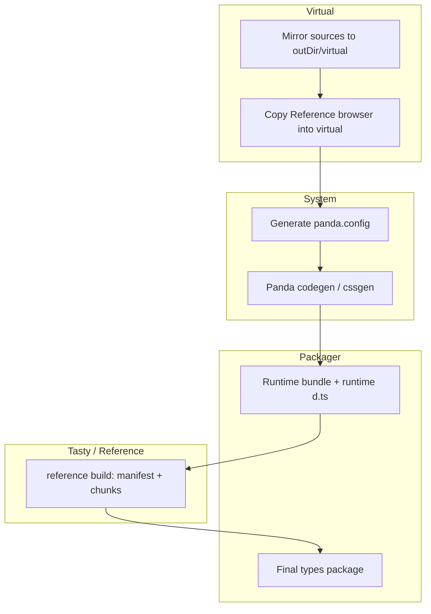

# Reference UI — deep orientation

This document is a **long-form map** of what Reference UI is, how the major subsystems connect, and where to look in the tree. It is written for engineers (and agents) who need more than a README tagline.

If you only need the short version, start with the root [README.md](./README.md) and the package READMEs linked at the end.

---

## 1. What this project is (in one paragraph)

**Reference UI** is a **chainable design system CLI** (`ref` in `@reference-ui/core`) that **compiles** a consumer’s `ui.config.ts` and source into **generated packages** (React, styled system, types, and more) under a configurable output directory (default **`.reference-ui`**). The same build produces **native-backed analysis** (`@reference-ui/rust`) and a **Model Context Protocol** server (`ref mcp`) that exposes **your project’s** real component inventory and types—not a hand-curated catalog from our docs.

The “**AI era**” angle is not marketing fluff: the stack is designed so that **machines and humans read the same artifacts**—generated types, Tasty chunks, Atlas usage, and Styletrace rules all trace back to the same sources of truth the runtime uses.

---

## 2. Monorepo map (what lives where)

| Path | Role |
| --- | --- |
| `packages/reference-core` | `ref` CLI, `ref sync` orchestration, virtual FS, event bus, system workers, packager, Vite/Webpack integration, MCP implementation. |
| `packages/reference-lib` | First-party design system built on the generated surface (dogfood for the product). |
| `packages/reference-docs` | Vite docs site; often used as the `cwd` for MCP in this repo so `ui.config.ts` matches the site. |
| `packages/reference-unit` | Local app for validating generated runtime behavior. |
| `packages/reference-e2e` | Playwright tests; **what** is tested per matrix entry (Dagger owns **where** it runs for matrix flows). |
| `packages/reference-rs` | Rust crate + napi-rs `.node` addon + `js/` TypeScript (Atlas, Tasty, Styletrace, virtualfs, etc.). |
| `packages/reference-icons` | Icon package (decoupled / release-focused; see its README). |
| `fixtures/*` | Consumer-style fixtures, including `extend-library` and `layer-library` for composition tests. |
| `matrix/*` | Matrix scenario packages (install/TypeScript stories) discovered by the pipeline. |
| `pipeline/` | Dagger graph, **Verdaccio** staging, pack → load → test flows, **matrix** bootstrap. |
| `docs/` | Additional architecture notes (`Architecture.md`, `CORE.md`, `STRUCTURE.md`, …). |

Root scripts (`pnpm dev`, `pnpm build`, `pnpm test`, `pnpm test:rust`, …) tie these together; see the root [README.md](./README.md).

---

## 3. Design system surface (user-facing API philosophy)

The **docs site** and `docs/docs.md` describe the public contract at a high level. In short:

- **Typed HTML primitives** — e.g. `Div`, `Span`, `A`—not abstract “layout” components like `Box` / `Text` with an `as` prop. The intent is a **shallow, predictable** element tree that matches the DOM and compiles to **zero-runtime CSS** for most styling.
- **Style props** map to **compile-time** CSS through Panda; unsupported CSS features are **intentionally** absent where they would break the model.
- **Tokens, `css()`, recipes, patterns** — the **system** package is the generated home for design tokens and runtime helpers; `baseSystem` + `extends` / `layers` are how **multiple systems compose** without copy-paste.

This is the “knowledge-first” story: the **same** tokens and types you import are what Tasty, Styletrace, and MCP can reason about.

---

## 4. The mental model: compiler + orchestrator, not a dev server

- **`ref sync`** is the main build. It is **not** a long-lived design-server process; it **runs a dependency graph of workers and events** until `sync:complete` (or `sync:failed`).
- **Watch mode** (`ref sync --watch`) reuses the same graph but keys incremental work off **virtual filesystem** change events, not raw file watches only.
- **Generated output** is written under `outDir` (default `.reference-ui`): virtual mirror, Panda output, packaged `@reference-ui/*` facsimiles, Tasty manifest and chunks, MCP model, etc.
- **Bundlers** (Webpack plugin, Vite integration) can **watch** and **refresh** sync sessions so app dev servers stay aligned with generated files—see `packages/reference-core/src/vite/` and `src/webpack/`.

---

## 4. `ui.config.ts`: the control surface (what you can configure)

`ReferenceUIConfig` in `packages/reference-core/src/config/types.ts` is the public contract. Highlights:

| Field | Purpose |
| --- | --- |
| `name` | **Required.** Design-system identity (CSS `@layer`, `data-layer` on primitives). |
| `include` | Globs of files to scan for Panda extraction; also drives **codegen copy** for isolation. |
| `extends` | Optional `BaseSystem[]` — upstream **token/fragment** systems merged **before** your own (portable `baseSystem` from other packages). |
| `layers` | Optional `BaseSystem[]` — upstream **component CSS** in an isolated cascade **layer**; **tokens from upstream do not** merge into your Panda config or TS types. |
| `jsxElements` | Extra JSX tag names for discovery when static tracing cannot infer them (e.g. generated surfaces). |
| `outDir` | Output root (default `.reference-ui`). |
| `normalizeCss` | Toggle normalize CSS reset (default `true`). |
| `useDesignSystem` | Opt into the built-in design system pieces (default `true`). |
| `debug` | Verbose logging. |
| `mcp` | **Separate** from `include`: `mcp.include` / `mcp.exclude` are **only** for Atlas when building the MCP model—so you can point inventory at app code without changing Panda’s scan. |
| `skipTypescript` | Skip tsup declaration emit in test-only scenarios. |

**`extends` vs `layers` in practice**

- Use **`extends`** when you want a real **shared token + fragment** relationship (design tokens, recipes, patterns) from another Reference-built package.
- Use **`layers`** when you need **another system’s look** (CSS) without polluting your **token namespace** or generated types—typical for **stacking** third-party or internal libraries where you do not want their semantic tokens in your API.

`packages/reference-core/src/system/panda/config/README.md` and `src/system/css/README.md` document how Panda config generation consumes `baseSystem` and how **ordering** works when both `extends` and `layers` participate.

---

## 5. `ref` commands (CLI surface)

| Command | Role |
| --- | --- |
| `ref` / `ref sync` (default) | Full sync: virtual tree → system config → Panda → packager → reference (Tasty) → final types package. Uses workers and the event bus. |
| `ref clean` | Deletes the output directory (`outDir`); **main thread only**; use before tests for a cold state. |
| `ref mcp` | Starts the MCP server: **stdio** (editors) or **HTTP** (`--transport http`) for debugging. Runs in the **CLI process**; the heavy MCP artifact build can use a **child process** (see below). |

Editor integration: prefer `node` + the built CLI path; do not assume `pnpm` exists on the host `PATH` for MCP spawns. Examples live in [packages/reference-core/README.md](./packages/reference-core/README.md).

---

## 6. The `ref sync` pipeline: phases and why order matters

Orchestration is **declarative** in `packages/reference-core/src/sync/events.ts` (not buried inside workers). The comments in that file are the canonical story; the following is a merged summary.

### 6.1 Phase list (happy path)

1. **Worker readiness** — Multiple workers must publish `*:ready` (e.g. `virtual:ready`, `reference:ready`, `packager:ready`, `system:config:ready`, `system:panda:ready`) before the graph unlocks.
2. **Virtual copy: all** — After `virtual:ready` and `reference:ready`, emit `run:virtual:copy:all` to mirror sources into `outDir/virtual` (synthesized workspace).
3. **Reference component into virtual** — `virtual:copy:complete` triggers `run:reference:component:copy` so the **in-browser `Reference` sources** are copied into the virtual tree; that matters because downstream tooling resolves imports against the **virtual** tree.
4. **Virtual complete barrier** — `virtual:complete` is the line after which **config, Panda, and reference** may assume a coherent virtual project.
5. **Watch** — `watch:change` maps to `run:virtual:sync:file` (per-file), feeding `virtual:fs:change` and `virtual:fragment:change`.
6. **System config** — First config build waits for `virtual:complete` and the config worker. Fragment-only changes can trigger **config + Panda** without a full reference rebuild to avoid HMR noise (`virtual:fragment:change` → `run:system:config` only after first completion).
7. **Panda** — After `system:config:complete` and the Panda worker: `run:panda:codegen` (and fast css-only paths in watch).
8. **Runtime packager** — After `system:panda:codegen`, the **runtime bundle** must run so that imports like `@reference-ui/react` exist as **real directories** the reference build can resolve.
9. **Runtime TypeScript** — `packager:runtime:complete` → `packager-ts:runtime:requested`. **Critical:** the reference (Tasty) build must not run until **runtime `.d.mts` / declaration surfaces** exist, or re-exported symbols (e.g. `SystemStyleObject`) vanish from the generated manifest. The `sync/events.ts` comment block spells this out explicitly.
10. **Reference / Tasty build** — Once `VIRTUAL_COMPLETE` and `packager-ts:runtime:complete`, emit `run:reference:build`.
11. **Final `@reference-ui/types` pack** — After `reference:complete`, `run:packager:bundle` and the closing declaration pass; ends with `packager-ts:complete` → `sync:complete`.
12. **MCP** — **Not** part of `ref sync`. `ref mcp` loads or builds the component model in **its own process** via `loadOrBuildMcpArtifact` / `createMcpModelState`.

### 6.2 Failure fan-in

`sync:failed` is emitted on any of: `system:config:failed`, `system:panda:codegen:failed`, `virtual:failed`, `packager-ts:failed`, `reference:failed`, `mcp:failed`, or `reference:component:copy-failed`.

### 6.3 Diagram (high level)

---

## 7. Virtual filesystem (`outDir/virtual`)

**Why a virtual tree exists**

- Panda and downstream tools get a **stable, isolated** copy of the user’s sources (and the mirrored Reference browser) so path resolution and codegen are **reproducible** without mutating the user’s original tree.
- Watch mode can apply **surgical** updates: `run:virtual:sync:file` and fragment-level invalidation.
- The **packager and reference** builds resolve the same layout that the rest of the pipeline sees—avoiding “it works in the app but not in the analyzer” drift.

Paths are resolved with helpers in `packages/reference-core/src/lib/paths/` (e.g. `getOutDirPath`, `getVirtualDirPath`).

---

## 8. System layer: `baseSystem`, Panda, and CSS

- **`system/base`** prepares the portable `baseSystem` **fragment** bundle, writes `baseSystem.mjs` / `baseSystem.d.mts`, and hands the **collector** bundle to Panda config generation. **`baseSystem` is a Reference UI contract**, not an opaque Panda handwave—see [packages/reference-core/src/system/base/README.md](./packages/reference-core/src/system/base/README.md).
- **Panda** runs in a worker: codegen, then cssgen; watch can take a **fast CSS-only** path.
- **Layer postprocessing** updates `baseSystem.css` with a **layer-safe** representation when `layers` participate—so cascade order stays explicit and testable. Deep detail: [packages/reference-core/src/system/css/README.md](./packages/reference-core/src/system/css/README.md) and [RELEASE_READY.md](./packages/reference-core/src/system/RELEASE_READY.md) in the same area.

---

## 9. Multi-threading: Piscina workers and `workers.json`

Workers are **discovered** from `packages/reference-core/workers.json` and built as separate bundles (see `src/lib/thread-pool/worker-entries.ts` + tsup). Current entries:

| Key | Source file | Typical responsibility |
| --- | --- | --- |
| `watch` | `src/watch/worker.ts` | Watches user sources; emits `watch:change`. |
| `virtual` | `src/virtual/worker.ts` | Virtual copy + FS events. |
| `reference` | `src/reference/bridge/worker.ts` | Reference build bridge; copies browser into virtual; `run:reference:build`, etc. |
| `config` | `src/system/workers/config.ts` | Write `panda.config.ts` from fragments. |
| `panda` | `src/system/workers/panda.ts` | Panda codegen / cssgen. |
| `packager` | `src/packager/worker.ts` | Package runtime and final bundle orchestration. |
| `packager-ts` | `src/packager/ts/worker.ts` | TypeScript / declaration generation coordination. |
| `mcp` | `src/mcp/worker/worker.ts` | Worker-side MCP support (the **stdio/HTTP** server still runs in the main CLI—see [packages/reference-core/src/mcp/server/README.md](./packages/reference-core/src/mcp/server/README.md)). |

**Contract:** each worker is **event wiring only**—`on('run:…')`, do work, `emit('…:complete')`, return `KEEP_ALIVE` from `src/lib/thread-pool`. **Business rules for sequencing** live in `sync/events.ts` and `sync/events.utils.ts`, not inside the worker body.

To add a worker: implement `src/.../worker.ts`, add to `workers.json`, register init and events (see [packages/reference-core/src/system/workers/README.md](./packages/reference-core/src/system/workers/README.md) and the root core README’s workers section).

---

## 10. Event bus: `BroadcastChannel` and typed envelopes

Location: `packages/reference-core/src/lib/event-bus/`.

- **Transport:** a single `BroadcastChannel` (see `channel/wire.ts` for `BUS_CHANNEL_NAME` and the envelope type `bus:event`). **All threads** that import the bus participate—main and worker threads.
- **API:** `emit`, `on`, `once`, `off`, `onceAll`, `initEventBus`. Typed events are keyed off the central `Events` map in `src/events` (or equivalent). Empty-payload events omit the payload in `emit`.
- **Local dispatch:** `emit` also dispatches to same-thread listeners immediately via `dispatchBusEnvelope`—so you get **both** in-process and cross-thread delivery.
- **Not guaranteed:** message ordering across bursts, durable replay, or process-level semantics beyond Node’s `BroadcastChannel`—documented in the module README.
- **Logging:** `initEventBus()` can enable **structured bus logging** when the project’s `debug: true` is set (config described in the event-bus README).

This bus is how **Piscina workers** stay coherent without a bespoke IPC protocol for every feature.

---

## 11. `@reference-ui/rust`: native layer and JS entrypoints

Package: `packages/reference-rs/`. The Rust crate builds as a **Node-API** (napi-rs) **`.node`** shared library plus optional **rlib** for tests. TypeScript in `js/` loads the correct binary per **OS/arch** (`js/runtime/loader.ts`).

| Subpath (export) | Responsibility |
| --- | --- |
| `@reference-ui/rust` | Core native exports + loader helpers. |
| `@reference-ui/rust/atlas` | `analyze` / `analyzeDetailed` over the Rust engine. |
| `@reference-ui/rust/tasty` | Tasty **runtime** (graph API, browser helpers, chunk loading). |
| `@reference-ui/rust/tasty/build` | Emit and filesystem glue for the build. |
| `@reference-ui/rust/tasty/browser` | `createTastyBrowserRuntime` and related. |
| `@reference-ui/rust/styletrace` | Style surface analysis. |

`analyzeDetailed(cwd, config?)` **normalizes** the config JSON with `rootDir: <resolved cwd>` before calling native `analyzeAtlas`, so per-call overrides merge predictably. When **no** `mcp.include` / `mcp.exclude` is set, `getAtlasMcpConfig` returns `undefined` and Atlas uses its default scoping; when set, the MCP pipeline passes **only** those selectors to Atlas, independent of Panda’s `include`.

**Targets:** the package lists napi-rs targets in its `package.json` (e.g. Apple and Linux GNU). The **matrix** pipeline asserts that a **Linux** native tarball exists for the same version as `@reference-ui/rust` when running containerized tests—see §15.

---

## 12. Atlas: React/TSX inventory and usage

**Questions Atlas answers** (from [packages/reference-rs/js/atlas/README.md](./packages/reference-rs/js/atlas/README.md)):

- Which exported React components exist?
- What **named props type** does each map to (when resolvable)?
- How are components **used** in JSX (counts, literal prop summaries, examples, `usedWith` co-occurrence)?

**Scope boundaries** are explicit: function components, default exports, barrel re-exports, namespace imports—**not** full type-level metaprogramming. Failures show up as **diagnostics** (e.g. `unresolved-props-type`, `unresolved-include-package`) rather than silent guesswork.

Atlas is the **spine of “what is actually in this repo’s JSX”** for MCP. It does **not** replace Tasty: it **identifies** the interface, Tasty **enriches** the shape.

---

## 13. Tasty: type graph, emission, and chunk loading

**Role:** Rust (OXC) parses TypeScript, resolves symbols, lowers types to a `TypeRef` IR, and **emits**:

- A **small manifest** module: version, `symbolsByName`, `symbolsById`, and per-symbol **chunk id** and library flags.
- **Chunk modules** holding full symbol payloads—loaded **lazily** in JS.

**Why chunks**

- Large design systems can have **huge** type surfaces. Eagerly loading every symbol in one bundle would bloat the browser and slow IDE tooling.
- The **chunk loader** (`packages/reference-rs/js/tasty/internal/chunk-loader.ts`) **deduplicates** concurrent loads: one `import()` per resolved path, cached as a `Promise` in a `Map`.

**Object-like projection** (for docs, MCP, API tables)

- Tasty preserves a **canonical graph** but can expose a **bounded object-like view** of complex aliases when flattening is safe; otherwise it **falls back** to raw or linked definitions (see the Tasty README’s “Object-Like Projection” and “What Raw Means” sections).
- `FIRST_CLASS_TYPES.md` in the Tasty tree discusses treating **`type` aliases** as first-class documentation symbols.

**Re-exports and `node_modules`**

- Tasty does **not** slurp all of `node_modules`; it follows user **re-exports** into packages when the user opts in via re-export surface (see the “Scan Boundary” section of the Tasty README).
- The JS **runtime** in `js/tasty` is the **lazy** consumer of emitted assets; the **contract** starts in Rust.

**Bridge into `@reference-ui/types`**

- The packager postprocess **rewrites** a placeholder in the types bundle to **`import('./tasty/runtime.js')`** so esbuild and **app bundlers** retain a **real dynamic import** edge; without that rewrite, the Tasty runtime and **chunk graph** could be left out of production builds ([packages/reference-core/src/packager/postprocess/rewrite-types-runtime-import.ts](./packages/reference-core/src/packager/postprocess/rewrite-types-runtime-import.ts)).

---

## 14. Styletrace: which components “count” as Reference-styled

**Inputs it respects**

- **Primitive names** come from the **same** generated source as the runtime: `packages/reference-core/src/system/primitives/tags.ts` (not a duplicated hand list).
- **Style prop names** are derived from the public `StyleProps` type in `packages/reference-core/src/types/style-props.ts` via the **Oxc-based resolver**—import chasing, mapped types, indexed access, intersections, and common utility wrappers.

**What it does**

- Finds exported components whose public props include style props, then **walks JSX** for forwarding patterns: explicit props, rest spreads, local wrappers, barrels, `export *` fan-out, namespace and default import paths, and factory components—**including into `node_modules`** when package resolution can follow a style contract back to Reference primitives or the `splitCssProps` / `box` / `css` pipeline.

So Styletrace is the **semantic “this wrapper is still a Reference-styled boundary”** layer, complementary to Atlas’s “this component exists” layer.

---

## 15. MCP: dynamic model, build graph, and tools

### 15.1 Artifact locations (under `outDir`)

| Path | Content |
| --- | --- |
| `types/tasty/manifest.js` | **Required** for MCP build. If missing, `generateMcpArtifact` throws and tells you to run `ref sync` first. |
| `mcp/model.json` | Written artifact: **full** MCP build output (schema version, workspace root, manifest path, Atlas diagnostics, sorted components). |

`getMcpModelPath` / `getMcpTypesManifestPath` live in `packages/reference-core/src/mcp/pipeline/paths.ts`.

### 15.2 How the model is built

1. **Prefetch Atlas** — `prefetchMcpAtlas` dedupes by serialized `mcp` config; repeated calls in one process hit the same `analyzeDetailed` promise.
2. **Tasty side** — For each Atlas component, if `interface.name` is set, `loadMcpReferenceData` uses the Tasty **API** (`createReferenceApi` from manifest) to load the symbol, members, JSDoc, **related symbols**, **extends** chains, and **member origin** mapping—same conceptual work as the browser `Reference` viewer, specialized for MCP JSON.
3. **Join** — `joinMcpComponentWithReference` merges:
   - Atlas: usage counts, examples, per-prop usage stats, `usedWith`.
   - Tasty: `type` strings, descriptions, optional/readonly, defaults.
   - If Tasty has **documented** props Atlas never saw in JSX, they appear as **`documentedOnlyProps`** with `usage: 'unused'` (see [packages/reference-core/src/mcp/pipeline/join.ts](./packages/reference-core/src/mcp/pipeline/join.ts))—so **docs stay honest** about “never observed in the repo”.

### 15.3 `createMcpModelState` and warm start

From `packages/reference-core/src/mcp/server/index.ts`:

- If `model.json` **exists** on disk: read it **immediately** (keeps tools responsive), then **schedule a background** rebuild in a child process; when done, **replace** the in-memory artifact.
- If no cache: **block** on a full child-process build before serving.
- On background failure: log a warning; the last good in-memory (or on-disk) model remains in use where possible.

So the MCP is **not** a static file checked into git for your app: it is **rebuilt** from the **current** tree + **current** Tasty output.

### 15.4 Exposed tools and resource

| Tool / resource | Purpose |
| --- | --- |
| `list_components` | Search/filter list with optional `query`, `source`, `limit` (capped at 100). |
| `get_component` | Full joined record for one component name (optional `source` disambiguation). |
| `get_component_examples` | Examples from Atlas. |
| `get_common_patterns` | `usedWith` neighborhood (limit capped at 50). |
| `reference-ui://component-model` (resource) | Public JSON model (schema version, `generatedAt`, `components`—via `toPublicModel`). |

Server version field is currently `0.0.3` in source; the description states Atlas + generated types backing.

### 15.5 Transports

- **Stdio** — `runReferenceMcpServer` for editor MCP clients.
- **HTTP** — `runReferenceMcpHttpServer` with a small Node `http` server, streamable transport, JSON body per request, fixed path (see `DEFAULT_REFERENCE_MCP_PATH` in the same module). Useful for local debugging and curl-style inspection.

**Process model:** the MCP **SDK** server and transports run in the **CLI process**; heavy work uses **`spawnMcpBuildChild`** under `mcp/worker/child-process/` to avoid blocking the process that holds stdio (details in the child-process README in that tree).

### 15.6 Sync vs MCP

`sync/events.ts` states it plainly: **MCP does not block `ref sync`**. They share generated inputs (you need **`ref sync`** to produce the types manifest) but **different lifecycles**.

---

## 16. The `Reference` React component (browser) and Tasty

Files: `packages/reference-core/src/reference/browser/` (e.g. `Reference.tsx`, `Runtime.ts`).

- **`createReferenceComponent`** — Loading states, error UI, and document rendering; uses `useReferenceDocument`.
- **Runtime** — `createDefaultReferenceRuntime` builds a `TastyBrowserRuntime` with:
  - `loadRuntimeModule: () => import('__REFERENCE_UI_TYPES_RUNTIME__' as string)` — a **build-time placeholder** the packager rewrites to `./tasty/runtime.js` so the consumer bundle can **split** the Tasty runtime.
  - `apiOptions: getReferenceUiTastyBrowserApiOptions()` — prefers `@reference-ui/react`, `@reference-ui/system`, `@reference-ui/types` for scoping, and custom **generic parameter projection** for the `P` type parameter to **`SystemProperties`** from those libraries (see [packages/reference-core/src/reference/tasty/api.ts](./packages/reference-core/src/reference/tasty/api.ts)).
- **Data path** — `loadSymbolByName`, `getDisplayMembers`, extends chain and member origins, related symbol graph—mirroring what MCP needs server-side, but in React for human-readable docs in an app.

---

## 17. Packager and TypeScript pipeline (why two steps)

- **Runtime package(s)** are bundled so the **reference** and Tasty analysis can `import` generated React and system types **as consumers do**.
- **TypeScript workers** (packager-ts) run **orchestrated** declaration passes: the sync graph enforces that **runtime declarations finish before** the reference build, and the **final** pass completes after the reference build so `@reference-ui/types` contains the **Tasty** artifacts.

`packages/reference-core/src/packager/ts/README.md` and `src/packager/README.md` document the package definitions and the division of responsibility.

---

## 18. Webpack and Vite integration (short)

- The **Webpack plugin** hard-aliases `react`, `@reference-ui/*`, and `@reference-ui/system/baseSystem` into the project’s `node_modules`, clears unsafe caches, and **starts** sync session refresh and managed-output watch hooks—so the app rebuild sees **fresh** generated files.
- Vite lives under `packages/reference-core/src/vite/`.

---

## 19. Pipeline, Verdaccio, and “test what you ship”

**Problem** Reference UI solves: failures often appear only **after** `npm pack` / public registry semantics, not in workspace `pnpm` links.

**Registry module** — `pipeline/src/registry/` (split into `index`, `paths`, `runtime` (Verdaccio lifecycle), `package-prep` (workspace → version rewrite), `pack`, `load`, `manifest`).

**Typical local flow**

1. `pnpm build` (through the pipeline) produces built workspace artifacts.
2. `pnpm pipeline:registry:pack` (or the repo’s equivalent) materializes **publish-shaped** tarballs.
3. `pnpm pipeline:registry:start` runs Verdaccio.
4. `pnpm pipeline:registry:stage:local` loads those tarballs into the local registry with a **manifest** describing names, versions, paths, and hashes.

**Why:** staging copies packages to `.pipeline/registry/staging/`, rewrites **`workspace:`** to concrete versions, strips `private` where needed, and runs `pnpm pack`—matching **real npm** behavior as closely as practical. Downstream test installs pull from the **same** artifact set release would promote.

Full narrative: [pipeline/src/registry/README.md](./pipeline/src/registry/README.md) and [pipeline/Vision.md](./pipeline/Vision.md).

---

## 20. Dagger matrix bootstrap (containerized install + `ref sync` + tests)

Implementation: [pipeline/src/testing/matrix/run.ts](./pipeline/src/testing/matrix/run.ts) (also summarized in [pipeline/src/testing/matrix/README.md](./pipeline/src/testing/matrix/README.md)).

**At a high level**

1. **Validate** matrix fixtures and **discover** packages via `matrix.json` and workspace metadata (`listMatrixWorkspacePackages`).
2. **Build** and stage workspace packages with `buildWorkspacePackages` — may require **`linux-x64-gnu`** native artifacts; if the registry manifest lacks the matching per-target package at the same version as `@reference-ui/rust`, the runner **throws** with an explicit message (host-side staging must have produced the Linux `.node` tarball first).
3. **Read** the **shared** host Verdaccio manifest; fingerprint it for a **Dagger pnpm store cache** key so repeated runs reuse dependency downloads.
4. **Node container** — e.g. `node:24-bookworm`, pnpm from Corepack, env vars for `CI`, registry URL inside the graph.
5. **Service binding** — Verdaccio runs on the **host**; Dagger **forwards** it as a service (`dag.host().service(…)`) at `managedRegistryHost:managedRegistryPort` so the container uses **`npm_config_registry`** / `pnpm install --registry` consistently with the same manifest the host published.
6. For each matrix package: write `/consumer` (see `consumerDirInContainer` in [pipeline/config.ts](./pipeline/config.ts)) `package.json` (synthesized from the fixture + pinned `@reference-ui/core` and `@reference-ui/lib` versions), `tsconfig`, `ui.config.ts`, and fixture `src`/`tests` files; **`pnpm install` from the registry**; run **`pnpm exec ref sync`**; then **`pnpm test`**.
7. **Logs** land under **`.pipeline/testing/matrix/`** with per-package, per-stage filenames (`-install.log`, `-ref-sync.log`, `-test.log`).

**macOS:** if Docker uses Colima, `ensureContainerRuntime` can start the VM when needed (see the matrix README).

**Separation of concerns** — Dagger handles **isolation, caching, and registry plumbing**; Playwright and assertion logic remain in **`reference-e2e`** for true browser scenarios (matrix README calls this out explicitly). This bootstrap is **package-install + CLI + project tests in Linux**, which catches a different class of issues than in-repo workspace tests alone.

---

## 21. Testing layers (not exhaustive)

| Layer | Catches… |
| --- | --- |
| `packages/reference-core` unit tests (Vitest) | Event bus, path helpers, sync helpers, many pure modules. |
| `packages/reference-rs` (Rust + Vitest) | Parser and emitter semantics, Tasty case suites, Styletrace, Atlas. |
| `reference-e2e` | Browser-level regressions, Playwright. |
| `reference-unit` | App-shaped dogfood. |
| Pipeline unit tests | `pnpm pipeline:test:pipeline` for registry and graph helpers. |
| Matrix (Dagger) | Packaged **install** + **`ref sync`** in clean Linux + project tests. |

---

## 22. Extended reading index

| Topic | Path |
| --- | --- |
| Root overview | [README.md](./README.md) |
| Core CLI and threading | [packages/reference-core/README.md](./packages/reference-core/README.md) |
| MCP product architecture | [packages/reference-core/src/mcp/MCP.md](./packages/reference-core/src/mcp/MCP.md) |
| MCP module layout | [packages/reference-core/src/mcp/README.md](./packages/reference-core/src/mcp/README.md) |
| System overview | [packages/reference-core/src/system/README.md](./packages/reference-core/src/system/README.md) |
| Event bus | [packages/reference-core/src/lib/event-bus/README.md](./packages/reference-core/src/lib/event-bus/README.md) |
| Sync event graph (source) | [packages/reference-core/src/sync/events.ts](./packages/reference-core/src/sync/events.ts) |
| Tasty Rust | [packages/reference-rs/src/tasty/README.md](./packages/reference-rs/src/tasty/README.md) |
| Styletrace | [packages/reference-rs/src/styletrace/README.md](./packages/reference-rs/src/styletrace/README.md) |
| Atlas JS | [packages/reference-rs/js/atlas/README.md](./packages/reference-rs/js/atlas/README.md) |
| @reference-ui/rust | [packages/reference-rs/README.md](./packages/reference-rs/README.md) |
| Packager TS | [packages/reference-core/src/packager/ts/README.md](./packages/reference-core/src/packager/ts/README.md) |
| Registry | [pipeline/src/registry/README.md](./pipeline/src/registry/README.md) |
| Matrix + Dagger | [pipeline/src/testing/matrix/README.md](./pipeline/src/testing/matrix/README.md) |
| Pipeline vision | [pipeline/Vision.md](./pipeline/Vision.md) |
| Architecture map (long) | [docs/Architecture.md](./docs/Architecture.md) |

---

*This file is a living index: when behavior changes, update the code first, then align this document—or treat discrepancies as a bug in the doc.*
