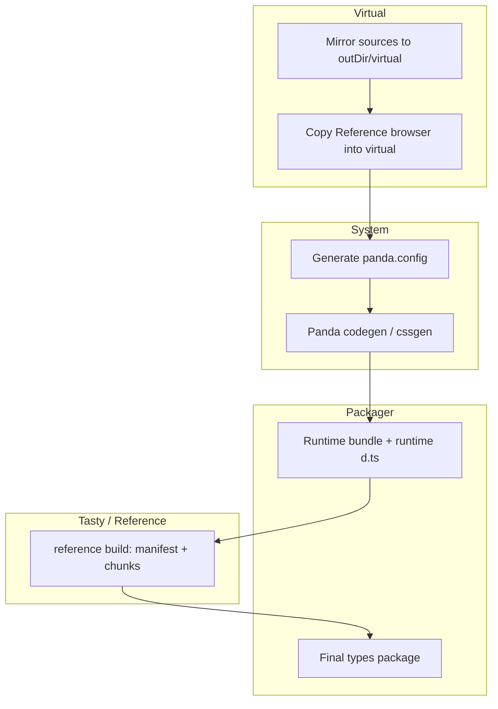

# Reference UI — deep orientation

This document is a **long-form map** of what Reference UI is, how the major subsystems connect, and where to look in the tree. It is written for engineers (and agents) who need more than a README tagline.

If you only need the short version, start with the root [README.md](./README.md) and the package READMEs linked at the end.

The **reference-core internals** are merged from two repo docs: **[docs/Architecture.md](./docs/Architecture.md)** (**§23** — per-file tree, innovations, quick reference) and **[docs/STRUCTURE.md](./docs/STRUCTURE.md)** (**§24** — three-layer build diagram, declarative API table, eval + microbundle **closure** example, design principles, contributor workflow). Both use historical `src/cli/` / `src/styled/` paths; **§23.1** / **§24** call out where those ideas live after refactors (`system/panda/config/`, `lib/fragments/`, `sync/`, `reference-lib` theme, etc.).

**Native analysis and transforms** live in **[packages/reference-rs](./packages/reference-rs/)** (`@reference-ui/rust`, Rust crate **`reference-virtual-native`**)—see **§25** for the crate layout, N-API surface, Oxc-based modules (Atlas, Tasty, Styletrace, virtualrs), and how that package relates to the rest of this file (**§12–§16**).

---

## 1. What this project is (in one paragraph)

**Reference UI** is a **chainable design system CLI** (`ref` in `@reference-ui/core`) that **compiles** a consumer’s `ui.config.ts` and source into **generated packages** (React, styled system, types, and more) under a configurable output directory (default **`.reference-ui`**). The same build produces **native-backed analysis** (`@reference-ui/rust`) and a **Model Context Protocol** server (`ref mcp`) that exposes **your project’s** real component inventory and types—not a hand-curated catalog from our docs.

The “**AI era**” angle is not marketing fluff: the stack is designed so that **machines and humans read the same artifacts**—generated types, Tasty chunks, Atlas usage, and Styletrace rules all trace back to the same sources of truth the runtime uses.

---

## 2. Monorepo map (what lives where)

| Path | Role |
| --- | --- |
| `packages/reference-core` | `ref` CLI, `ref sync` orchestration, virtual FS, event bus, system workers, packager, Vite/Webpack integration, MCP implementation. |
| `packages/reference-lib` | First-party design system built on the generated surface (dogfood for the product). |
| `packages/reference-docs` | Vite docs site; often used as the `cwd` for MCP in this repo so `ui.config.ts` matches the site. |
| `packages/reference-unit` | Local app for validating generated runtime behavior. |
| `packages/reference-e2e` | Playwright tests; **what** is tested per matrix entry (Dagger owns **where** it runs for matrix flows). |
| `packages/reference-rs` | **`@reference-ui/rust`** — Rust crate `reference-virtual-native`, napi-rs `.node` binary `virtual-native`, Oxc-based **Atlas / Tasty / Styletrace / virtualrs**; see **§25** (and **§12–§16** for how core uses it). |
| `packages/reference-icons` | Icon package (decoupled / release-focused; see its README). |
| `fixtures/*` | Consumer-style fixtures, including `extend-library` and `layer-library` for composition tests. |
| `matrix/*` | Matrix scenario packages (install/TypeScript stories) discovered by the pipeline. |
| `pipeline/` | Dagger graph, **Verdaccio** staging, pack → load → test flows, **matrix** bootstrap. |
| `docs/` | **reference-core story** — [STRUCTURE.md](./docs/STRUCTURE.md) (three layers, API table, microbundle pattern); [Architecture.md](./docs/Architecture.md) (file map); also `CORE.md`, `LAYERS.md`, `SIZE.md`, `RELEASE.md`, etc. **§23–§24** in this file fold both in with current paths. |

Root scripts (`pnpm dev`, `pnpm build`, `pnpm test`, `pnpm test:rust`, …) tie these together; see the root [README.md](./README.md).

---

## 3. Design system surface (user-facing API philosophy)

The **docs site** and `docs/docs.md` describe the public contract at a high level. In short:

- **Typed HTML primitives** — e.g. `Div`, `Span`, `A`—not abstract “layout” components like `Box` / `Text` with an `as` prop. The intent is a **shallow, predictable** element tree that matches the DOM and compiles to **zero-runtime CSS** for most styling.
- **Style props** map to **compile-time** CSS through Panda; unsupported CSS features are **intentionally** absent where they would break the model.
- **Tokens, `css()`, recipes, patterns** — the **system** package is the generated home for design tokens and runtime helpers; `baseSystem` + `extends` / `layers` are how **multiple systems compose** without copy-paste.

This is the “knowledge-first” story: the **same** tokens and types you import are what Tasty, Styletrace, and MCP can reason about.

---

## 4. The mental model: compiler + orchestrator, not a dev server

- **`ref sync`** is the main build. It is **not** a long-lived design-server process; it **runs a dependency graph of workers and events** until `sync:complete` (or `sync:failed`).
- **Watch mode** (`ref sync --watch`) reuses the same graph but keys incremental work off **virtual filesystem** change events, not raw file watches only.
- **Generated output** is written under `outDir` (default `.reference-ui`): virtual mirror, Panda output, packaged `@reference-ui/*` facsimiles, Tasty manifest and chunks, MCP model, etc.
- **Bundlers** (Webpack plugin, Vite integration) can **watch** and **refresh** sync sessions so app dev servers stay aligned with generated files—see `packages/reference-core/src/vite/` and `src/webpack/`.

---

## 5. `ui.config.ts`: the control surface (what you can configure)

`ReferenceUIConfig` in `packages/reference-core/src/config/types.ts` is the public contract. Highlights:

| Field | Purpose |
| --- | --- |
| `name` | **Required.** Design-system identity (CSS `@layer`, `data-layer` on primitives). |
| `include` | Globs of files to scan for Panda extraction; also drives **codegen copy** for isolation. |
| `extends` | Optional `BaseSystem[]` — upstream **token/fragment** systems merged **before** your own (portable `baseSystem` from other packages). |
| `layers` | Optional `BaseSystem[]` — upstream **component CSS** in an isolated cascade **layer**; **tokens from upstream do not** merge into your Panda config or TS types. |
| `jsxElements` | Extra JSX tag names for discovery when static tracing cannot infer them (e.g. generated surfaces). |
| `outDir` | Output root (default `.reference-ui`). |
| `normalizeCss` | Toggle normalize CSS reset (default `true`). |
| `useDesignSystem` | Opt into the built-in design system pieces (default `true`). |
| `debug` | Verbose logging. |
| `mcp` | **Separate** from `include`: `mcp.include` / `mcp.exclude` are **only** for Atlas when building the MCP model—so you can point inventory at app code without changing Panda’s scan. |
| `skipTypescript` | Skip tsup declaration emit in test-only scenarios. |

**`extends` vs `layers` in practice**

- Use **`extends`** when you want a real **shared token + fragment** relationship (design tokens, recipes, patterns) from another Reference-built package.
- Use **`layers`** when you need **another system’s look** (CSS) without polluting your **token namespace** or generated types—typical for **stacking** third-party or internal libraries where you do not want their semantic tokens in your API.

`packages/reference-core/src/system/panda/config/README.md` and `src/system/css/README.md` document how Panda config generation consumes `baseSystem` and how **ordering** works when both `extends` and `layers` participate.

---

## 6. `ref` commands (CLI surface)

| Command | Role |
| --- | --- |
| `ref` / `ref sync` (default) | Full sync: virtual tree → system config → Panda → packager → reference (Tasty) → final types package. Uses workers and the event bus. |
| `ref clean` | Deletes the output directory (`outDir`); **main thread only**; use before tests for a cold state. |
| `ref mcp` | Starts the MCP server: **stdio** (editors) or **HTTP** (`--transport http`) for debugging. Runs in the **CLI process**; the heavy MCP artifact build can use a **child process** (see below). |

Editor integration: prefer `node` + the built CLI path; do not assume `pnpm` exists on the host `PATH` for MCP spawns. Examples live in [packages/reference-core/README.md](./packages/reference-core/README.md).

---

## 7. The `ref sync` pipeline: phases and why order matters

Orchestration is **declarative** in `packages/reference-core/src/sync/events.ts` (not buried inside workers). The comments in that file are the canonical story; the following is a merged summary.

### 7.1 Phase list (happy path)

1. **Worker readiness** — Multiple workers must publish `*:ready` (e.g. `virtual:ready`, `reference:ready`, `packager:ready`, `system:config:ready`, `system:panda:ready`) before the graph unlocks.
2. **Virtual copy: all** — After `virtual:ready` and `reference:ready`, emit `run:virtual:copy:all` to mirror sources into `outDir/virtual` (synthesized workspace).
3. **Reference component into virtual** — `virtual:copy:complete` triggers `run:reference:component:copy` so the **in-browser `Reference` sources** are copied into the virtual tree; that matters because downstream tooling resolves imports against the **virtual** tree.
4. **Virtual complete barrier** — `virtual:complete` is the line after which **config, Panda, and reference** may assume a coherent virtual project.
5. **Watch** — `watch:change` maps to `run:virtual:sync:file` (per-file), feeding `virtual:fs:change` and `virtual:fragment:change`.
6. **System config** — First config build waits for `virtual:complete` and the config worker. Fragment-only changes can trigger **config + Panda** without a full reference rebuild to avoid HMR noise (`virtual:fragment:change` → `run:system:config` only after first completion).
7. **Panda** — After `system:config:complete` and the Panda worker: `run:panda:codegen` (and fast css-only paths in watch).
8. **Runtime packager** — After `system:panda:codegen`, the **runtime bundle** must run so that imports like `@reference-ui/react` exist as **real directories** the reference build can resolve.
9. **Runtime TypeScript** — `packager:runtime:complete` → `packager-ts:runtime:requested`. **Critical:** the reference (Tasty) build must not run until **runtime `.d.mts` / declaration surfaces** exist, or re-exported symbols (e.g. `SystemStyleObject`) vanish from the generated manifest. The `sync/events.ts` comment block spells this out explicitly.
10. **Reference / Tasty build** — Once `VIRTUAL_COMPLETE` and `packager-ts:runtime:complete`, emit `run:reference:build`.
11. **Final `@reference-ui/types` pack** — After `reference:complete`, `run:packager:bundle` and the closing declaration pass; ends with `packager-ts:complete` → `sync:complete`.
12. **MCP** — **Not** part of `ref sync`. `ref mcp` loads or builds the component model in **its own process** via `loadOrBuildMcpArtifact` / `createMcpModelState`.

### 7.2 Failure fan-in

`sync:failed` is emitted on any of: `system:config:failed`, `system:panda:codegen:failed`, `virtual:failed`, `packager-ts:failed`, `reference:failed`, `mcp:failed`, or `reference:component:copy-failed`.

### 7.3 Diagram (high level)



---

## 8. Virtual filesystem (`outDir/virtual`)

**Why a virtual tree exists**

- Panda and downstream tools get a **stable, isolated** copy of the user’s sources (and the mirrored Reference browser) so path resolution and codegen are **reproducible** without mutating the user’s original tree.
- Watch mode can apply **surgical** updates: `run:virtual:sync:file` and fragment-level invalidation.
- The **packager and reference** builds resolve the same layout that the rest of the pipeline sees—avoiding “it works in the app but not in the analyzer” drift.

Paths are resolved with helpers in `packages/reference-core/src/lib/paths/` (e.g. `getOutDirPath`, `getVirtualDirPath`).

---

## 9. System layer: `baseSystem`, Panda, and CSS

- **`system/base`** prepares the portable `baseSystem` **fragment** bundle, writes `baseSystem.mjs` / `baseSystem.d.mts`, and hands the **collector** bundle to Panda config generation. **`baseSystem` is a Reference UI contract**, not an opaque Panda handwave—see [packages/reference-core/src/system/base/README.md](./packages/reference-core/src/system/base/README.md).
- **Panda** runs in a worker: codegen, then cssgen; watch can take a **fast CSS-only** path.
- **Layer postprocessing** updates `baseSystem.css` with a **layer-safe** representation when `layers` participate—so cascade order stays explicit and testable. Deep detail: [packages/reference-core/src/system/css/README.md](./packages/reference-core/src/system/css/README.md) and [RELEASE_READY.md](./packages/reference-core/src/system/RELEASE_READY.md) in the same area.

---

## 10. Multi-threading: Piscina workers and `workers.json`

Workers are **discovered** from `packages/reference-core/workers.json` and built as separate bundles (see `src/lib/thread-pool/worker-entries.ts` + tsup). Current entries:

| Key | Source file | Typical responsibility |
| --- | --- | --- |
| `watch` | `src/watch/worker.ts` | Watches user sources; emits `watch:change`. |
| `virtual` | `src/virtual/worker.ts` | Virtual copy + FS events. |
| `reference` | `src/reference/bridge/worker.ts` | Reference build bridge; copies browser into virtual; `run:reference:build`, etc. |
| `config` | `src/system/workers/config.ts` | Write `panda.config.ts` from fragments. |
| `panda` | `src/system/workers/panda.ts` | Panda codegen / cssgen. |
| `packager` | `src/packager/worker.ts` | Package runtime and final bundle orchestration. |
| `packager-ts` | `src/packager/ts/worker.ts` | TypeScript / declaration generation coordination. |
| `mcp` | `src/mcp/worker/worker.ts` | Worker-side MCP support (the **stdio/HTTP** server still runs in the main CLI—see [packages/reference-core/src/mcp/server/README.md](./packages/reference-core/src/mcp/server/README.md)). |

**Contract:** each worker is **event wiring only**—`on('run:…')`, do work, `emit('…:complete')`, return `KEEP_ALIVE` from `src/lib/thread-pool`. **Business rules for sequencing** live in `sync/events.ts` and `sync/events.utils.ts`, not inside the worker body.

To add a worker: implement `src/.../worker.ts`, add to `workers.json`, register init and events (see [packages/reference-core/src/system/workers/README.md](./packages/reference-core/src/system/workers/README.md) and the root core README’s workers section).

---

## 11. Event bus: `BroadcastChannel` and typed envelopes

Location: `packages/reference-core/src/lib/event-bus/`.

- **Transport:** a single `BroadcastChannel` (see `channel/wire.ts` for `BUS_CHANNEL_NAME` and the envelope type `bus:event`). **All threads** that import the bus participate—main and worker threads.
- **API:** `emit`, `on`, `once`, `off`, `onceAll`, `initEventBus`. Typed events are keyed off the central `Events` map in `src/events` (or equivalent). Empty-payload events omit the payload in `emit`.
- **Local dispatch:** `emit` also dispatches to same-thread listeners immediately via `dispatchBusEnvelope`—so you get **both** in-process and cross-thread delivery.
- **Not guaranteed:** message ordering across bursts, durable replay, or process-level semantics beyond Node’s `BroadcastChannel`—documented in the module README.
- **Logging:** `initEventBus()` can enable **structured bus logging** when the project’s `debug: true` is set (config described in the event-bus README).

This bus is how **Piscina workers** stay coherent without a bespoke IPC protocol for every feature.

---

## 12. `@reference-ui/rust`: native layer and JS entrypoints

Package: `packages/reference-rs/`. The Rust crate builds as a **Node-API** (napi-rs) **`.node`** shared library plus optional **rlib** for tests. TypeScript in `js/` loads the correct binary per **OS/arch** (`js/runtime/loader.ts`).

| Subpath (export) | Responsibility |
| --- | --- |
| `@reference-ui/rust` | Core native exports + loader helpers. |
| `@reference-ui/rust/atlas` | `analyze` / `analyzeDetailed` over the Rust engine. |
| `@reference-ui/rust/tasty` | Tasty **runtime** (graph API, browser helpers, chunk loading). |
| `@reference-ui/rust/tasty/build` | Emit and filesystem glue for the build. |
| `@reference-ui/rust/tasty/browser` | `createTastyBrowserRuntime` and related. |
| `@reference-ui/rust/styletrace` | Style surface analysis. |

`analyzeDetailed(cwd, config?)` **normalizes** the config JSON with `rootDir: <resolved cwd>` before calling native `analyzeAtlas`, so per-call overrides merge predictably. When **no** `mcp.include` / `mcp.exclude` is set, `getAtlasMcpConfig` returns `undefined` and Atlas uses its default scoping; when set, the MCP pipeline passes **only** those selectors to Atlas, independent of Panda’s `include`.

**Targets:** the package lists napi-rs targets in its `package.json` (e.g. Apple and Linux GNU). The **matrix** pipeline asserts that a **Linux** native tarball exists for the same version as `@reference-ui/rust` when running containerized tests—see §21.

**Deeper dive** (crate name, all `#[napi]` entrypoints, Oxc stack, `virtualrs`, build/test): **§25**.

---

## 13. Atlas: React/TSX inventory and usage

**Questions Atlas answers** (from [packages/reference-rs/js/atlas/README.md](./packages/reference-rs/js/atlas/README.md)):

- Which exported React components exist?
- What **named props type** does each map to (when resolvable)?
- How are components **used** in JSX (counts, literal prop summaries, examples, `usedWith` co-occurrence)?

**Scope boundaries** are explicit: function components, default exports, barrel re-exports, namespace imports—**not** full type-level metaprogramming. Failures show up as **diagnostics** (e.g. `unresolved-props-type`, `unresolved-include-package`) rather than silent guesswork.

Atlas is the **spine of “what is actually in this repo’s JSX”** for MCP. It does **not** replace Tasty: it **identifies** the interface, Tasty **enriches** the shape.

---

## 14. Tasty: type graph, emission, and chunk loading

**Role:** Rust (OXC) parses TypeScript, resolves symbols, lowers types to a `TypeRef` IR, and **emits**:

- A **small manifest** module: version, `symbolsByName`, `symbolsById`, and per-symbol **chunk id** and library flags.
- **Chunk modules** holding full symbol payloads—loaded **lazily** in JS.

**Why chunks**

- Large design systems can have **huge** type surfaces. Eagerly loading every symbol in one bundle would bloat the browser and slow IDE tooling.
- The **chunk loader** (`packages/reference-rs/js/tasty/internal/chunk-loader.ts`) **deduplicates** concurrent loads: one `import()` per resolved path, cached as a `Promise` in a `Map`.

**Object-like projection** (for docs, MCP, API tables)

- Tasty preserves a **canonical graph** but can expose a **bounded object-like view** of complex aliases when flattening is safe; otherwise it **falls back** to raw or linked definitions (see the Tasty README’s “Object-Like Projection” and “What Raw Means” sections).
- `FIRST_CLASS_TYPES.md` in the Tasty tree discusses treating **`type` aliases** as first-class documentation symbols.

**Re-exports and `node_modules`**

- Tasty does **not** slurp all of `node_modules`; it follows user **re-exports** into packages when the user opts in via re-export surface (see the “Scan Boundary” section of the Tasty README).
- The JS **runtime** in `js/tasty` is the **lazy** consumer of emitted assets; the **contract** starts in Rust.

**Bridge into `@reference-ui/types`**

- The packager postprocess **rewrites** a placeholder in the types bundle to **`import('./tasty/runtime.js')`** so esbuild and **app bundlers** retain a **real dynamic import** edge; without that rewrite, the Tasty runtime and **chunk graph** could be left out of production builds ([packages/reference-core/src/packager/postprocess/rewrite-types-runtime-import.ts](./packages/reference-core/src/packager/postprocess/rewrite-types-runtime-import.ts)).

---

## 15. Styletrace: which components “count” as Reference-styled

**Inputs it respects**

- **Primitive names** come from the **same** generated source as the runtime: `packages/reference-core/src/system/primitives/tags.ts` (not a duplicated hand list).
- **Style prop names** are derived from the public `StyleProps` type in `packages/reference-core/src/types/style-props.ts` via the **Oxc-based resolver**—import chasing, mapped types, indexed access, intersections, and common utility wrappers.

**What it does**

- Finds exported components whose public props include style props, then **walks JSX** for forwarding patterns: explicit props, rest spreads, local wrappers, barrels, `export *` fan-out, namespace and default import paths, and factory components—**including into `node_modules`** when package resolution can follow a style contract back to Reference primitives or the `splitCssProps` / `box` / `css` pipeline.

So Styletrace is the **semantic “this wrapper is still a Reference-styled boundary”** layer, complementary to Atlas’s “this component exists” layer.

---

## 16. MCP: dynamic model, build graph, and tools

### 16.1 Artifact locations (under `outDir`)

| Path | Content |
| --- | --- |
| `types/tasty/manifest.js` | **Required** for MCP build. If missing, `generateMcpArtifact` throws and tells you to run `ref sync` first. |
| `mcp/model.json` | Written artifact: **full** MCP build output (schema version, workspace root, manifest path, Atlas diagnostics, sorted components). |

`getMcpModelPath` / `getMcpTypesManifestPath` live in `packages/reference-core/src/mcp/pipeline/paths.ts`.

### 16.2 How the model is built

1. **Prefetch Atlas** — `prefetchMcpAtlas` dedupes by serialized `mcp` config; repeated calls in one process hit the same `analyzeDetailed` promise.
2. **Tasty side** — For each Atlas component, if `interface.name` is set, `loadMcpReferenceData` uses the Tasty **API** (`createReferenceApi` from manifest) to load the symbol, members, JSDoc, **related symbols**, **extends** chains, and **member origin** mapping—same conceptual work as the browser `Reference` viewer, specialized for MCP JSON.
3. **Join** — `joinMcpComponentWithReference` merges:
   - Atlas: usage counts, examples, per-prop usage stats, `usedWith`.
   - Tasty: `type` strings, descriptions, optional/readonly, defaults.
   - If Tasty has **documented** props Atlas never saw in JSX, they appear as **`documentedOnlyProps`** with `usage: 'unused'` (see [packages/reference-core/src/mcp/pipeline/join.ts](./packages/reference-core/src/mcp/pipeline/join.ts))—so **docs stay honest** about “never observed in the repo”.

### 16.3 `createMcpModelState` and warm start

From `packages/reference-core/src/mcp/server/index.ts`:

- If `model.json` **exists** on disk: read it **immediately** (keeps tools responsive), then **schedule a background** rebuild in a child process; when done, **replace** the in-memory artifact.
- If no cache: **block** on a full child-process build before serving.
- On background failure: log a warning; the last good in-memory (or on-disk) model remains in use where possible.

So the MCP is **not** a static file checked into git for your app: it is **rebuilt** from the **current** tree + **current** Tasty output.

### 16.4 Exposed tools and resource

| Tool / resource | Purpose |
| --- | --- |
| `list_components` | Search/filter list with optional `query`, `source`, `limit` (capped at 100). |
| `get_component` | Full joined record for one component name (optional `source` disambiguation). |
| `get_component_examples` | Examples from Atlas. |
| `reference-ui://component-model` (resource) | Public JSON model (schema version, `generatedAt`, `components`—via `toPublicModel`). |

Server version field is currently `0.0.3` in source; the description states Atlas + generated types backing.

### 16.5 Transports

- **Stdio** — `runReferenceMcpServer` for editor MCP clients.
- **HTTP** — `runReferenceMcpHttpServer` with a small Node `http` server, streamable transport, JSON body per request, fixed path (see `DEFAULT_REFERENCE_MCP_PATH` in the same module). Useful for local debugging and curl-style inspection.

**Process model:** the MCP **SDK** server and transports run in the **CLI process**; heavy work uses **`spawnMcpBuildChild`** under `mcp/worker/child-process/` to avoid blocking the process that holds stdio (details in the child-process README in that tree).

### 16.6 Sync vs MCP

`sync/events.ts` states it plainly: **MCP does not block `ref sync`**. They share generated inputs (you need **`ref sync`** to produce the types manifest) but **different lifecycles**.

---

## 17. The `Reference` React component (browser) and Tasty

Files: `packages/reference-core/src/reference/browser/` (e.g. `Reference.tsx`, `Runtime.ts`).

- **`createReferenceComponent`** — Loading states, error UI, and document rendering; uses `useReferenceDocument`.
- **Runtime** — `createDefaultReferenceRuntime` builds a `TastyBrowserRuntime` with:
  - `loadRuntimeModule: () => import('__REFERENCE_UI_TYPES_RUNTIME__' as string)` — a **build-time placeholder** the packager rewrites to `./tasty/runtime.js` so the consumer bundle can **split** the Tasty runtime.
  - `apiOptions: getReferenceUiTastyBrowserApiOptions()` — prefers `@reference-ui/react`, `@reference-ui/system`, `@reference-ui/types` for scoping, and custom **generic parameter projection** for the `P` type parameter to **`SystemProperties`** from those libraries (see [packages/reference-core/src/reference/tasty/api.ts](./packages/reference-core/src/reference/tasty/api.ts)).
- **Data path** — `loadSymbolByName`, `getDisplayMembers`, extends chain and member origins, related symbol graph—mirroring what MCP needs server-side, but in React for human-readable docs in an app.

---

## 18. Packager and TypeScript pipeline (why two steps)

- **Runtime package(s)** are bundled so the **reference** and Tasty analysis can `import` generated React and system types **as consumers do**.
- **TypeScript workers** (packager-ts) run **orchestrated** declaration passes: the sync graph enforces that **runtime declarations finish before** the reference build, and the **final** pass completes after the reference build so `@reference-ui/types` contains the **Tasty** artifacts.

`packages/reference-core/src/packager/ts/README.md` and `src/packager/README.md` document the package definitions and the division of responsibility.

---

## 19. Webpack and Vite integration (short)

- The **Webpack plugin** hard-aliases `react`, `@reference-ui/*`, and `@reference-ui/system/baseSystem` into the project’s `node_modules`, clears unsafe caches, and **starts** sync session refresh and managed-output watch hooks—so the app rebuild sees **fresh** generated files.
- Vite lives under `packages/reference-core/src/vite/`.

---

## 20. Pipeline, Verdaccio, and “test what you ship”

**Problem** Reference UI solves: failures often appear only **after** `npm pack` / public registry semantics, not in workspace `pnpm` links.

**Registry module** — `pipeline/src/registry/` (split into `index`, `paths`, `runtime` (Verdaccio lifecycle), `package-prep` (workspace → version rewrite), `pack`, `load`, `manifest`).

**Typical local flow**

1. `pnpm build` (through the pipeline) produces built workspace artifacts.
2. `pnpm pipeline:registry:pack` (or the repo’s equivalent) materializes **publish-shaped** tarballs.
3. `pnpm pipeline:registry:start` runs Verdaccio.
4. `pnpm pipeline:registry:stage:local` loads those tarballs into the local registry with a **manifest** describing names, versions, paths, and hashes.

**Why:** staging copies packages to `.pipeline/registry/staging/`, rewrites **`workspace:`** to concrete versions, strips `private` where needed, and runs `pnpm pack`—matching **real npm** behavior as closely as practical. Downstream test installs pull from the **same** artifact set release would promote.

Full narrative: [pipeline/src/registry/README.md](./pipeline/src/registry/README.md) and [pipeline/Vision.md](./pipeline/Vision.md).

---

## 21. Dagger matrix bootstrap (containerized install + `ref sync` + tests)

Implementation: [pipeline/src/testing/matrix/run.ts](./pipeline/src/testing/matrix/run.ts) (also summarized in [pipeline/src/testing/matrix/README.md](./pipeline/src/testing/matrix/README.md)).

**At a high level**

1. **Validate** matrix fixtures and **discover** packages via `matrix.json` and workspace metadata (`listMatrixWorkspacePackages`).
2. **Build** and stage workspace packages with `buildWorkspacePackages` — may require **`linux-x64-gnu`** native artifacts; if the registry manifest lacks the matching per-target package at the same version as `@reference-ui/rust`, the runner **throws** with an explicit message (host-side staging must have produced the Linux `.node` tarball first).
3. **Read** the **shared** host Verdaccio manifest; fingerprint it for a **Dagger pnpm store cache** key so repeated runs reuse dependency downloads.
4. **Node container** — e.g. `node:24-bookworm`, pnpm from Corepack, env vars for `CI`, registry URL inside the graph.
5. **Service binding** — Verdaccio runs on the **host**; Dagger **forwards** it as a service (`dag.host().service(…)`) at `managedRegistryHost:managedRegistryPort` so the container uses **`npm_config_registry`** / `pnpm install --registry` consistently with the same manifest the host published.
6. For each matrix package: write `/consumer` (see `consumerDirInContainer` in [pipeline/config.ts](./pipeline/config.ts)) `package.json` (synthesized from the fixture + pinned `@reference-ui/core` and `@reference-ui/lib` versions), `tsconfig`, `ui.config.ts`, and fixture `src`/`tests` files; **`pnpm install` from the registry**; run **`pnpm exec ref sync`**; then **`pnpm test`**.
7. **Logs** land under **`.pipeline/testing/matrix/`** with per-package, per-stage filenames (`-install.log`, `-ref-sync.log`, `-test.log`).

**macOS:** if Docker uses Colima, `ensureContainerRuntime` can start the VM when needed (see the matrix README).

**Separation of concerns** — Dagger handles **isolation, caching, and registry plumbing**; Playwright and assertion logic remain in **`reference-e2e`** for true browser scenarios (matrix README calls this out explicitly). This bootstrap is **package-install + CLI + project tests in Linux**, which catches a different class of issues than in-repo workspace tests alone.

---

## 22. Testing layers (not exhaustive)

| Layer | Catches… |
| --- | --- |
| `packages/reference-core` unit tests (Vitest) | Event bus, path helpers, sync helpers, many pure modules. |
| `packages/reference-rs` (Rust + Vitest) | Parser and emitter semantics, Tasty case suites, Styletrace, Atlas. |
| `reference-e2e` | Browser-level regressions, Playwright. |
| `reference-unit` | App-shaped dogfood. |
| Pipeline unit tests | `pnpm pipeline:test:pipeline` for registry and graph helpers. |
| Matrix (Dagger) | Packaged **install** + **`ref sync`** in clean Linux + project tests. |

---

## 23. Appendix: `reference-core` meaty map (from [docs/Architecture.md](./docs/Architecture.md) + current tree)

The content below is **synthesized and expanded** from the long-form **reference-core architecture map** in the repo. That document’s paths are written relative to **`packages/reference-core/src/`** (it says `src/`). The monorepo has **evolved**: orchestration is **`src/index.ts` + `src/sync/`** (not `cli/commands/sync.ts`), Panda config and extensions live primarily under **`src/system/panda/config/`** (not only under a top-level `cli/panda/`), and **build-time collection** also flows through **`src/lib/fragments/`** (see its README: it supersedes older `extendPandaConfig` + `runEval` patterns in many places). First-party **theme/animation** source that looks like the “styled/theme” table often lives in **`packages/reference-lib/src/core/theme/`** in this repo, while **reference-core** owns **generation**, **Panda wiring**, and **primitives** under `src/system/`.

When a row below still says `cli/…` or `styled/…`, read it as the **architectural role**; use the **drift** table to open the right file today.

### 23.1 Path drift: Architecture.md → current reference-core

| Documented in Architecture.md | Typical location in the tree *now* |
| --- | --- |
| `cli/index.ts` | `packages/reference-core/src/index.ts` (Commander entry; `dist/cli/index.mjs`) |
| `cli/commands/sync.ts` | `packages/reference-core/src/sync/` (`runSync`, `bootstrap`, `events.ts`) |
| `cli/eval/*` (scanner, runner, registry) | `packages/reference-core/src/lib/fragments/` (collectors, `collectFragments`, `createFragmentCollector` — see [fragments README](./packages/reference-core/src/lib/fragments/README.md)) |
| `cli/panda/config/*`, `createPandaConfig` | `packages/reference-core/src/system/panda/config/` (`create.ts`, `init.ts`, `extensions/`, `liquid/`) |
| `cli/panda/boxPattern/*` | Logic absorbed into **extensions** and box pattern under `system/panda/config/extensions/` and related `system/build` inputs |
| `cli/panda/fontFace/*` | `system/panda/config/extensions/api/font.ts`, `extendFontFaces.ts`, etc. |
| `cli/panda/gen/runner.ts` | `packages/reference-core/src/system/panda/gen/` |
| `styled/*` (theme, api, props) | **Build-time** inputs: `system/build/styled/`, `system/panda/config/extensions/api/`; **first-party** library: `reference-lib/src/core/theme/`; **generated** output ultimately lands in the **packaged** `@reference-ui/system` and friends under `outDir` |
| `primitives/*` | `packages/reference-core/src/system/primitives/` (`tags.ts`, `index.tsx`, `createPrimitive` flow via `system/build/primitives/`) |
| `src/system/` → `styled-system/` | Generated/staged output; consumer sees `.reference-ui` + `node_modules/@reference-ui/*` after sync |

### 23.2 Full `src/` tree (as in Architecture.md)

The block below is the **complete** file-structure map from Architecture.md (§“File Structure Map”). It is the **meatiest** single view of how the original design split **CLI / styled / primitives / system**. Treat filename lines as a **checklist of responsibilities**; if a file is not found at that path, search by **basename** under `packages/reference-core/src/` (or read §23.1).

```
src/
    Architecture.md          - Upstream doc (lives in repo docs/ in monorepo)

    cli/
        index.ts               - CLI entry (see drift: now src/index.ts)
        commands/
            link-system.ts       - Symlink generated system
            sync.ts              - Main build (see drift: now src/sync/)
        config/
            index.ts             - Config loader exports
            load-config.ts       - Load ui.config.ts
        eval/
            index.ts             - Eval exports
            readme.md            - Eval system docs
            registry.ts          - Function name registry
            runner.ts            - Bundle + execute discovered config
            scanner.ts           - File scanner for registered calls
        internal/
            link-local-system.ts
        lib/
            microBundle.ts       - esbuild wrapper
            run-generate-primitives.ts
        panda/
            boxPattern/          - collect → bundle → generate box pattern
            config/              - createPandaConfig, extendPandaConfig, deepMerge
            fontFace/            - font system from extendFont
            gen/                 - Panda codegen runner, CVA notes
        workspace/
            copy-to-node-modules.ts
            resolve-core.ts

    entry/
        index.ts                - Package exports (see package `exports` + src/public.ts)

    primitives/
        createPrimitive.tsx     - Primitive factory
        index.tsx               - Exports primitives
        recipes.ts
        tags.ts                 - HTML tag list (Styletrace reads generated/tags story)
        types.ts
        css/                    - Per-element default styles (h1…h6, p, code, …)

    styled/
        css.global.ts           - Global CSS defaults
        css.static.ts
        index.ts
        patterns.d.ts
        animations/             - fade, slide, bounce, spin, attention, scale
        api/                    - public + internal extend* (tokens, recipe, pattern, …)
        font/                   - fonts.ts, generated font.ts
        props/                  - box, r, container, font
        rhythm/                 - r prop utilities, helpers
        theme/                  - colors, spacing, radii, animations tokens
        types/

    system/                   - Generated Panda output (symlink / mirror)
        helpers.js, package.json, styles.css
        css/ jsx/ patterns/ recipes/ tokens/ types/
```

### 23.3 reference-core package root (files & dirs)

Architecture.md’s “Project Root” table maps to **`packages/reference-core/`** in the monorepo. Current analogues:

| Artifact | Role |
| --- | --- |
| `package.json` | `bin: ref`, `mcp`; `exports` for `config`, `constants`; napi / build scripts. |
| `tsconfig.json` | TypeScript for the package. |
| `tsup.config.ts` | Bundles `src/index.ts`, workers, `mcp-child`, outputs `dist/cli/*.mjs`. |
| `project.json` | Nx task wiring. |
| `workers.json` | Piscina worker entry map (watch, virtual, panda, packager, mcp, …). |
| `panda.config.ts` at package root | **If present, generated** from the pipeline—not hand-edited in the long term. |
| `dist/` | **Built** CLI + workers (consumers use published `dist/` from npm). |
| `.panda/`, cache dirs | Panda / tool caches as configured. |

### 23.4 Eval → fragments: how build-time discovery works (concept from Architecture.md)

**Original model (Architecture.md, “Eval System”):**

1. **Registry** of discoverable function names (`extendPandaConfig`, etc.).
2. **Scanner** finds files calling those functions.
3. **Runner** bundles with esbuild, executes, reads **`globalThis`** collectors.
4. **Output:** merged config fragments for Panda.

**Current model (see `lib/fragments/`):** named collectors (`createFragmentCollector`), per-concern keys (no one `COLLECTOR_KEY` collision), `collectFragments` driving the same **build-time** idea—**discover, execute in isolation, merge**—for `baseSystem`, tokens, and Panda extension surfaces. The migration story is in [STYLED-SYSTEM-MIGRATION.md](./packages/reference-core/docs/STYLED-SYSTEM-MIGRATION.md) and the fragments plan/README.

### 23.5 Panda “microbundles” (config, box pattern, font) — roles

From Architecture.md, each microbundle followed **collect → bundle → execute → generate → output**. Today the **roles** are preserved under `system/panda/config/` and extensions:

| Microbundle (doc name) | Purpose | Notable outputs / notes |
| --- | --- | --- |
| **config** | Merge Panda config extensions | `panda.config.ts` path via `createPandaConfig`, `liquid` templates, `deepMerge` concepts |
| **boxPattern** | Unified box pattern, inline transforms (Panda does not capture closure vars in pattern transforms) | Extensions under `extensions/`, container + `r` + rhythm — see `extensions/r/`, `rhythm/` |
| **fontFace** | Font tokens, recipes, `@font-face` | `extendFontFaces` API files, font tests in config tree |
| **gen** | Run `panda codegen` / cssgen | `system/panda/gen/codegen.ts`, worker `system/workers/panda.ts` |

CVA import rewrite examples: Architecture points at `virtual/transforms`—the real transform layer for import hygiene is under **`packages/reference-core/src/virtual/transforms/`**.

### 23.6 Styled “domains” (theme, font, rhythm, props, animations, api)

Taken from Architecture.md’s **Styled System** section; these are the **authoring** buckets for a design system. In the monorepo, much of the **default** first-party content is implemented under **`packages/reference-lib/src/core/theme/`** (animations, colors, spacing, primitives, global), while **reference-core** provides the **machinery** (Panda extensions, `r` prop, container queries, pattern merges).

| Domain | What it holds (per Architecture.md) |
| --- | --- |
| **theme/** | Color, spacing, radii, animation *tokens* |
| **font/** | `extendFont`, generated `font.ts`, @font-face story |
| **rhythm/** | Vertical rhythm, `r` prop utilities ( Architecture highlights **container-first** `r={{ 320: {...} }}` ) |
| **props/** | Merged **box** pattern, `r`, `container`, `font` preset props |
| **animations/** | Keyframe modules (fade, slide, scale, spin, bounce, attention) |
| **api/** + **api/internal/** | `extendTokens`, `extendRecipe`, `extendPattern`, `extendUtilities`, `extendGlobalCss`, `extendStaticCss`, `extendGlobalFontface`, `extendKeyframes`, `extendFont` |
| **api/runtime/** | `css()`, recipe helpers re-exported for components |

**Global / static CSS:** `css.global.ts` (e.g. `:root`, body), `css.static.ts` (force specific utilities/recipes) — same concepts apply to generated global layers in the sync pipeline.

### 23.7 Primitives (Architecture.md + reference-core)

| File (doc) | Role | Current touchpoints |
| --- | --- | --- |
| `createPrimitive.tsx` | Factory for type-safe elements | `system/build/primitives/`, `system/primitives/index.tsx` |
| `tags.ts` | Authoritative tag list | **`system/primitives/tags.ts`** — also used by Styletrace for primitive identity |
| `primitives/css/*.style.ts` | Per-tag defaults | Paralleled by build-time / theme primitives in **reference-lib** and generated CSS; reference-core **generates** primitive surface for the design system |
| `recipes.ts` / `types.ts` | Recipes and prop types | Prop typing aligns with `StyleProps` in `src/types/` |

**Design rule (from Architecture + product):** many **HTML** elements, **no polymorphic `as` prop** on a fake `Box`—keeps types shallow and traceable (Styletrace depends on that).

### 23.8 Generated `system/` output (Panda runtime)

From Architecture.md — what lands in the **generated** design-system package (paths may be under `outDir` + `node_modules` after sync):

| Subdir / file | Role |
| --- | --- |
| `css/` | `css()`, `cx()`, atomic classes |
| `jsx/` | JSX factory, runtime `Box` (Panda’s box — distinct from “no Box” *primitive* policy in our public docs; know which layer you mean) |
| `patterns/`, `recipes/` | Pattern and recipe functions |
| `tokens/`, `types/` | Token values and TS |
| `styles.css` | Flattened static CSS |
| `helpers.js` | Runtime helpers |

### 23.9 Architecture flow diagram (from Architecture.md, with sync reality)

The upstream doc’s pipeline is **eval → microbundle → Panda → link**. The **monorepo** extends that with **virtual FS → workers → packager → reference (Tasty) → types** (see §7 of this file). Merged view:

```
User / library code (extend*, tokens, primitives, app JSX)
        ↓
  ref sync (index.ts + sync/* + workers)
        ↓
  Virtual mirror + system workers (config → Panda codegen/cssgen)
        ↓
  Packager: runtime packages + d.ts
        ↓
  Reference build (Tasty manifest + chunks) + final @reference-ui/types
        ↓
  Runtime: static CSS, generated packages, zero-runtime styling story
        ↓
  (Separate) ref mcp: Atlas + Tasty-enriched model.json
```

The **large ASCII diagram** in Architecture.md (CLI → eval → microbundles → Panda → `styled-system/`) is still **valid** for the **Panda half**; mentally **prefix** the graph in §7 of *this* file for the **full** product.

### 23.10 Key innovations (abridged from Architecture.md)

1. **Build-time discovery** — Register-and-collect config without shipping a second runtime registry (modernized through **fragments**).
2. **Microbundle / extension split** — Isolated features (config, box, fonts) with **merge semantics** and generated TS that Panda can consume; **box pattern** keeps transforms **inlined** where Panda cannot close over scope.
3. **Container-first responsive** — `r` prop and container query story (`styled/props/r.ts` in the doc; `system/panda/config/extensions/r/` in tree).
4. **Type-safe primitives** — One component per real element; **no** `as` prop soup on the *public* primitive story.
5. **Domain organization** — theme vs font vs rhythm vs props vs animations.
6. **Zero-runtime CSS** — Panda generates **static** CSS + **typed** API surface; no runtime style engine in the hot path for generated rules.

### 23.11 File-count scale (from Architecture.md)

| Category (doc) | ~Count | Notes |
| --- | ---: | --- |
| CLI / build | ~40 | Excludes many newer `mcp/`, `virtual/`, `reference/` files |
| Styled (conceptual) | ~35 | Split with reference-lib in practice |
| Primitives | ~30 | Plus build scripts |
| Generated | “100+” in `styled-system/` | Now also `outDir` + tarballs in pipeline tests |

**Total** in the low hundreds of *hand-written* source files for reference-core alone; **generated** output is much larger.

### 23.12 “I want to…” (quick reference, paths corrected)

| Goal | Start here (monorepo) |
| --- | --- |
| Change merge semantics for Panda config | `packages/reference-core/src/system/panda/config/create.ts`, `init.ts`, `extensions/` |
| Add rhythm / `r` behavior | `system/panda/config/extensions/r/`, `extensions/rhythm/` |
| Add container query props | `system/panda/config/extensions/container/` |
| Work on build-time collection | `packages/reference-core/src/lib/fragments/` |
| Change primitive tag set / codegen | `system/primitives/`, `system/build/primitives/` |
| Run codegen worker | `system/panda/gen/`, `system/workers/panda.ts` |
| First-party theme colors / animations | `packages/reference-lib/src/core/theme/` |
| Read the **full** per-file list | [docs/Architecture.md](./docs/Architecture.md) + **§23.2** above |

### 23.13 Future expansion (from Architecture.md conclusion)

The source doc lists **planned** microbundles (animation, theme switching, design-token export) and **tooling** (static analysis, visual regression, Storybook, perf benches). Treat those as **roadmap ideas**, not promises—check `docs/` and issues for what shipped.

### 23.14 Development workflow (from Architecture.md, updated)

1. **Edit** design tokens or components (e.g. under `reference-lib` or your app using Reference).
2. **`ref sync`** or **`ref sync --watch`** from the consumer package (with `cwd` set to the project with `ui.config.ts`).
3. **Pipeline inside core**: virtual + config + Panda + packager + reference + types (§7).
4. **Import** `@reference-ui/system/css`, `@reference-ui/react`, etc., from generated `node_modules` (or workspace links during dev).

Example import lines in Architecture.md (`Box` from system/jsx) illustrate **Panda’s** runtime `Box`—our **public** docs also stress **typed HTML primitives** for app code; know which API layer you are teaching.

For the **three-layer diagram**, **declarative API table**, **PRESETS / closure** example, and **design principles** in one place, continue to **§24** ([docs/STRUCTURE.md](./docs/STRUCTURE.md) merge).

---

## 24. Appendix: Three-layer build & [docs/STRUCTURE.md](./docs/STRUCTURE.md)

[docs/STRUCTURE.md](./docs/STRUCTURE.md) overlaps [Architecture.md](./docs/Architecture.md) on *what* reference-core is, but it is the clearest place for the **three-layer mental model**, the **full declarative API table** (`tokens()`, `recipe()`, …), the **microbundle** folder pattern, the **closure / inlining** example (why transforms must be self-contained for Panda), **five design principles**, and **contributor** workflow. Everything below is drawn from that doc; **path drift** matches **§23.1** (there is no longer a top-level `packages/reference-core/src/cli/eval/` or `src/styled/` in the form described—use `lib/fragments/`, `system/panda/config/`, `system/build/`, and `reference-lib` as appropriate).

### 24.1 Core capabilities (from STRUCTURE overview)

- **Zero-runtime CSS generation** via build-time collection and bundling
- **Type-safe styling API** on Panda CSS with custom extensions
- **CLI microbundle architecture** for extensible code generation
- **Multi-target output:** React components, Web components, and design tokens
- **Self-contained patterns** (work around Panda codegen limitations)
- **Single source of truth** for tokens, fonts, animations, and component styles

### 24.2 Primary outputs (generated packages)

1. **`@reference-ui/react`** — React surface with full TypeScript support  
2. **`@reference-ui/web`** — Web components (framework-agnostic)  
3. **`@reference-ui/system`** — Panda-powered design system: `css()`, patterns, recipes, tokens, global styles / theme

These are materialized into the consumer’s **`node_modules`** (or workspace links) after **`ref sync`**, not only as abstract package names.

### 24.3 The three-layer architecture (ASCII from STRUCTURE)

This is the **intended** dataflow for the **Panda / styled** slice of the product. The **full** `ref sync` graph (virtual FS, workers, packager, Tasty, types) is still **§7** in this file—think of the diagram below as the **middle** of that larger pipeline.

```
┌─────────────────────────────────────────────────────────────┐
│  User API Layer (styled/api/)                               │
│  • Declarative config: tokens(), recipe(), pattern(),        │
│    font(), keyframes(), utilities()                         │
│  • High-level, type-safe configuration                      │
└─────────────────────────────────────────────────────────────┘
                          ↓
┌─────────────────────────────────────────────────────────────┐
│  CLI Eval & Microbundle Layer (cli/)                        │
│  • Discovers and evaluates config calls                    │
│  • Microbundles: config/, boxPattern/, fontFace/            │
│  • Emits bundled TypeScript at build time                  │
└─────────────────────────────────────────────────────────────┘
                          ↓
┌─────────────────────────────────────────────────────────────┐
│  Panda CSS Layer (generated)                                │
│  • Merged panda.config.ts from fragments                    │
│  • Generated runtime (styled-system / outDir)               │
│  • Type-safe CSS-in-JS + optimized static CSS               │
└─────────────────────────────────────────────────────────────┘
```

### 24.4 Declarative styled APIs (table from STRUCTURE)

| API | Purpose | Typical use |
| --- | --- | --- |
| `tokens()` | Register design tokens | Colors, spacing, fonts, radii |
| `recipe()` | Single-part component styles | Button / badge variants |
| `slotRecipe()` | Multi-part component styles | Card regions |
| `pattern()` | Extend box pattern with custom props | Container queries, font presets |
| `font()` | All-in-one font system | Families, weights, @font-face |
| `utilities()` | Custom utility generators | Rhythm, truncation |
| `globalCss()` | Global styles | `:root`, body defaults |
| `staticCss()` | Force utility/recipe generation | Ensure classes exist |
| `globalFontface()` | @font-face rules | Web font loading |
| `keyframes()` | Animation keyframes | Motion presets |

*Implementation* of these extension points in the monorepo is split between **`system/panda/config/extensions/api/`** (Panda-facing `extend*`), **`system/build/styled/`**, and first-party **theme** code under **`packages/reference-lib/src/core/theme/`**—the table is the **authoring** contract, not a single directory listing.

### 24.5 Domain-based organization (conceptual `src/styled/`)

STRUCTURE.md groups authored design system code by **domain**:

```
src/styled/
├── api/          # tokens(), recipe(), pattern() infrastructure
├── theme/        # Core tokens (color, spacing, radii, …)
├── font/         # Typography
├── rhythm/       # Spacing / vertical rhythm
└── props/        # Pattern extensions (box prop surface)
```

**Today:** the same *concerns* appear in **`system/panda/config/extensions/`** (api, rhythm, r, container, size, …) and in **reference-lib**’s `core/theme/`. The diagram remains the right **mental** decomposition.

### 24.6 Eval system: how build-time discovery works (from STRUCTURE)

1. **Registry** — which function names participate in collection (legacy: `extendPandaConfig` and friends).  
2. **Scanner** — find files that invoke those entrypoints.  
3. **Runner** — bundle + execute with a **global collector** (esbuild-backed).  
4. **Collection** — capture config fragments.  
5. **Merge** — deep merge into a coherent Panda config (and related artifacts).

**Example (conceptual):** a `tokens({ colors: { brand: { value: '…' } } })` in theme source is discovered, executed in isolation, and merged into the eventual **`panda.config.ts`**. The **modern** implementation is **`lib/fragments/`** and related pipeline code—see [fragments README](./packages/reference-core/src/lib/fragments/README.md) and [STYLED-SYSTEM-MIGRATION.md](./packages/reference-core/docs/STYLED-SYSTEM-MIGRATION.md).

### 24.7 Microbundles: why they exist, folder shape, and the closure pitfall

**Why microbundles?** Panda’s codegen does **not** carry **closure** variables into generated pattern transforms. Transforms must be **self-contained** (constants **inlined** in the transform body).

**From STRUCTURE.md (canonical example):**

```typescript
// ❌ Doesn't work - PRESETS not in generated code
const PRESETS = { sans: {...} }
pattern({
  transform(props) {
    return PRESETS[props.font]  // ReferenceError at runtime
  }
})

// ✅ Works - inlined in transform body
pattern({
  transform(props) {
    const PRESETS = { sans: {...} }  // Serialized into generated code
    return PRESETS[props.font]
  }
})
```

**Microbundle directory pattern** (per feature: config, boxPattern, fontFace, …):

```
feature/
├── extendFeature.ts         # User / internal API; registers in globalThis
├── initFeatureCollector.ts
├── collectEntryTemplate.ts
├── generateFeature.ts
├── createFeature.ts
└── index.ts
```

**Execution flow:** collect → generate temp **entry** → `microBundle()` (esbuild) → **execute** → **generate** TypeScript → **write** committed outputs.

**Current mapping:** the **`config`**, **box/pattern**, and **font** responsibilities are implemented under **`system/panda/config/`** and **`system/build/`** rather than a literal `cli/panda/feature/` tree; the **invariants** (inline transforms, no stale closures) are unchanged.

### 24.8 Type safety & module resolution (from STRUCTURE)

- **Types follow generated code** — pattern props, token literals, responsive shapes, and recipe variants surface in JSX and `css()` with autocomplete.  
- **Module resolution** — in development, consumers resolve `@reference-ui/system` (and siblings) to the **generated** output under **`outDir`** and linked **`node_modules`**; published packages keep the same **export shape**. TypeScript should behave the same in both modes when sync has run.

### 24.9 `packages/reference-core/` tree (from STRUCTURE “Project structure”)

STRUCTURE.md includes a **nested** tree with `src/cli/`, `src/styled/`, `src/components/`, `src/entry/`, and generated `panda.config.ts` / `styled-system/`. It matches the **separation of concerns** in this appendix; the **current** on-disk shape is a **superset** (MCP, virtual, packager, `sync/`, etc.) and some subtrees are **reorganized** (see **§23.1**). Use the tree in STRUCTURE for **roles**, and **`packages/reference-core/src/***` for **reality** when in doubt.

### 24.10 Key design principles (from STRUCTURE)

1. **Zero-runtime performance** — CSS work at build time; inlined pattern transforms; deduped static output.  
2. **Type safety first** — generated types, compile-time validation, minimal “magic string” surface.  
3. **Composability** — small APIs that stack; pattern extensions fold into a unified **box** surface.  
4. **Build-time extensibility** — eval/fragments + microbundle-style **codegen** for new features.  
5. **Self-contained patterns** — no closure capture in pattern transforms; generated code remains readable and debuggable.

### 24.11 Development workflow (from STRUCTURE, path-updated)

**Users:** install `@reference-ui/core` → import base styles (`@reference-ui/system/styles.css`) → author tokens / components using the APIs in **§24.4** → **`ref sync`** (or watch) → import from `@reference-ui/*`.

**Contributors:** change system definitions or `reference-lib` theme → `pnpm` build the relevant package → run tests → commit. Generated outputs may be **committed** where the package expects them; follow existing repo conventions and `packages/reference-core` scripts.

**Adding a simple config extension:** add or adjust logic under **`system/panda/config/extensions/api/`** and wire through the **fragment** / collector story where applicable.

**Adding a feature that needs code generation:** follow the **collect → bundle → execute → generate** flow from **§24.7**; colocate with the **extensions** and **build** modules that own similar features.

### 24.12 “Related documentation” in STRUCTURE.md (redirects)

STRUCTURE’s bottom links point at paths like `src/styled/PLAN.md` and `src/cli/eval/readme.md` that **do not exist** in the current monorepo layout. Use instead:

| Original STRUCTURE link | Use this |
| --- | --- |
| Eval readme | [packages/reference-core/src/lib/fragments/README.md](./packages/reference-core/src/lib/fragments/README.md) |
| Config microbundle | [packages/reference-core/src/system/panda/config/README.md](./packages/reference-core/src/system/panda/config/README.md) |
| STYLED-SYSTEM-MIGRATION | [packages/reference-core/docs/STYLED-SYSTEM-MIGRATION.md](./packages/reference-core/docs/STYLED-SYSTEM-MIGRATION.md) |
| Overall file map | [docs/Architecture.md](./docs/Architecture.md) and **§23** in this file |
| This STRUCTURE content | [docs/STRUCTURE.md](./docs/STRUCTURE.md) (source) and **§24** here (merged) |

---

## 25. Appendix: `packages/reference-rs` (`@reference-ui/rust`)

[packages/reference-rs](./packages/reference-rs/) is a **separate published package** from `@reference-ui/core`. It is the **native tier** of Reference UI: heavy parsing and analysis run in **Rust** (with **Oxc** for TypeScript/JSX), and selected entrypoints are exposed to Node through **Node-API** via [napi-rs](https://github.com/napi-rs/napi-rs). TypeScript in **`js/`** loads the **`.node`** binary and provides ergonomic APIs, bundled with **tsup** into **`dist/`**. High-level product behavior of Atlas, Tasty, and Styletrace in the user-facing story is also in **§12–§16** above; this section is the **package/crate** map.

### 25.1 Package vs crate

| Name | What it is |
| --- | --- |
| **npm** `@reference-ui/rust` | Published package: `dist/` JS, `native/*.node` (or platform resolution via napi), `package.json` `exports`. |
| **Cargo** `reference-virtual-native` | Rust library: `cdylib` (for the Node addon) and **`rlib`** (for `cargo test` and embedding). |

### 25.2 Dependencies and stack (from `Cargo.toml`)

- **Oxc** (`oxc_parser`, `oxc_ast`, `oxc_semantic`, `oxc_traverse`, etc.) — shared with the “parse TS/JSX → analyze” philosophy across Tasty, Atlas, and Styletrace.  
- **serde / serde_json** — N-API boundaries and internal interchange; Atlas results serialize to JSON for Node.  
- **ts-rs** — Types shared with the TS layer in some feature areas.  
- **globwalk**, **regex**, **indexmap**, **dashmap**, **chrono** — scanning, text, and structured output where needed.  
- **napi** / **napi-derive** — behind the **`napi`** Cargo feature (enabled **by default**). Disabling it would be for `rlib`-only / non-Node builds.

### 25.3 N-API exports (from `src/lib.rs`)

These **`#[napi]`** functions are what Node actually calls (names are the Rust API; JS wrappers live under `js/`):

| Function | Role |
| --- | --- |
| `rewrite_css_imports` | Virtual module transform (CSS import paths) — **`virtualrs`**. |
| `rewrite_cva_imports` | CVA import rewrite for virtual / pipeline — **`virtualrs`**. |
| `scan_and_emit_modules` | Tasty: scan TypeScript with include globs, **emit** ESM module sources as JSON (keys = relative paths) — used in the Tasty build path. |
| `analyze_atlas` | Run **Atlas** on a `root_dir` with optional `AtlasConfig` JSON; returns **JSON** string (`AtlasAnalysisResult`). |
| `analyze_styletrace` | Run **Styletrace** (`trace_style_jsx_names`) for the repo root; returns JSON. |

`pub use` in `lib.rs` also exposes **Rust** types to other crates in the workspace: `AtlasAnalysisResult`, `AtlasAnalyzer`, `AtlasConfig`, Tasty’s `ScanRequest` / `scan_typescript_bundle`, and Styletrace helpers (`trace_style_jsx_names`, `collect_style_prop_names`, `collect_reference_style_prop_names`, `StyleTraceError`).

### 25.4 Major Rust modules (under `src/`)

| Directory | Role |
| --- | --- |
| **`atlas/`** | **React/TSX component** usage analysis: which components, props type mapping, counts, examples, `usedWith`, diagnostics. The JS side is `js/atlas/` (thin wrapper around `analyze_atlas`). |
| **`tasty/`** | **Type graph**: scan, AST + symbol work, OXC `TypeRef` lowering, **manifest + chunk** emission, generators, tests. Largest subtree (`scanner/`, `ast/`, `generator/`, etc.). |
| **`styletrace/`** | **Resolver** + **analysis** passes: connect **StyleProps** and primitives (`tags.ts` source of truth) to exported JSX. See the package [styletrace README](./packages/reference-rs/src/styletrace/README.md). |
| **`virtualrs/`** | String transforms for the **virtual** / pipeline story (CVA, CSS import rewriting) used from N-API above. |

### 25.5 TypeScript `js/` layer and `package.json` exports

- **`js/runtime/loader.ts`** — Resolves **`native/virtual-native.<target>.node`** (binary name **`virtual-native`** per `package.json` **napi** block) for the current **OS/arch** (`require` or equivalent).  
- **Per-subpath bundles** (from [package.json exports](./packages/reference-rs/package.json)): `@reference-ui/rust`, `@reference-ui/rust/tasty`, `@reference-ui/rust/tasty/browser`, `@reference-ui/rust/tasty/build`, `@reference-ui/rust/atlas`, `@reference-ui/rust/styletrace`.  
- **tsup** builds ESM + declarations into `dist/`.

`prepublish:npm` / `napi` **targets** in `package.json` (e.g. `aarch64-apple-darwin`, `x86_64-unknown-linux-gnu`, Windows MSVC) line up with **Matrix** and registry staging: Linux consumers need a **published or staged** per-target **`.node`** for the same version as `@reference-ui/rust` (see **§21**).

### 25.6 Build, test, and artifacts

| Command / script | Role |
| --- | --- |
| `pnpm --filter @reference-ui/rust run build` | `ensure-native` + `build:js` (compile addon if needed, then tsup). |
| `pnpm --filter @reference-ui/rust run ensure-native` | Ensure `.node` exists for dev (see `js/tools/ensure-native.ts`). |
| `build:native` / `napi build` | Produce `native/*.node` for the selected platform. |
| `cargo test` + `vitest run` | `pnpm run test` runs both. |

**Benchmarks:** `[[bench]]` in `Cargo.toml` (e.g. `scan_kitchen_sink`).

**Docs in tree:** [packages/reference-rs/docs/](./packages/reference-rs/docs/) (e.g. Tasty: `tasty-rs.md`, `tasty-js.md`), plus per-module `README.md` files under `src/`.

### 25.7 How the rest of the monorepo depends on this package

- **`@reference-ui/core` MCP** — `analyzeDetailed` from `@reference-ui/rust/atlas` + Tasty manifest for enrichment (**§16**).  
- **Panda / config** — Styletrace integration in `system/panda/config/styletrace.ts` (wiring, not a full re-list here).  
- **Packager / types** — Tasty emit + **chunk** runtime in `@reference-ui/types` (§14, §18).  
- **Browser `Reference` component** — Tasty browser runtime from `@reference-ui/rust/tasty/browser` (**§17**).

If `@reference-ui/rust` fails to load the native binary, any path that needs Atlas, Tasty emit, or Styletrace will fail early—**always build or `ensure-native`** in dev.

### 25.8 Quick map: where to work

| I want to… | Start here |
| --- | --- |
| Change Atlas semantics / diagnostics | `packages/reference-rs/src/atlas/`, `js/atlas/` |
| Change Tasty IR or emit format | `packages/reference-rs/src/tasty/` (see [tasty README](./packages/reference-rs/src/tasty/README.md)) |
| Change Styletrace resolution / JSX walk | `packages/reference-rs/src/styletrace/` |
| Add a new `#[napi]` export | `src/lib.rs` + new Rust module + `js/` binding + `tsup.config` / `package.json` exports |
| See full package overview | [packages/reference-rs/README.md](./packages/reference-rs/README.md) |

---

## 26. Extended reading index

| Topic | Path |
| --- | --- |
| Root overview | [README.md](./README.md) |
| Core CLI and threading | [packages/reference-core/README.md](./packages/reference-core/README.md) |
| MCP product architecture | [packages/reference-core/src/mcp/MCP.md](./packages/reference-core/src/mcp/MCP.md) |
| MCP module layout | [packages/reference-core/src/mcp/README.md](./packages/reference-core/src/mcp/README.md) |
| System overview | [packages/reference-core/src/system/README.md](./packages/reference-core/src/system/README.md) |
| Event bus | [packages/reference-core/src/lib/event-bus/README.md](./packages/reference-core/src/lib/event-bus/README.md) |
| Sync event graph (source) | [packages/reference-core/src/sync/events.ts](./packages/reference-core/src/sync/events.ts) |
| Tasty Rust | [packages/reference-rs/src/tasty/README.md](./packages/reference-rs/src/tasty/README.md) |
| Styletrace | [packages/reference-rs/src/styletrace/README.md](./packages/reference-rs/src/styletrace/README.md) |
| Atlas JS | [packages/reference-rs/js/atlas/README.md](./packages/reference-rs/js/atlas/README.md) |
| @reference-ui/rust | [packages/reference-rs/README.md](./packages/reference-rs/README.md) — **§25** in this file (N-API, modules, matrix artifacts) |
| Tasty (Rust/JS) package docs | [packages/reference-rs/docs/](./packages/reference-rs/docs/) (`tasty-rs.md`, `tasty-js.md`) |
| Packager TS | [packages/reference-core/src/packager/ts/README.md](./packages/reference-core/src/packager/ts/README.md) |
| Registry | [pipeline/src/registry/README.md](./pipeline/src/registry/README.md) |
| Matrix + Dagger | [pipeline/src/testing/matrix/README.md](./pipeline/src/testing/matrix/README.md) |
| Pipeline vision | [pipeline/Vision.md](./pipeline/Vision.md) |
| `reference-core` file map (original) | [docs/Architecture.md](./docs/Architecture.md) — see also **§23** in this file for path drift and merge |
| Three-layer build, API table, microbundle closure example (STRUCTURE) | [docs/STRUCTURE.md](./docs/STRUCTURE.md) — see also **§24** in this file (merged + updated paths) |
| Core vision (CORE) | [docs/CORE.md](./docs/CORE.md) |
| Layers semantics | [docs/LAYERS.md](./docs/LAYERS.md) |

---

*This file is a living index: when behavior changes, update the code first, then align this document—or treat discrepancies as a bug in the doc.*
