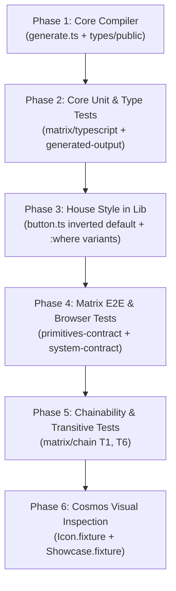

# VARIANTS.md — First-Class Primitive Variants Architecture & Production Rollout Plan

## 1. Executive Summary & Philosophy

This document defines the production-grade specification, compiler integration, TypeScript extension seams, CSS layer contracts, and matrix verification suite for **First-Class Primitive Variants** in Reference UI.

### 1.1 The Problem Space
Historically, design systems built on atomic primitives face three fatal architectural failures:
1. **Component Sprawl**: Inventing dozens of single-purpose wrapper components (`<Card>`, `<Badge>`, `<Panel>`, `<FilledInput>`, `<StripedTable>`, `<GhostButton>`) that clutter package entrypoints, induce duplicate-import collisions in LLM generation, and obscure native HTML semantics.
2. **The Inverted Default Trap**: In `reference-lib`, `.ref-button` historically defaulted to `ui.button.background` (solid black in light mode, bright white in dark mode). Because the unadorned primitive dressed itself as a high-contrast Primary CTA, any multi-button screen generated by an LLM or developer suffered from severe visual blowout.
3. **The Snowflake Temptation**: Attempting to solve this by hacking a `variant` prop onto `Button` alone in `reference-core` breaks the pristine mathematical symmetry of `generate.ts`, turning a pure HTML compiler into an opinionated component kit.

### 1.2 The Solution
Treat `variant` as a **universal architectural capability of the primitive system itself**, mirroring the exact footprint of `colorMode` and `container`:

```
JSX Primitive Prop         DOM Reflection             CSS Cascade Seam
variant="primary"    ──▶   data-variant="primary"  ──▶  .ref-button:where([data-variant="primary"])
colorMode="dark"     ──▶   data-panda-theme="dark" ──▶  .ref-button:where([data-panda-theme="dark"])
container={true}     ──▶   @container              ──▶  cq container registration
```

* **`reference-core`** stays 100% mathematically uniform: all 50+ HTML primitives accept `variant?: string` and reflect it to `data-variant` on the DOM. Zero special cases in code generation.
* **`reference-lib`** provides the **House Style** using `:where([data-variant="..."])`, flipping defaults to calm/neutral controls and providing out-of-the-box styling for common design patterns.
* **Downstream Consumers & Chains** can override TypeScript definitions via module augmentation, and override styling via style props, Panda recipes, or downstream layers with zero specificity friction.

---

## 2. Reference Core Compiler Contract

### 2.1 Type Surface Architecture
In [`packages/reference-core/src/types/public/props.ts`](file:///Users/ryn/Developer/reference-ui/packages/reference-core/src/types/public/props.ts), Reference UI already defines:
> *"Higher-level props layered on top of the base style object... Supported on HTML primitives only and emitted through runtime attributes rather than the style object itself."*

We introduce `VariantProps` into this explicit category:

```ts
// packages/reference-core/src/types/public/props.ts
export interface VariantProps<T extends string = string> {
  /**
   * Design system styling variant. Emitted to the DOM as `data-variant`
   * rather than entering the style object directly.
   */
  variant?: StylePropValue<T>
}

export type ReferenceProps =
  & ContainerProps
  & ResponsiveProps
  & FontProps
  & VariantProps
```

And in [`packages/reference-core/src/types/public/primitives.ts`](file:///Users/ryn/Developer/reference-ui/packages/reference-core/src/types/public/primitives.ts):
```ts
type PrimitiveOwnProps = StyleProps & ColorModeProps & VariantProps & PrimitiveCssProps
```

### 2.2 Mathematical Symmetry in `generate.ts`
In [`packages/reference-core/src/system/build/primitives/generate.ts`](file:///Users/ryn/Developer/reference-ui/packages/reference-core/src/system/build/primitives/generate.ts), `splitPrimitiveProps` must extract `variant` so it **does not leak** into `elementProps` (preventing an invalid `variant="..."` attribute on the DOM):

```tsx
function splitPrimitiveProps<T extends Record<string, unknown>>(props: T) {
  const { className, children, colorMode, variant, ...rest } = props as T & {
    className?: string
    children?: React.ReactNode
    colorMode?: unknown
    variant?: unknown
  }
  const [styleProps, elementProps] = splitCssProps(rest)
  const domProps: Record<string, unknown> = { ...elementProps }
  const patternStyle: Record<string, unknown> = {}
  for (const key of BOX_PATTERN_PROPS_FOR_STYLES) {
    if (key in domProps) {
      patternStyle[key] = domProps[key]
      delete domProps[key]
    }
  }
  return {
    className,
    children,
    colorMode,
    variant,
    styleProps: { ...styleProps, ...patternStyle },
    elementProps: domProps,
  }
}
```

And in `generatePrimitive(tag: string)`:
```tsx
const variantAttr = variant != null && variant !== '' ? { 'data-variant': String(variant) } : {};
return (
  <LayerScopeContext.Provider value={providesLayerScope}>
    <ColorModeContext.Provider value={resolvedColorMode}>
      <${tag}
        ref={ref}
        className={classes}
        {...dataLayerAttr}
        {...colorModeAttr}
        {...variantAttr}
        {...elementProps}
      >
        {children}
      </${tag}>
    </ColorModeContext.Provider>
  </LayerScopeContext.Provider>
);
```

**Compiler Invariants**:
1. All 50+ HTML primitives (`Button`, `Input`, `Div`, `Span`, `Table`, `A`, `Hr`, etc.) receive this behavior identically.
2. The runtime DOM emits **only** `data-variant="value"`. The raw `variant` prop never reaches the DOM element.
3. If `variant` is undefined, empty string, or null, no `data-variant` attribute is rendered.

---

## 3. TypeScript Extensibility & Override Seam

A core requirement is that **users can customize or override what variants are valid in TypeScript**, while preserving self-documenting autocomplete out of the box.

### 3.1 The Registry Interface Pattern
In `packages/reference-core/src/types/public/variants.ts`:

```ts
/**
 * Global registry for primitive variant names.
 * Downstream packages (e.g. `@reference-ui/lib`) and user applications
 * augment this interface to define or extend known variant literals.
 */
export interface PrimitiveVariantRegistry {
  button: 'default' | 'primary' | 'ghost'
  input: 'outline' | 'filled' | 'flushed' | 'unstyled'
  textarea: 'outline' | 'filled' | 'flushed' | 'unstyled'
  select: 'outline' | 'filled'
  table: 'simple' | 'striped' | 'compact' | 'borderless'
  div: 'card' | 'well' | 'floating' | 'inset'
  span: 'badge' | 'pill'
  a: 'accent' | 'subtle' | 'muted'
  code: 'inline' | 'ghost' | 'outline'
  kbd: 'raised' | 'subtle'
  hr: 'subtle' | 'dashed' | 'bold'
}

/**
 * Resolves the variant union for a given primitive tag.
 * Uses `(string & {})` to provide instant IDE autocomplete for registered variants
 * while permitting arbitrary strings without type errors, unless in strict mode.
 */
export type PrimitiveVariantValue<T extends PrimitiveTag> =
  T extends keyof PrimitiveVariantRegistry
    ? PrimitiveVariantRegistry[T] | (string & {})
    : string
```

### 3.2 How Consumers Extend or Override TS Definitions
Downstream applications can augment `PrimitiveVariantRegistry` directly in their project:

```ts
// in consumer's env.d.ts or theme.d.ts:
declare module '@reference-ui/react' {
  interface PrimitiveVariantRegistry {
    button: 'primary' | 'secondary' | 'danger' | 'glow'
    div: 'card' | 'glass' | 'neon'
  }
}
```

**Result**:
* Autocomplete in the user's editor immediately offers `'primary' | 'secondary' | 'danger' | 'glow'` for `<Button variant="|">`.
* When wrapped via `recipe(Button, { ... })`, the recipe's own `RecipeVariantProps` strictly shadows the base prop.

---

## 4. The CSS Cascade & Specificity Invariants

### 4.1 The Specificity Wall Problem
If `reference-lib` declares:
```css
/* Specificity: [0, 2, 0] (1 class + 1 attribute) */
.ref-button[data-variant="primary"] {
  background-color: white;
}
```
Then a downstream utility class or user recipe with specificity `[0, 1, 0]` (e.g. `.bg_purple_500`) **cannot override the background color without `!important`**.

### 4.2 The Mandate: Zero-Specificity `:where()`
All House Style variant rules in `reference-lib` **must** use `:where()`:

```css
/* Base geometry & defaults: specificity [0, 1, 0] */
.ref-button {
  /* layout, heights, typography, focus rings, icon offsets */
}

/* Default / Secondary baseline: specificity [0, 1, 0] */
.ref-button:where([data-variant="default"], :not([data-variant])) {
  background-color: {colors.ui.table.row.mutedBackground};
  color: {colors.design.text.base};
  border: 1px solid {colors.ui.field.border};
}

/* Primary CTA: specificity [0, 1, 0] */
.ref-button:where([data-variant="primary"]) {
  background-color: {colors.ui.button.background};
  color: {colors.ui.button.foreground};
  border-color: transparent;
}

/* Ghost: specificity [0, 1, 0] */
.ref-button:where([data-variant="ghost"]) {
  background-color: transparent;
  border-color: transparent;
}
```

### 4.3 Why this is mathematically bulletproof:
1. `:where([data-variant="..."])` adds **exactly 0 specificity**. The overall selector specificity remains `(0, 1, 0)`.
2. Any inline style prop (`<Button variant="primary" bg="brand.purple" />`) generates a utility class that matches or exceeds specificity and cleanly wins.
3. In Reference UI's layer order (`@layer reset, global, base, tokens, recipes, utilities;`), `recipes` and `utilities` sit **above** `base`/`global`. Any consumer recipe or utility style overrides house variants by layer priority alone.

---

## 5. Chaining & Composition Contract (`matrix/chain`)

Reference UI's compilation model distinguishes between `extends` and `layers` across multi-tier library graphs (Sketches T1–T13 in [`matrix/CHAIN.md`](file:///Users/ryn/Developer/reference-ui/matrix/CHAIN.md)).

### 5.1 Variant Inheritance Across Chained Libraries
Consider the canonical chain topology T6:
$$\text{Library A (reference-lib)} \longrightarrow \text{Library B (design-system)} \longrightarrow \text{User Space (App)}$$

1. **`Library A`** defines house variants under its system layer `@layer reference-lib { .ref-button:where([data-variant="primary"]) { ... } }`.
2. **`Library B`** extends `Library A`. It introduces an override or new variant:
   `@layer design-system { .ref-button:where([data-variant="primary"]) { bg: brand.teal; } }`.
3. **`User Space`** extends `Library B`.

**Compiler Rule**:
* Per `matrix/CHAIN_RULES.md` Rule 5 & 6, upstream layers are ordered as `[...extends, ...layers, localSystem]`.
* Layer order in the final assembled stylesheet is:
  `@layer reference-lib, design-system, app;`
* Because later layers override earlier layers, `design-system`'s primary variant **naturally defeats** `reference-lib`'s primary variant.
* And an app-level override in `app` naturally defeats both.

### 5.2 Layer-Only Isolation (`layers[]` mode)
When a consumer uses `layers: [reference-lib]` instead of `extends: [reference-lib]`:
* The consumer receives `reference-lib.css` under `@layer reference-lib`.
* The consumer's TypeScript surface does **not** adopt `reference-lib`'s tokens or type augmentations.
* Visual styling for `data-variant="primary"` still resolves correctly in the browser without polluting the consumer's Panda config.

---

## 6. Comprehensive Verification Suite ("Ludicrous Testing")

To ensure complete production integrity, the rollout must be backed by concrete tests across all five matrix and core test tiers:

### Tier 1: Type Contract Tests (`matrix/typescript`)
Create `matrix/typescript/src/primitive-variants.assertions.ts`:
* [ ] Verify that `<Button variant="primary" />`, `<Button variant="default" />`, and `<Button variant="ghost" />` compile without errors.
* [ ] Verify that `<Input variant="filled" />`, `<Input variant="flushed" />`, and `<Input variant="outline" />` compile without errors.
* [ ] Verify that `<Div variant="card" />`, `<Table variant="striped" />`, and `<Span variant="badge" />` compile without errors.
* [ ] Verify that augmented variant names (e.g. `variant="glow"`) compile when `PrimitiveVariantRegistry` is augmented.
* [ ] Run `pnpm exec tsc --noEmit` via the matrix pipeline to ensure all assertions hold.

### Tier 2: Unit & AST Generation Tests (`matrix/primitives/tests/unit`)
Update `matrix/primitives/tests/unit/generated-output.test.ts`:
* [ ] Parse `react/styles.css` using PostCSS AST:
  * Assert that `.ref-button:where([data-variant="primary"])` exists in the AST.
  * Assert that no bare `.ref-button[data-variant="primary"]` (without `:where`) exists in emitted styles.
* [ ] Verify all 50+ primitives in `packages/reference-core/src/system/primitives/index.tsx` split `variant` and project `data-variant`.

### Tier 3: Real Browser E2E Contracts (`matrix/primitives/tests/e2e`)
In `matrix/primitives/tests/e2e/primitives-contract.spec.ts` (tested across Chromium, Firefox, WebKit under both Vite 7 and Webpack 5):
* [ ] **Baseline Inversion**: Assert `<Button>Text</Button>` has neutral background (`rgb(...)`) and does NOT have pure white/black CTA colors.
* [ ] **DOM Attribute Emission**: Assert `<Button variant="primary">` renders `<button class="ref-button" data-variant="primary">`.
* [ ] **No Prop Leakage**: Assert that `variant` is NOT emitted as a DOM attribute (only `data-variant`).
* [ ] **Computed Styles**: Assert `<Button variant="primary">` computes to `{colors.ui.button.background}`.
* [ ] **Computed Styles**: Assert `<Button variant="ghost">` computes to `transparent` background and border.
* [ ] **Style Prop Precedence**: Assert `<Button variant="primary" bg="rgb(128, 0, 128)">` computes to `rgb(128, 0, 128)` in the browser (proving `:where()` zero-specificity).

### Tier 4: Cascade & Layer Order Contracts (`matrix/system/tests/e2e`)
In `matrix/system/tests/e2e/system-contract.spec.ts`:
* [ ] Assert that `:where([data-variant])` in `@layer base`/`@layer global` is overridden by `@layer recipes`.
* [ ] Assert that `:where([data-variant])` in `@layer base`/`@layer global` is overridden by `@layer utilities`.

### Tier 5: Chainability Contracts (`matrix/chain/T1`, `matrix/chain/T6`)
* [ ] In `matrix/chain/T1`: Assert that a consumer extending `reference-lib` sees house variants resolve across the library boundary.
* [ ] In `matrix/chain/T6`: Assert that in a 3-tier chain (`LibA -> LibB -> App`), an override on `.ref-button:where([data-variant="primary"])` in `LibB` overrides `LibA`, and an override in `App` overrides both.

---

## 7. Implementation Phasing



### Phase 1: Reference Core
1. Update `packages/reference-core/src/types/public/props.ts` to add `VariantProps`.
2. Create `packages/reference-core/src/types/public/variants.ts` defining `PrimitiveVariantRegistry`.
3. Update `packages/reference-core/src/system/build/primitives/generate.ts`:
   - Update `splitPrimitiveProps` to extract `variant`.
   - Update `generatePrimitive` to project `{...variantAttr}` with `data-variant`.
4. Re-run `pnpm --filter @reference-ui/core run build`.

### Phase 2: Reference Lib
1. Update `packages/reference-lib/src/core/theme/primitives/forms/button.ts`:
   - Invert `.ref-button` default: neutral background, subtle border, standard text.
   - Add `.ref-button:where([data-variant="primary"])`: CTA background.
   - Add `.ref-button:where([data-variant="ghost"])`: transparent background and border.
2. Re-run `ref sync` in `reference-lib`.

### Phase 3: Matrix Suite & Verification
1. Add `primitive-variants.assertions.ts` in `matrix/typescript`.
2. Add E2E browser assertions in `matrix/primitives`.
3. Run full matrix check: `pnpm --filter @matrix/* test`.
4. Verify Cosmos fixtures in both light and dark modes.
