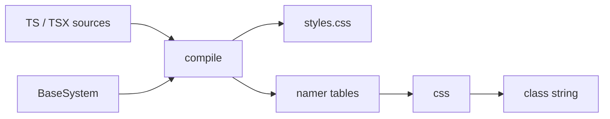
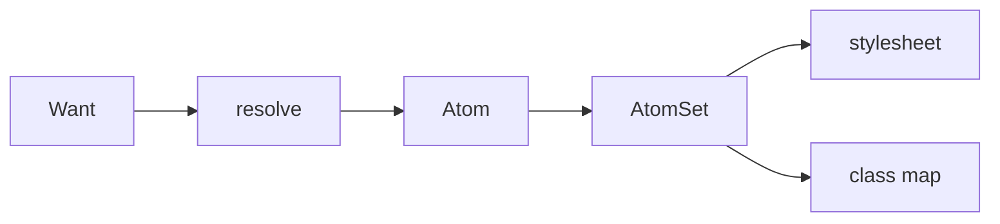
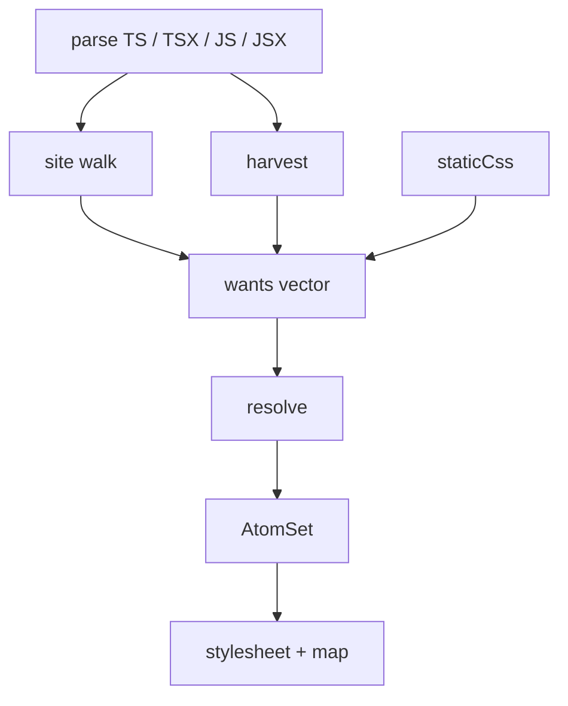
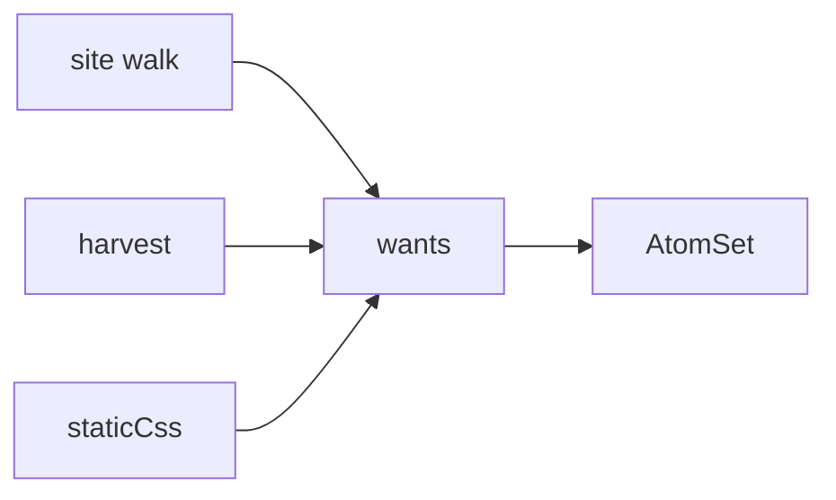

# Atomic extraction — how the compiler is put together

A foundation picture of the native style compiler in `packages/reference-rs/modules/atomic`. Authors write StyleProps, `css()`, and `recipe()`. They never write class names. Compile emits a stylesheet and a lookup map. Runtime concatenates classes. Nothing is injected in the browser.

This is the living overview. The crate contract is [`packages/reference-rs/modules/atomic/README.md`](../packages/reference-rs/modules/atomic/README.md). Stations live in that crate’s `SPEC.md`. Harvest as a mission is [Operation Forge](./missions/completed/operation-forge.md) Part I. The `#00aeff` walkthrough is the harvest section; domain words sit later.

## The contract

```text
build:   every literal want in the program  →  AtomSet   (what's possible)
runtime: this element's (prop, value)*      →  concat    (what this instance needs)
```

Hashed whole-object classes cannot name `{ ...base, ...override }` or `css({ color })` where `color` is a prop. One class per leaf can. Ten call sites writing `mt="2r"` become ten wants and **one** atom.

A miss at runtime constructs a class no rule backs: it paints nothing. In dev it warns once, naming the value and the prop. That is the seam: a value the program never wrote never paints.

## One namer, two implementations, one gate



| Artefact | Job | Example |
|---|---|---|
| `styles.css` | Six layers, utilities last | `.@reference-ui/lib__c_red { color: red; }` |
| namer tables | The closed data both namers read: prefixes, aliases, lowerings, keyword sets, breakpoints, conditions, fonts | `prefixes: { marginTop: "mt" }` |
| class map + plans | Compile-internal oracle rows behind the differential gate, never shipped | `stylePlans[i].declarations` |

Ghost class (runtime asks for a name the sheet never printed) is a P0 for compiler outputs. The compiler namer is the oracle; the runtime namer is its second implementation, and the differential gate holds the two byte-equal on every declaration the compile produced. A miss constructs a class with no rule — that is a miss class, not a ghost. Recipes and `stylePropNames` ride the artifact alongside the tables, unchanged.

## Harvest — define `#00aeff`, then take it away

Harvest is not a dataflow tracer. It does not follow a hex from an array onto `borderColor`. It does two dumb jobs: collect CSS-shaped strings in the program (**pool**), and fill style positions whose *value* the walk could not name (**sinks**). Cross them. That is the class.

Same public API either way — `css()` or a StyleProp on a host:

```ts
import { css } from '@reference-ui/react'

const palette = ['#00aeff']

export function Card({ color }: { color: string }) {
  return css({ color, padding: '4px' })
}

// same sink, same sheet:
// <Div color={color} padding="4px" />
```

The walk names `padding: '4px'`. `color` is a parameter, so it is a hole: sink `(color, [])`. The pool has `#00aeff` (a color) and `4px` (a length). Harvest pours every compatible pool value into that hole. `#00aeff` lands on `color`. It does not land on `borderColor` — nothing asked `borderColor` through a hole. `4px` does not land on `color`.

`@layer utilities` (reset / tokens omitted):

```css
.@reference-ui/lib__p_4px { padding: 4px; }
.@reference-ui/lib__c_#00aeff { color: #00aeff; }
```

Map:

```json
{
  "padding:4px": "@reference-ui/lib__p_4px",
  "color:#00aeff": "@reference-ui/lib__c_#00aeff"
}
```

Runtime `Card({ color: '#00aeff' })` looks up `"color:#00aeff"` and paints. `Card({ color: 'hotpink' })` misses — `hotpink` was never written. The site still warns: the expression *is* dynamic. Harvest filled the hole; it did not un-warn it.

Now delete the hex.

```ts
export function Card({ color }: { color: string }) {
  return css({ color, padding: '4px' })
}
```

The sink is still there. The pool is empty of colors.

```css
.@reference-ui/lib__p_4px { padding: 4px; }
```

Map: `"padding:4px"` only. Same `Card({ color: '#00aeff' })` now paints nothing. A value the program never wrote never paints.

Keep the hex and drop the hole instead — `css({ color: 'red', padding: '4px' })` with `palette` still in the file — and harvest mints nothing. No sink, no class for `#00aeff`. The string is just JavaScript.

Ten colors and three holes is the same cross, just larger. **10 × 3 = 30 classes.** Harvest does not know which function “owns” the palette.

```ts
const palette = [
  '#00aeff', '#ae00ff', '#ff00ae', '#00ffae', '#ae00ae',
  '#111111', '#ffffff', 'red', 'navy', 'rgba(0,0,0,0.5)',
]

export function paintColor(color: string) {
  return css({ color })
}
export function paintBorder(borderColor: string) {
  return css({ borderColor })
}
export function paintBg(bg: string) {
  return css({ bg })
}
```

Pool: 10 colors. Sinks: `(color, [])`, `(borderColor, [])`, `(bg, [])`. Each hex becomes three utilities — `color`, `border-color`, and `background` (`bg` is the `background` alias, not `backgroundColor`; that would be a fourth sink).

```css
.@reference-ui/lib__c_#00aeff { color: #00aeff; }
.@reference-ui/lib__bd-c_#00aeff { border-color: #00aeff; }
.@reference-ui/lib__bg_#00aeff { background: #00aeff; }
/* same three rules for the other nine values → 30 */
```

Map keys: `"color:#00aeff"`, `"borderColor:#00aeff"`, `"bg:#00aeff"`, … Runtime `paintColor('#00aeff')` only looks up `"color:#00aeff"`. The other twenty-nine sit in the sheet because the holes exist. Delete one hex → three classes vanish. Delete `paintBorder` → the ten `border-color` rows vanish; color and bg stay. A pair the walk already minted statically is not a 31st — harvest skips twins.

## Grain: Want → Atom → AtomSet

A **Want** is a raw intention from source, before CSS is real:

```ts
// authored
css({ mt: '2r', _hover: { color: 'red' } })
```

```text
Want { prop: "mt",    value: "2r",  when: [] }
Want { prop: "color", value: "red", when: ["_hover"] }
```

Resolve turns those into **Atoms** — one printable declaration each:

```text
Atom { prop: "margin-top", value: calc(2 * var(--spacing-root)), conditions: [] }
Atom { prop: "color",      value: red,                           conditions: [_hover] }
```

**AtomSet** is an `FxHashSet` keyed by `(prop, value, conditions, important)`. Identity, not origin. Whoever minted the want, the atom is the same.



Bool and null can sit on a Want (`<Div border />`). They never become an Atom. Resolve is the boundary: leftover booleans warn and drop; `null` is a hole.

## The pipeline

One parse per source. Oxc ASTs live for the whole compile. Constants, the value graph, the site walk, and harvest share them.



1. **Discover.** Virtual files, or a disk scan of `.ts` / `.tsx` / `.js` / `.jsx`. Not JSON. Not `node_modules`.
2. **Site walk.** JSX StyleProps, `css()`, `recipe()`. Styletrace names the hosts. The fold table names expressions it can see. Ternaries scoop leaves; the engine does not run author JS.
3. **Harvest.** After the walk: every wholesale CSS / rhythm string in those ASTs, crossed with the holes the walk refused.
4. **staticCss.** Third want source from the base system (`color: ['*']` enumerates that token category).
5. **Resolve.** Rhythm, shorthands, tokens, conditions.
6. **Emit.** `@layer reset, global, base, tokens, recipes, utilities;` plus the runtime map.

Recipes are a closed table in `@layer recipes`. Style props on a recipe host stay utilities. `@layer utilities` wins because it comes last.

## Three sensors, one identity

The walk does not have to be the only producer. Three sensors write the same wants vector. Dedup is the set.



| Sensor | Knows | Example |
|---|---|---|
| **Site walk** | Structure: which prop, under which `when`, on which host | `css({ color: 'red' })` mints `color:red` |
| **Harvest** | Information: a complete value exists in the program | `'red'` in an array, plus a dynamic `color` hole |
| **staticCss** | Catalog: the theme said these tokens exist | `color: ['*']` so `bg={prop}` can look up |

Harvest cannot carry the system. A value with no prop and no `when` is not an atom. The walk is the surveyor. Harvest is the floor under it.

## Harvest domain

The `#00aeff` walkthrough above is the whole mechanism. These are the words for it.

```text
pool (values, no props)  ×  sinks (props, no values)  →  wants
```

### Words

| Term | Meaning |
|---|---|
| **Site** | A style position the walk found: a StyleProp on a host, a key in `css()`, a recipe slot. Always has a **prop** and a **`when`**. |
| **`when`** | The condition scope of that site (`[]` at rest, `["_hover"]`, `["md", "_hover"]`, …). Harvest copies it. It never invents a condition. |
| **Hole** | A site whose *value* the walk could not name. Six refusal codes: identifier, member, expression, template, binary, unary. The site still warns. |
| **Sink** | The `(prop, when)` of a hole. Prop known, value unknown. Harvest fills sinks; that is the only place a pooled string becomes an atom. |
| **Pool** | Distinct wholesale CSS / rhythm strings in compile inputs, bucketed by **kind**. No prop. Position does not matter (array, helper return, const bag). |
| **Kind** | The CSS family of a value, from canon: color, length, transform, math, url, keyword. Rhythm (`13r`) rides length. |
| **Kind gate** | Which pool values may land on which sinks (`prop_accepts`). `#ae00ff` on `borderColor` yes; `'4px'` on `color` no. |
| **Wholesale** | A complete value as a string node. `'#ae00ff'` yes. `` `#${hex}` `` no. Numbers are not wholesale. |
| **Alphabet** | The recognizer: named colors, hex, `rgba()`, lengths, `13r`, transforms, `var()`, CSS-wide keywords. Not token paths (`gray.800`). |
| **Mint** | Write a Want (and a runtime authored declaration) for one pool value onto one sink. Origin `"harvest"`. Same wants vector as the walk. |
| **Twin** | A pair the walk already minted — exact, or an alias like `mt` / `marginTop`. Harvest skips it; infos count net-new only. |
| **Compile inputs** | The `.ts` / `.tsx` / `.js` / `.jsx` this compile parsed. Not `node_modules`. Not JSON. |

A sink is named that way because values drain into it. Runtime still has to ask for that exact authored string.

### What is not a sink

A refusal is not automatically a sink. No sink, no harvest atom. A palette sitting in an array while every `css()` call is static contributes **zero** classes (ATM-HARVEST-04).

| Shape | Why not |
|---|---|
| `css({ color: 'red' })` | Named — not a hole. The walk already minted. |
| `css({ ...props })` | No prop. Rest-spreads never become sinks. |
| Unknown props, or runtime-owned (`variant`, `colorMode`) | Would never paint. |
| Some host-owned props (`gap`, `offset` on Toast / Overlay) | Component props, not style positions. |
| Mutation, residue, dead-branch codes | Not the six dynamic-value refusals. |
| A random `<div color="red">` | Not a host. Styletrace never opened a site. |

Two color-kind holes (`css({ color })` and `css({ borderColor: x })`) would mint **both** `"color:#00aeff"` and `"borderColor:#00aeff"`. Harvest does not know the array “is for borders.” False positives are accepted: `status = 'red'` plus a color sink still mints `"color:red"`. One extra class, only if a compatible hole exists.

## Worked examples

### 1. A static site — walk only

```ts
import { css } from '@reference-ui/react'

export const title = css({ color: 'red', padding: '4px' })
```

The walk names both leaves. Harvest sees `'red'` and `'4px'` but finds **no sinks** (nothing was dynamic), so it mints nothing. Sheet:

```css
.@reference-ui/lib__c_red { color: red; }
.@reference-ui/lib__p_4px { padding: 4px; }
```

Map: `"color:red"`, `"padding:4px"`. ATM-HARVEST-04 is this as a control: a static program’s sheet is byte-identical with or without the harvest pass.

### 2. Nested ternary — scoop the leaves

```ts
css({ color: on ? (dark ? 'navy' : 'red') : 'blue' })
```

Open tests compile every leaf. Runtime picks. Equal leaves collapse in the set. `undefined` is no leaf. The compiler is not evaluating `on` or `dark`. It is collecting what the program wrote.

Panda will fold a value-level open ternary inside an object; `css(cond ? a : b)` as a **call argument** it drops. We extract both arms. Same optimism as harvest: compile what is possible, let runtime choose.

### 3. A conditioned sink

The same cross, with the sink’s `when`. Harvest copies it. It never invents a condition.

```ts
const palette = ['red', '#0af']

export function paint(shade: string) {
  return css({ _hover: { color: shade } })
}
```

```css
.@reference-ui/lib__hover:c_red:is(:hover, [data-hover]) { color: red; }
.@reference-ui/lib__hover:c_#0af:is(:hover, [data-hover]) { color: #0af; }
```

Map: `"_hover:color:red"`, `"_hover:color:#0af"`. No unconditioned `"color:red"`. ATM-HARVEST-03.

### 4. What is not a value

```ts
`2${n}r`                 // arithmetic, not rhythm
`#${hex}`                // not a color
`rgba(${r},${g},${b},1)` // not a color
css({ ...props })        // rest-spread: no prop, not a sink
```

Wholesale only: a complete CSS or rhythm literal in a string node. Holey templates mint nothing (ATM-HARVEST-02). Numbers are not harvested — no CSS-shaped signature; they reach dynamic sinks through `staticCss`. JSON files are never compile inputs. Scanning them would be compiling a data bag, not a program.

## Resolve, briefly

Wants still carry authored strings. Resolve lowers them:

| Authored | After resolve |
|---|---|
| `2r` | `calc(2 * var(--spacing-root))` |
| `n300` | `var(--colors-n-300)` |
| `rgba(0,0,0,0.5)` | passed through (complete CSS, not a token path) |
| `mt` | `margin-top` (shorthand expand) |
| `_hover` | `&:hover` (selector wrap) |

Named CSS colors (`red`, `rebeccapurple`) are alphabet, not token paths. `gray.800` is still the token resolver. A value with `{…}` braces is not complete CSS; it goes through interpolation.

## Runtime

Neo `css()` runs the runtime namer over the **authored** five-tuple `(system, when, prop, value, important)` and concatenates class names. It never hashes, never injects, never resolves tokens or rhythm in the browser.

```ts
css({ color: 'red' })           // hit → "@reference-ui/lib__c_red"
css({ color })                  // constructs whatever string `color` is this render
css({ color: 'not-in-source' }) // miss → "@reference-ui/lib__c_not-in-source", no paint + dev warn
```

The runtime cannot tell who minted the atom. Site walk, harvest, and `staticCss` are compile-time sensors. After `AtomSet`, there is only the class.

## The walk stays load-bearing

Harvest evenings edges. It does not replace:

- **Styletrace** — which JSX names are hosts, which props they own. A random `<div color="red">` is not a sink.
- **Fold table / module graph** — spreads, helpers, imports. Paint from harvest can *hide* a miss (`'red'` was written, a color sink exists) while the walk still failed to name the expression. Fold still has to be honest.
- **Rest-spreads** — `{...props}` has no prop. What paints through a rest is whatever *named* sites already minted.
- **`when`** — `'2px'` in a nested bag is not `_focusVisible: outlineWidth` unless the walk said that hole is under `_focusVisible`.

A fully static program harvests nothing. A program with dynamic holes harvests onto those holes only — not onto all 71 color-bearing properties “just in case.”

## Where to go next

| If you want | Read |
|---|---|
| Crate pipeline, what it refuses | [`modules/atomic/README.md`](../packages/reference-rs/modules/atomic/README.md) |
| Stations (ATM-\*) | [`modules/atomic/SPEC.md`](../packages/reference-rs/modules/atomic/SPEC.md) |
| Harvest alphabet, sinks, authorship | this file (`#00aeff` walkthrough, then Harvest domain); [operation-forge.md](./missions/completed/operation-forge.md) Part I |
| Shipped per-atom map, namer as a function | [operation-jettison.md](./missions/operation-jettison.md) |
| Harvest sheet size, pool doctrine | [operation-reaper.md](./missions/operation-reaper.md) |
| `css()` as composition | [FEATURES/CSS_COMPOSITION.md](./FEATURES/CSS_COMPOSITION.md) |
| Six-layer cascade | [LAYERS.md](./LAYERS.md) (portable `/ layers:` story; engine layers are the crate README) |
