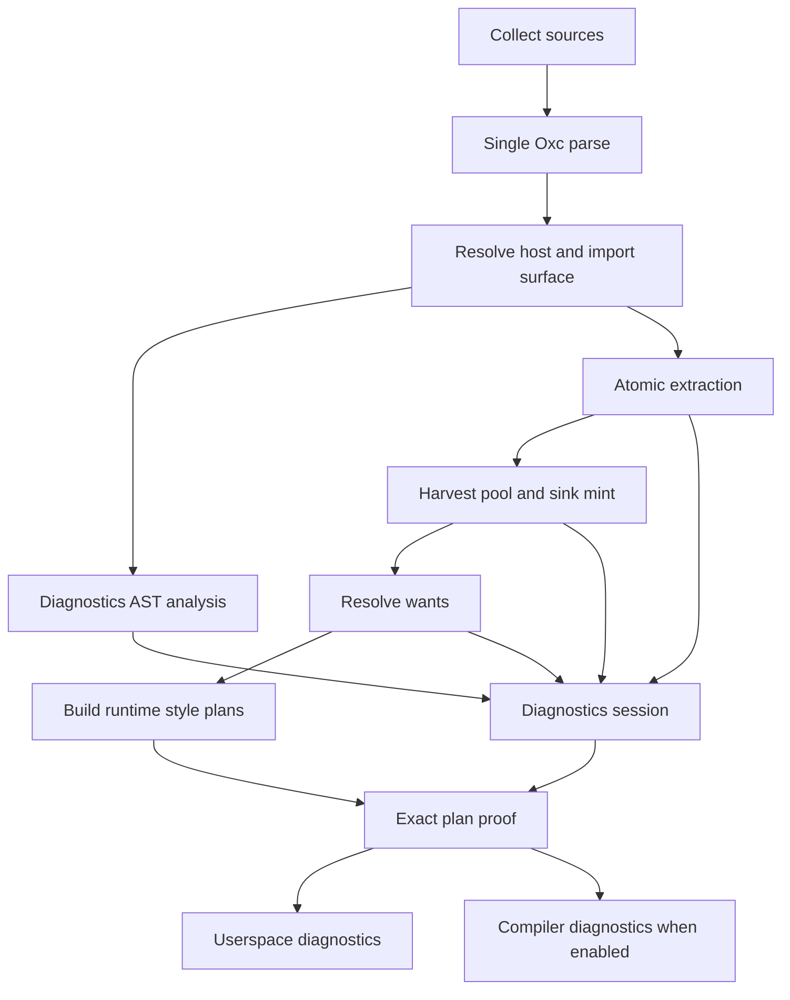

OPERATION: READY

# Mission: Operation Error Correct

Status: `ready` (HQ 2026-09-19). This is the implementation plan, not an
implementation. No compiler, Neo, runtime, or lib work begins until the
READY-phase challenges at the end return without a blocker and HQ writes
`OPERATION: GO`.

Signal protocol: `OPERATION: READY` means the architecture is concrete
enough to challenge. `OPERATION: GO` starts the slices in order.

## The claim

Compiler diagnostics are proof, not suspicion.

Atomic gets one diagnostics subsystem with two audiences:

1. **Userspace** receives existing fatal `ATM-E-*` diagnostics unchanged,
   plus non-fatal warnings only when the compiler can prove that an exact
   runtime style lookup will have no plan if execution reaches that site.
2. **Compiler** receives everything useful that does not clear that bar:
   dynamic refusals, partial assembly, spreads, harvest activity, dead
   branches, coverage observations, and analysis limits. This is a
   toggleable backchannel, off by default.

No “probably.” No warning because an AST shape looks difficult. No warning
because harvest minted zero values. If the exact failing lookup is not known,
the author does not hear it on the default channel.

The current Splitter lines are the motivating defect:

```text
[neo] sync warning ATM-W-UNFOLDABLE-SPREAD: Dynamic object spread encountered in style object; keeping sibling properties
```

The sibling properties paint, call-site extraction and harvest often cover
the spread, and the compiler cannot name an exact lookup that will miss.
That is compiler information wearing a user-warning costume. Error Correct
moves it to the backchannel.

## Signed policy

These decisions are closed:

- A new userspace diagnostic is a **non-fatal warning**.
- “Certain” means an exact runtime lookup key is known and absent from the
  final runtime plan. The guarantee is conditional only on execution
  reaching that lookup; compile time cannot prove that a component renders.
- Existing fatal `ATM-E-*` behavior is preserved. This operation does not
  downgrade parse, base-system, recipe, host-graph, or token-reference
  errors.
- A source-contract concern is not enough. “This expression is partial,”
  “this spread is dynamic,” and “we minted nothing here” are not runtime
  failure proofs.
- The compiler backchannel is `logs: ['compiler']` in `ui.config.ts`.
  `debug?: boolean` remains the JS infrastructure logger and does not imply
  compiler diagnostics.
- Compiler diagnostics are returned separately from userspace diagnostics.
  Hosts never re-filter one mixed array.
- Runtime lookup misses remain the final ground truth. Error Correct does
  not redesign the runtime miss reporter.

Silence is a valid result. A first release with no new userspace warning is
better than a release with one warning that cannot carry a proof.

## Correction to the old partial-value idea

The previous draft treated direct partial assembly as the one new certain
warning:

```tsx
minW={`${minWidth}px`}
css({ width: n + 'px' })
css({ color: `#${hex}` })
```

That is certain only as an extraction fact: the complete value does not
exist at that source site. It is **not** a certain runtime failure. Runtime
looks up the evaluated value, not the syntax. If another compile input
caused `width: 200px` to enter the global style-plan index, then
`` `${minWidth}px` `` paints when `minWidth === 200`.

Therefore:

- partial templates and concats are compiler-channel facts;
- whole-value wraps such as `` `${color}` `` are compiler-channel facts;
- identifiers, members, calls, spreads, and unknown operands are
  compiler-channel facts;
- none becomes a userspace warning until an exact evaluated lookup key can
  be derived and proved absent from the final plan.

The same correction applies to harvest counts. Today
`ATM-I-HARVEST-SINK` reports **net-new pairs minted**. Zero may mean the pair
already existed as a site want or alias twin. Positive N says nothing about
which value runtime will request. “Covered” and “uncovered” are not
userspace verdicts and must not appear as promises.

## Architecture decision: one parse, an independent diagnostics analysis

Diagnostics needs its own AST **analysis**, not its own AST parser.

The Oxc parser answers one question: what syntax is in this source? It has
no extraction direction. `atomic::compile` already parses every
`.ts`/`.tsx`/`.js`/`.jsx` input once, with the correct source mode, and keeps
the allocators and programs alive for the compile. Reparsing inside
diagnostics would add:

- a second JSX/TypeScript mode decision;
- a second parse-error and span coordinate system;
- duplicate CPU and memory;
- a new way for extraction and diagnostics to disagree before either has
  analyzed anything.

The parser remains single-owner infrastructure in `atomic::compile`.
Diagnostics receives borrowed `Program` values from that parse and runs an
independent visitor over them. Its analysis is independent in the way that
matters: it predicts the exact runtime queries implied by source, then
compares those expectations with what the compiler actually emitted. It
does not infer success from extraction’s `Want` list.

This is the “opposite” pass:

- extraction asks, “what plans can I build from this source?”;
- diagnostics asks, “what exact plans will runtime request from this source,
  and did the compiler build them?”

Harvest remains a third, different pass: “what complete values exist
anywhere in the program?”

## Placement

Diagnostics remains a substantial subsystem of the Atomic product:

```text
packages/reference-rs/modules/atomic/src/diagnostics/
```

It does **not** become a sibling product crate and gets no standalone
`diagnose()` N-API method. It has no useful caller without the Atomic
compile, its codes are already `ATM-*`, and its proof requires Atomic’s
final style plans.

It is nevertheless a real module, not three helper functions in `mod.rs`.
The intended shape is:

```text
diagnostics/
├── mod.rs                 public subsystem seam
├── README.md              architecture, invariants, audiences
├── codes.rs               stable wire codes
├── render.rs              user/compiler rendering
├── session.rs             compile-long fact and expectation store
├── facts.rs               typed producer protocol
├── site.rs                source/site identity and owned locations
├── channels.rs            userspace/compiler partition
├── policy.rs              proof-to-verdict table
├── analysis/
│   ├── mod.rs             independent AST analysis entry
│   ├── css.rs             imported css() surfaces
│   ├── jsx.rs             traced JSX style surfaces
│   ├── conditions.rs      runtime `when` query shape
│   └── values.rs          exact-value vs unknown-value classification
├── adapters/
│   ├── extract.rs         extraction refusals and outcomes
│   ├── harvest.rs         pool/sink/mint telemetry
│   ├── resolve.rs         resolved or rejected exact declarations
│   └── hosts.rs           StyleTrace/host facts
└── proof/
    ├── mod.rs
    └── plans.rs           expected key vs final plan-key set
```

Names may tighten during Slice 1, but the responsibilities do not collapse
back into one file. Every Rust file follows the `agent-rs` size,
complexity, argument-count, and top-of-file commentary gates.

## The seam: facts in, reports out

Other compiler phases do not construct final user messages. They report
typed facts to a compile-long `DiagnosticsSession`.

The narrow producer interface is conceptually:

```rust
pub trait DiagnosticSink {
    fn report(&mut self, fact: DiagnosticFact);
}
```

The session owns data, not AST references. A fact may carry a copyable span
and a source id; it must not retain an Oxc node or borrow a phase context.

The shared identities are:

```rust
pub struct SourceSite {
    pub source: SourceId,
    pub span: Span,
    pub surface: StyleSurfaceKind,
    pub prop: Box<str>,
    pub when: Vec<Box<str>>,
}

pub struct OwnedLookupKey {
    pub system: Box<str>,
    pub when: Vec<Box<str>>,
    pub prop: Box<str>,
    pub value: serde_json::Value,
    pub important: bool,
}
```

`SourceSite` identifies the author location. `OwnedLookupKey` identifies
runtime truth. The key must be built and serialized by the same runtime-key
authority used by `RuntimeStylePlan`; diagnostics does not grow a second
canonical JSON or key serializer.

The fact vocabulary is small and semantic:

```rust
pub enum DiagnosticFact {
    ExistingError(Diagnostic),
    ExactLookupExpected {
        site: SourceSite,
        key: OwnedLookupKey,
    },
    DynamicSlot {
        site: SourceSite,
        shape: DynamicShape,
    },
    ExtractOutcome {
        site: SourceSite,
        outcome: ExtractOutcome,
    },
    HarvestOutcome {
        site: SourceSite,
        minted: usize,
    },
    ResolveOutcome {
        site: SourceSite,
        key: Option<OwnedLookupKey>,
        outcome: ResolveOutcome,
    },
}
```

The exact enum may split by file, but producers do not send prose and do
not choose an audience.

### Parse and source coordinator

`atomic::compile` owns:

- source collection;
- one allocator and one parse per source;
- parse diagnostics;
- the source catalog used to render UTF-16 line/column positions;
- creation of `DiagnosticsSession`.

After StyleTrace has resolved the host surface and import bindings are
known, the coordinator gives diagnostics an `AnalysisInput` containing the
borrowed programs, source catalog, base-system surface, and resolved host
facts.

### Diagnostics AST analysis

`diagnostics::analysis` walks the shared parsed programs independently.
It covers runtime style-query surfaces, initially:

- imported `css()` style objects;
- traced JSX style props and JSX `css` objects;
- their static conditions, responsive values, and `important` state.

It excludes native `style`, `globalCss`, static CSS config, and recipe
tables because they do not use the same runtime style-plan lookup. Existing
fatal diagnostics on those surfaces continue through their current paths.

For each runtime style slot, analysis emits one of:

- an exact expected lookup, when runtime’s full key is statically known;
- a dynamic-shape fact, when any key component is unknown;
- no fact, when the syntax is not a runtime style lookup.

The analyzer may reuse shared primitives that define language truth:
canonical property names, condition lowering, static constant values, and
the runtime lookup-key serializer. It must not reuse extraction’s success
or final wants as evidence that the plan exists.

### Extract

Extract continues to build wants and authored declarations. It reports:

- site extracted;
- site refused and refusal class;
- dynamic identifier/member/template/binary/unary/call;
- partial template or concat;
- spread/object residue;
- source location and condition stack.

These facts explain compiler behavior on the backchannel. They do not
promote themselves to userspace.

The existing `ExpressionWalk::warn_dynamic` funnel becomes the first
adapter seam: sink registration stays coupled to the refusal, but final
wording and audience move out.

### Harvest

Harvest continues to collect the position-free value pool and mint onto
sinks. It reports facts such as pool counts and net-new minted pairs.

These facts are always compiler-channel telemetry. Neither zero nor
positive minted count is a failure proof.

### Resolve

Resolve reports whether an exact authored declaration produced atoms or
was rejected, preserving its reason and location when available. It does
not decide whether that reason is a userspace warning.

Existing fatal `ATM-E-*` diagnostics pass through unchanged. Warning-level
resolve facts enter policy like every other candidate: they need an exact
absent-key proof to remain on the default channel.

### Hosts and other modules

StyleTrace, and any future compiler dependency, keeps its own diagnostic
type. The Atomic boundary converts it into a `DiagnosticFact`, as
`hosts/diagnostics.rs` already converts `TraceDiagnostic`.

Dependencies never import Atomic’s final user-message policy. They report
domain facts; Atomic diagnostics owns compile audiences and wording.

### Assembly and proof

Assembly builds `RuntimeStylePlan` values exactly as today. At the end it
hands diagnostics the set of final owned lookup keys.

`diagnostics::proof` joins:

```text
exact lookups predicted independently from source
                         against
exact lookup keys present in final RuntimeStylePlan output
```

The result is mechanical:

- expected key present: success, no userspace diagnostic;
- expected key absent: proven non-fatal userspace warning;
- no exact expected key: impossible to prove at build time, compiler
  channel at most;
- existing fatal error: preserve unchanged.

An exact key emitted because of another file, site, or harvest still counts
as present. Runtime will paint; diagnostics stays silent. That is the
incidental-coverage rule the previous draft was missing.

The userspace warning says only what is proved:

> `width: <value>` has no compiled style plan; this lookup will emit no class

If a resolver fact proves a specific cause, the message may add the
actionable reason. It never guesses from syntax.

## Compile order



The AST analysis runs while parsed programs are alive, then stores owned
expectations. Final proof runs after plans exist and needs no AST borrow.

## Channels and wire contract

Configuration:

```ts
export default defineConfig({
  name: 'my-system',
  include: ['src/**/*.{ts,tsx}'],
  logs: ['compiler'],
})
```

Omit `logs` or use `[]` for userspace only.

The public shapes become conceptually:

```ts
type LogChannel = 'compiler'

interface CompileRequest {
  // existing fields
  logs?: LogChannel[]
}

interface CompileResult {
  // existing artifacts
  diagnostics: Diagnostic[]
  compilerDiagnostics?: Diagnostic[]
}
```

Rules:

- `diagnostics` contains existing errors and proof-backed warnings only.
- `compilerDiagnostics` is absent unless `'compiler'` was requested.
- the compiler list is separate even when requested; a direct `compile()`
  caller cannot mistake it for product warnings;
- Neo prints userspace warnings as `[neo] sync warning …`;
- Neo prints the opt-in list as `[neo] compiler …`;
- compiler items retain stable codes and source locations;
- severity is not used as an audience proxy;
- `debug: true` does not enable this channel.

The future runtime channel may extend `LogChannel`, but runtime reporting is
not implemented by this operation.

## Policy audit

The migration audits candidate instances, not just code names. A single
legacy code can currently represent both exact and inexact situations.

Every existing `ATM-W-*` and `ATM-I-*` emitter ends in one of three states:

1. **Userspace** — the candidate carries an exact expected lookup and the
   final key set proves it absent.
2. **Compiler** — the fact is true and useful but cannot prove an exact
   runtime miss.
3. **Drop** — duplicate, non-actionable, or no longer useful even to compiler
   development.

All current `ATM-W-DYNAMIC-*`, `ATM-W-UNFOLDABLE-SPREAD`,
`ATM-I-HARVEST-SINK`, and `ATM-I-DEAD-BRANCH` candidates begin in the
compiler state. They can move to userspace only through proof, never through
a code allowlist.

Codes remain stable for backchannel consumers and old goldens. New codes are
appended only for genuinely new failure classes.

## Stations: diagnostics owns its proof suite

Diagnostics gets a first-class station family under Atomic:

```text
packages/reference-rs/modules/atomic/tests/cases/ATM-DIAG-*/
```

It does not need a sibling product or a new Vitest project. `ATM-DIAG-01`–
`05` already establish the home; `ATM-DIAG-04` and `06` remain the open
location/Unicode contracts and land as part of the new source-site
foundation.

New stations start at `ATM-DIAG-07`:

1. **`ATM-DIAG-07` — channel isolation.** Default compile contains no
   dynamic, spread, harvest, or dead-branch diagnostics. Opting into
   `'compiler'` returns them only in `compilerDiagnostics`.
2. **`ATM-DIAG-08` — exact plan present.** Diagnostics predicts a static
   runtime query; the same key is in `stylePlans`; userspace is silent.
3. **`ATM-DIAG-09` — exact plan absent.** Diagnostics predicts a static
   runtime query; the final plan omits it; one located non-fatal warning
   names that exact declaration.
4. **`ATM-DIAG-10` — incidental coverage.** The diagnosed site contributes
   no plan, but another source or harvest contributes the exact key.
   Userspace is silent because runtime paints.
5. **`ATM-DIAG-11` — unknown values stay compiler-only.** Identifiers,
   members, `` `${n}px` ``, `` `${color}` ``, calls, `a + b`, and spreads
   never become userspace warnings.
6. **`ATM-DIAG-12` — surface parity.** Imported `css()` and traced JSX
   produce the same expected key for equivalent declarations; native
   `style` and `globalCss` produce none.
7. **`ATM-DIAG-13` — producer seam.** Extract, harvest, resolve, and host
   facts retain one site identity, deterministic ordering, stable codes,
   and no duplicate final line.
8. **`ATM-DIAG-14` — source modes.** `.ts`, `.tsx`, `.js`, and `.jsx` use
   the one compiler parse; JSX mode, parse errors, and UTF-16 locations do
   not drift between extraction and diagnostics.

Unit tests live beside the Rust logic:

- source-site identity and UTF-16 rendering;
- exact/unknown AST value classification;
- runtime lookup-key parity;
- expected-key/final-key proof;
- audience policy;
- deterministic deduplication and ordering.

Neo adds focused sync cases for config threading and the distinct
`[neo] compiler` printer. Existing runtime miss tests remain the proof that
an observed missing key emits no class.

Every station README states the claim, symbols, sibling IDs, and search
terms so the case index can find the subsystem.

## Slices

### Slice 0 — ledger and red stations

- Inventory every current `ATM-W-*` and `ATM-I-*` emission site.
- Record producer, source surface, whether an exact runtime key is knowable,
  current default behavior, and target state: userspace/compiler/drop.
- Add red shells for `ATM-DIAG-04`, `06`, and `07`–`14`.
- Identify at least one real non-fatal, statically known declaration that
  reaches runtime but is omitted from final plans for `ATM-DIAG-09`.
  If none exists, do not invent one: the proof engine lands with unit tests
  and userspace gains no new warning yet.

Done when the ledger has no unclassified warning/info emitter and every
userspace row names its intended proof witness.

### Slice 1 — diagnostics module skeleton

- Split the existing diagnostics directory into source site, facts, session,
  policy, channels, analysis, adapters, and proof.
- Keep code/render serialization compatible.
- Introduce `SourceId`, `SourceSite`, owned locations, `DiagnosticSink`, and
  `DiagnosticsSession`.
- Complete the existing location and Unicode contracts (`ATM-DIAG-04/06`).
- Preserve current output byte-for-byte in this slice.

Done when the module shape exists, quality gates pass, and no diagnostic
behavior has changed.

### Slice 2 — independent AST expectations

- Feed diagnostics the compiler’s existing parsed programs and resolved
  style surface.
- Implement independent `css()` and traced-JSX analysis.
- Produce exact `OwnedLookupKey` expectations only when every runtime key
  component is statically known.
- Record dynamic/partial/spread shapes without pretending to know a key.
- Share runtime key canonicalization; do not share extraction success.

Done when `ATM-DIAG-08`, `11`, `12`, and `14` pass and no source is reparsed.

### Slice 3 — producer protocol

- Replace direct final-diagnostic creation in extract, harvest, resolve, and
  host adapters with typed facts, one producer family at a time.
- Keep sink creation and compilation behavior unchanged.
- Move prose and audience decisions into diagnostics policy.
- Keep existing `ATM-E-*` pass-through behavior.

Done when `ATM-DIAG-13` proves one stable site across phases and the full
Atomic artifact output has zero non-diagnostic drift.

### Slice 4 — final-plan proof

- Expose one owned runtime lookup-key type and one serializer authority.
- Build the final emitted-key set from `RuntimeStylePlan`.
- Join expected exact queries against that set after assembly.
- Emit a non-fatal userspace warning only for an absent expected key.
- Treat an exact key from any source, including harvest, as success.

Done when `ATM-DIAG-08`–`10` prove present, absent, and incidental-coverage
behavior.

### Slice 5 — compiler backchannel

- Add typed `logs?: Array<'compiler'>` config and request plumbing.
- Add optional `compilerDiagnostics` to the compile result.
- Move dynamic/refusal/spread/harvest/dead-branch candidates off the default
  result.
- Add the distinct Neo printer.
- Leave `debug?: boolean` unchanged.

Done when `ATM-DIAG-07` and the Neo sync cases prove default silence,
opt-in visibility, and array isolation.

### Slice 6 — audit rewrite and census

- Rewrite affected diagnostic goldens intentionally; no blanket snapshot
  update.
- Update Atomic SPEC rows and the diagnostics README.
- Run the warning census separately for Book/story scaffolding and shipped
  component source.
- Confirm the motivating Splitter warnings disappear by default and return
  only as `[neo] compiler` lines when requested.
- Run the complete `agent-rs` and targeted `agent-neo` verification paths.

Done when every default warning has an exact proof, every compiler-only fact
is absent by default, and emitted CSS/runtime artifacts are unchanged.

## Acceptance

Operation Error Correct is done only when all of these are true:

- Atomic parses each compile input once.
- Diagnostics owns an independent AST analysis over that parse.
- Extraction, harvest, resolve, hosts, and assembly communicate through
  typed facts rather than final user prose.
- `CompileResult.diagnostics` contains no “maybe.”
- Every new non-fatal userspace warning can name an exact expected lookup
  key absent from final `stylePlans`.
- Presence of that exact key anywhere suppresses the warning.
- Dynamic values, partial assembly, spreads, and harvest counts remain
  compiler-only.
- Existing fatal `ATM-E-*` behavior is unchanged.
- `logs: ['compiler']` is the only compiler-backchannel switch.
- Compiler diagnostics use a separate result field and printer.
- Stable codes, deterministic ordering, UTF-16 locations, and deduplication
  are pinned by stations.
- No stylesheet, class name, runtime plan, recipe table, or extraction
  behavior changes as a side effect of routing diagnostics.

## Non-goals

- No second source parse.
- No sibling diagnostics product crate, standalone N-API, or JS package.
- No runtime miss-reporter redesign.
- No reverse execution of bindings, callees, network data, storage, JSON
  payloads, or arbitrary JavaScript.
- No CSS-fragment heuristic list (`px`, `#`, `solid`, and friends).
- No warning based on harvest minted count or compatible-pool count.
- No lib component edits to silence diagnostics.
- No extraction, harvest, resolver, or stylesheet behavior changes.
- No code renames that break stable `ATM-*` wire values.
- No `debug: true` alias for compiler logs.

## READY-phase challenges

Before GO, read-only reviewers answer these against the code and proposed
red stations:

1. **Runtime-key parity.** Can diagnostics derive exactly the same key as
   Neo runtime for nested conditions, responsive objects/arrays,
   `important`, aliases, and canonical JSON without importing extraction
   outcomes?
2. **Independent-enough analysis.** Does the proposed shared surface input
   avoid duplicated API allowlists while still allowing diagnostics to catch
   an extraction omission?
3. **A real proven warning.** Which existing non-fatal static declaration
   is expected at runtime but absent from final plans? If there is none,
   confirm that zero new userspace warnings is the correct first release.
4. **Dependency shape.** Can `DiagnosticSink`, owned lookup keys, and
   finalization be placed without a conceptual diagnostics ↔ runtime or
   diagnostics ↔ extract ownership cycle?
5. **Ledger completeness.** Does every current warning/info emitter have a
   userspace/compiler/drop verdict, including resolve, global, static CSS,
   recipes, hosts, and portable stylesheet paths?

A blocker is any case where a userspace warning cannot carry an exact
absent-key witness, where the analyzer needs a second parse, or where
compiler-channel facts can leak into the default result.
