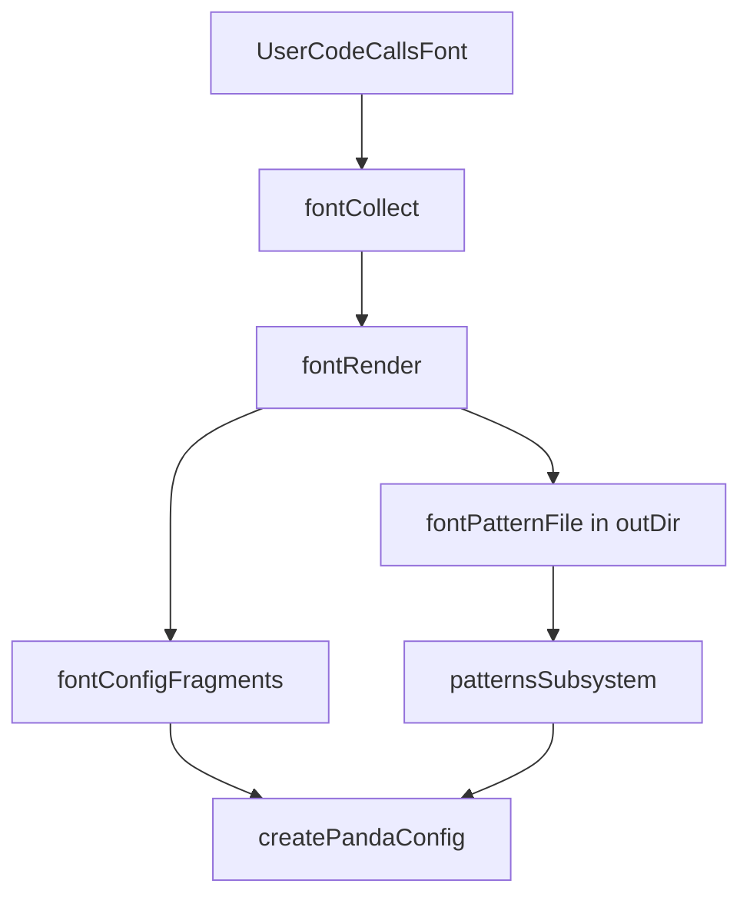

# Font Subsystem

`font/` is a dedicated subsystem, not a plain one-step fragment collector.

It collects raw font definitions from user code once, then:
- Renders `fontConfigFragments` for normal Panda config assembly (injected directly).
- Writes the generated pattern (an `extendPattern()` call) to a file in outDir (e.g. `outDir/.tmp/font-pattern.mjs`). The patterns pipeline picks it up from there via `additionalPatternFiles` and does not know about font.

This is the architecture the codebase should follow.

---

## Decision

The font system owns font-specific semantics:
- font family tokens
- font weight tokens
- `@font-face` rules
- `fontStyle` recipe variants
- generated `font` and `weight` pattern props

But it does **not** own final Panda config assembly or box-pattern merging.

Responsibilities stay split:
- `font/` generates artifacts
- `patterns/` merges pattern artifacts
- `config/` assembles final Panda config

---

## Data Flow



---

## Terminology

### `fontConfigFragments`

Pre-rendered fragment text generated by `font/` for:
- `tokens({ fonts, fontWeights })`
- `globalFontface(...)`
- `recipe('fontStyle', ...)`

These fragments are injected directly into Panda config generation.

### Font pattern file (`fontPatternFile`)

The font module writes the generated pattern (an `extendPattern()` call for `font` and `weight` props) to a file in the project’s outDir (e.g. `outDir/.tmp/font-pattern.mjs`). The patterns subsystem is given that path via `additionalPatternFiles` and collects from it like any other file that contains `extendPattern` calls. **Patterns does not know about font** — it just accepts a list of extra files to run the pattern collector on.

---

## Why This Shape

This resolves the earlier architectural conflict:

- Fonts are too rich to be treated as a single direct transform into Panda config.
- The generated `font` and `weight` props must still participate in the same merge flow as other box-pattern extensions.
- The config layer should stay dumb: it should receive already-prepared fragment strings and assemble them, not understand font semantics.

---

## Module Responsibilities

### `packages/reference-core/src/system/font`

Owns:
- collecting `font()` or `extendFont()` definitions from user code
- rendering tokens, fontface, recipe, and the font-pattern output
- writing the pattern output to a file in outDir and returning that path as `fontPatternFile`
- exposing a helper that returns `fontConfigFragments`, `fontPatternFile` (optional), and `definitionsCount`

### `packages/reference-core/src/system/patterns`

Owns:
- system pattern extensions
- optional **additional pattern files** (paths to files that contain `extendPattern` calls; e.g. the font-generated file in outDir)
- userspace `extendPattern()` extensions
- final merge order and final box-pattern fragment generation

Patterns has **no font-specific logic**. It accepts `additionalPatternFiles?: string[]` and runs the normal collector on those paths. Merge order: system → additional → user.

### `packages/reference-core/src/system/config`

Owns:
- reading internal fragments
- reading `fontConfigFragments`
- asking `patterns/` for the final merged pattern fragment
- writing the final `panda.config.ts`

---

## Concrete Runtime Contract

`font/index.ts` should expose a config-facing helper with a shape like:

```ts
interface FontFragmentsForConfig {
  fontConfigFragments: string
  fontPatternFragments: string
  definitionsCount: number
}
```

Expected behavior:
- `fontConfigFragments` is safe to inject directly into `createPandaConfig(...)`
- `fontPatternFile` (when set) is passed to the patterns pipeline as the single element of `additionalPatternFiles`; patterns collects from that file like any other extendPattern source

---

## Integration Points

### `runConfig`

`packages/reference-core/src/system/config/runConfig.ts` should:
1. collect and render fonts
2. pass `fontConfigFragments` into `createPandaConfig(...)`
3. pass `fontPatternFragments` into `getPatternFragmentsForConfig(...)`

### `patterns`

`packages/reference-core/src/system/patterns` should:
1. accept generated `fontPatternFragments`
2. evaluate them through the normal `extendPattern()` collector path
3. merge them with system and user pattern extensions
4. render the final box-pattern fragment once

This is the key invariant: fonts must hook into the patterns subsystem, not bypass it.

---

## Public API

Preferred public API:

```ts
import { font } from '@reference-ui/core/config'

font('display', {
  value: '"Playfair Display", serif',
  fontFace: {
    src: 'url(/fonts/playfair.woff2) format("woff2")',
    fontWeight: '400 900',
  },
  weights: {
    normal: '400',
    bold: '700',
  },
  css: {
    letterSpacing: '-0.02em',
  },
})
```

Compatibility alias:
- `extendFont(...)` can remain available while the docs converge on `font(...)`

Both names should be collectible during scanning while the migration is in progress.

---

## Testing

For output verification, use:

```sh
pnpm test:e2e
```

Useful coverage for the font subsystem:
- CLI-level tests for font collection and rendered outputs
- reference-app tests that verify:
  - `@font-face` rules land in generated CSS
  - `font` and `weight` props work through the merged box pattern
  - user-defined fonts are reflected in the generated config and CSS

---

## Implementation Order

1. Keep `font/` as the source of truth for font definitions and rendered outputs.
2. Add a stable `getFontFragmentsForConfig()` helper in `font/index.ts`.
3. Thread `fontConfigFragments` into `runConfig()` and `createPandaConfig()`.
4. Thread `fontPatternFragments` into `patterns/` so that subsystem owns merge and final render.
5. Keep `font()` as the preferred public API and retain `extendFont()` as compatibility where needed.
6. Verify with `pnpm test:e2e`.
