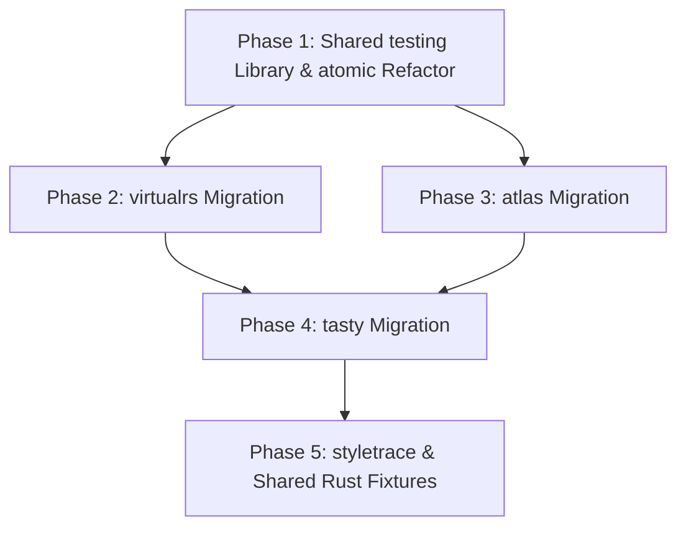

# Reference RS Test Framework (`TESTING.md`)

Shared station harness for **`packages/reference-rs`**: `packages/reference-rs/testing`, plus the per-module suites that consume it.

**Landed:** `testing/` library; `atomic`, `atlas`, `tasty`, and `virtualrs` station runners; `globalSetup.ts` gone; `--update-goldens` works for those four. Tasty runtime emit lives in `tests/.scratch/` (gitignored). Committed goldens are `output/manifest.js` + `output/chunks.json`. Virtualrs goldens are committed `output/expected.tsx`.

**Remaining:** styletrace still uses a monolithic `styletrace.test.ts` (it does use `createVirtualWorkspace`); `typegen` `.d.ts` goldens; `canon` / `base-system` stay Cargo-only.

§3 is the contract. §2 and §4–7 below are the original blueprint; several “current state” rows there are already done.

---

## 1. Executive Mandate & Vision

Across `packages/reference-rs`, compiler products share an identical macro lifecycle:
$$\text{Input Scenario (TSX/TS/AST)} \longrightarrow \text{Native N-API Call (Oxc/Rust)} \longrightarrow \text{Semantic Assertions} + \text{Committed Goldens}$$

Historically, however, modules evolved across four disconnected eras:
1. **Era 1 (Eager `globalSetup` Pre-Runners — `tasty`, `virtualrs`, `atlas`)**: Pre-compiles 500+ files to disk before tests run, turning Vitest suites into static file-diff checkers and hiding single-case failures.
2. **Era 2 (Ad-Hoc Temp Workspaces — `styletrace`)**: Generates ephemeral `mkdtemp` trees on the fly to fake `node_modules/`, duplicating fixture code strings across TypeScript and Rust.
3. **Era 3 (Pure Rust Unit Tests — `canon`, `base-system`, `typegen`)**: Instant sub-second Cargo suites, but lacks declarative golden validation for future `.d.ts` declaration printers.
4. **Era 4 (Declarative Station Pattern — `atomic`)**: A single runner, automatic folder discovery, colocated `spec.ts`, universal standing gauges, committed native goldens, and `--update-goldens` CLI intent.

### The Objective
Extract the Era 4 station pattern into a reusable, zero-overhead test library (**`packages/reference-rs/testing`**), eliminate all `globalSetup.ts` pre-runners, delete 60+ duplicate boilerplate test files, establish universal **Standing Gauges**, and standardize the `--update-goldens` developer experience across the entire Rust compiler workspace.

---

## 2. Current State Audit by Module

| Module | Test Model Today | Test Files / Fixtures | Flaws & Antipatterns | Target Architecture |
| :--- | :--- | :--- | :--- | :--- |
| **`atomic`** | Station pattern (`cases.test.ts`) | 1 runner, ID-named `ATM-*` stations (`tests/cases/ATM-COND-04`) | Shared `testing` runner. Folder name is the SPEC ID. | Keep 1:1 ID folders; no slug suffixes. |
| **`atlas`** | Decentralized Vitest + `globalSetup` | 4 root tests, 14 `api.test.ts`, 15 case folders | **Phantom Goldens**: `globalSetup` writes `output/analysis.json` every run; nothing asserts it. 4 root tests duplicate assertions on `demo_surface` only. `dynamic_values` has input and no `api.test.ts`. Stale `tests/atlas` path in Rust. | Single `cases.test.ts`, `ATL-*` stations (including `dynamic_values`), real committed `analysis.json` goldens, standing component schema gauges. |
| **`tasty`** | 38 `api.test.ts` files + `globalSetup` | 38 separate `api.test.ts` files, 38 case folders | **In-test `npm install`**: synchronous `npm install` in setup. Eagerly compiles 38 cases for 1 test. Only snapshots 1st lexicographical chunk. | Single `cases.test.ts`, `TST-*` stations, on-demand compilation per station, full multi-chunk coverage. |
| **`virtualrs`** | 15 `rewrite.test.ts` + `globalSetup` | 15 identical 3-line files, 15 case folders | Inverted setup: `globalSetup` writes `result.tsx` before tests start. Entire suite crashes if 1 setup fails. Exact `toBe` string comparison breaks on trivial whitespace. | Single `cases.test.ts`, `VRT-*` stations, in-memory execution, normalized code diffs. |
| **`styletrace`** | Monolithic `styletrace.test.ts` + temp dirs | 1 test file, 14 case folders | 4 on-disk cases (`default_export_package`, `export_star_package`, `node_modules_wrapper`, `subpath_package`) are unused; the same scenarios run from in-memory helper fixtures. Mock packages are duplicated between TS (`helpers.ts`) and Rust (`tracing.rs`). | Single `cases.test.ts`, `STY-*` stations, shared `VirtualWorkspace` helper. |
| **`canon`** | Cargo unit tests (`src/tests.rs`) | 10 generated unit tests, generator script | Static slices tested in Rust. Generator is already fail-closed (`pnpm canon`). | Keep pure Cargo; do not invent a `--check` flag. |
| **`base-system`** | Cargo unit tests (`src/lib.rs`) | 1 stub unit test | Pending 42 SPEC cases; needs in-memory fixture generators. | Shared in-memory `BaseSystem` fixtures across Rust crates. |
| **`typegen`** | Cargo unit tests (`src/lib.rs`) | 1 stub unit test, core prototypes | Will emit `.d.ts` declarations; needs golden snapshot tests and `tsc --noEmit` validation. | Golden `.d.ts` snapshots + TypeScript compilation seam test. |

---

## 3. Core Architecture: `packages/reference-rs/testing`

The shared testing framework lives at `packages/reference-rs/testing/` as a lightweight, type-safe harness built on top of Vitest.

```
packages/reference-rs/
├── testing/                          # Shared Test Mini-Library
│   ├── index.ts                      # Clean barrel exports
│   ├── types.ts                      # Contracts, contexts, and gauge signatures
│   ├── runner.ts                     # createStationSuite() execution engine
│   ├── goldens.ts                    # diffOrWriteGoldens() with CLI flag handling
│   ├── workspace.ts                  # createVirtualWorkspace() scratch FS builder
│   └── normalizers.ts                # AST, whitespace, and hash/ID normalizers
```

### 3.1 Type Contracts (`types.ts`)

```ts
/**
 * Execution context provided to station hooks and specs.
 */
export interface StationContext {
  /** Folder name, e.g. "ATM-LEAF-01" */
  caseName: string
  /** Extracted ID prefix, e.g. "ATM-LEAF-01" */
  caseId: string
  /** Absolute path to the station root */
  caseDir: string
  /** Absolute path to station input directory */
  inputDir: string
  /** Absolute path to station output directory */
  outputDir: string
}

/**
 * Contract implemented by every station's spec.ts.
 */
export interface StationSpec<TResult> {
  /** Primary SPEC.md ID anchor (must match folder prefix) */
  id: string
  /** Secondary or related SPEC IDs proved by this station */
  ids?: string[]
  /** Domain-specific assertions executed against the compilation result */
  verify(result: TResult, context: StationContext): void | Promise<void>
}

/**
 * Declared golden artifact emitted by the compiler.
 */
export interface GoldenDefinition<TResult> {
  /** Filename relative to output/, e.g. "styles.css", "analysis.json" */
  fileName: string
  /** Serialization format */
  format: 'text' | 'json'
  /** Extracts the data payload from the compiler result */
  extract(result: TResult): unknown
}

/**
 * Universal invariant gauge enforced across every station in a suite.
 */
export type StandingGauge<TResult> = (
  result: TResult,
  context: StationContext
) => void | Promise<void>

/**
 * Suite configuration for createStationSuite().
 */
export interface StationSuiteConfig<TResult> {
  /** Top-level Vitest describe block label */
  suiteName: string
  /** Absolute path to cases/ directory */
  casesDir: string
  /** Folder discovery regex (defaults to standard station ID prefix) */
  folderPattern?: RegExp
  /** Compiles or executes the case on-demand */
  compile(context: StationContext): Promise<TResult>
  /** Goldens verified or written for each station */
  goldens: GoldenDefinition<TResult>[]
  /** Universal invariants executed on every station */
  standingGauges?: StandingGauge<TResult>[]
  /** Mandatory files required inside each station folder */
  requiredFiles?: string[]
  /** Normalizer applied to text goldens before diffing */
  normalizeText?(content: string, fileName: string): string
}
```

### 3.2 The Generic Station Runner (`runner.ts`)

`createStationSuite` replaces hand-rolled loops and `globalSetup.ts` with a single, declarative function call:

```ts
export function createStationSuite<TResult>(config: StationSuiteConfig<TResult>): void {
  const {
    suiteName,
    casesDir,
    folderPattern = /^([A-Z]+-[A-Z]+-\d{2}|[a-zA-Z0-9_-]+)-.+$/,
    compile,
    goldens,
    standingGauges = [],
    requiredFiles = ['README.md', 'spec.ts', 'input'],
    normalizeText,
  } = config

  const updateGoldens = isUpdateGoldensRequested()

  function discoverStations(): string[] {
    if (!fs.existsSync(casesDir)) return []
    return fs
      .readdirSync(casesDir, { withFileTypes: true })
      .filter((entry) => entry.isDirectory())
      .map((entry) => entry.name)
      .filter((name) => folderPattern.test(name))
      .sort()
  }

  describe(suiteName, () => {
    const stations = discoverStations()

    it(`discovers at least one station under ${path.basename(casesDir)}`, () => {
      expect(stations.length).toBeGreaterThan(0)
    })

    for (const stationName of stations) {
      describe(stationName, () => {
        it(`${stationName} compiles, passes gauges, and matches goldens`, async () => {
          const match = folderPattern.exec(stationName)
          const expectedId = match ? match[1]! : stationName
          const stationDir = path.join(casesDir, stationName)
          const context: StationContext = {
            caseName: stationName,
            caseId: expectedId,
            caseDir: stationDir,
            inputDir: path.join(stationDir, 'input'),
            outputDir: path.join(stationDir, 'output'),
          }

          // 1. Validate station folder structural hygiene
          for (const req of requiredFiles) {
            expect(
              fs.existsSync(path.join(stationDir, req)),
              `Missing required station asset '${req}' in ${stationName}`
            ).toBe(true)
          }

          // 2. Dynamically import station specification
          const specModule = await import(path.join(stationDir, 'spec.ts'))
          const spec = specModule.default as StationSpec<TResult>
          expect(spec?.id, `spec.id '${spec?.id}' must match station prefix '${expectedId}'`).toBe(expectedId)
          expect(typeof spec?.verify, 'spec.verify must be an executable function').toBe('function')

          // 3. Compile case on-demand in memory
          const result = await compile(context)

          // 4. Run station semantic verification
          await spec.verify(result, context)

          // 5. Enforce universal standing gauges
          for (const gauge of standingGauges) {
            await gauge(result, context)
          }

          // 6. Assert or update committed goldens
          diffOrWriteGoldens(context.outputDir, result, goldens, updateGoldens, normalizeText)
        })
      })
    }
  })
}
```

### 3.3 The Golden Snapshot Engine (`goldens.ts`)

Unified handling of `--update-goldens` (CLI). `run.mjs` already forwards that flag as `UPDATE_GOLDENS=1` into Vitest; tests may read either. Authors update goldens through the CLI, not by exporting the env var by hand.
- **Deterministic Serialization**: JSON is 2-space indent with a trailing newline. Key order is whatever `extract()` returns — keep that shape stable. Do not sort keys in the harness unless a module’s payload is insertion-order-unstable.
- **Zero Silent Overwrites**: Output files are never rewritten during normal test runs. Updates are strictly opt-in via CLI.
- **Clear Baseline Diagnostics**: If `output/` is missing, the test fails with: `"Golden output directory missing. Run 'pnpm agentrs v <module> --update-goldens' to initialize."`
- **Native File Formats**: Output files are pure `.css`, `.json`, `.tsx`, or `.d.ts`—never opaque Vitest `.snap` serializations.

```ts
export function isUpdateGoldensRequested(): boolean {
  return process.argv.includes('--update-goldens') || process.env.UPDATE_GOLDENS === '1'
}

export function diffOrWriteGoldens<TResult>(
  outputDir: string,
  result: TResult,
  goldens: GoldenDefinition<TResult>[],
  update: boolean,
  normalizeText?: (content: string, fileName: string) => string
): void {
  if (update) {
    fs.mkdirSync(outputDir, { recursive: true })
    for (const g of goldens) {
      const filePath = path.join(outputDir, g.fileName)
      const value = g.extract(result)
      const serialized =
        g.format === 'json'
          ? JSON.stringify(value ?? {}, null, 2) + '\n'
          : String(value ?? '')
      fs.writeFileSync(filePath, serialized, 'utf-8')
    }
    return
  }

  expect(
    fs.existsSync(outputDir),
    `Golden output directory missing: ${outputDir}. Run with '--update-goldens' to generate.`
  ).toBe(true)

  for (const g of goldens) {
    const filePath = path.join(outputDir, g.fileName)
    expect(fs.existsSync(filePath), `Missing golden artifact: ${g.fileName}`).toBe(true)
    const raw = fs.readFileSync(filePath, 'utf-8')

    if (g.format === 'json') {
      const actual = g.extract(result) ?? {}
      const expected = JSON.parse(raw)
      expect(actual).toEqual(expected)
    } else {
      let actual = String(g.extract(result) ?? '')
      let expected = raw
      if (normalizeText) {
        actual = normalizeText(actual, g.fileName)
        expected = normalizeText(expected, g.fileName)
      }
      expect(actual).toBe(expected)
    }
  }
}
```

### 3.4 Virtual Workspace Builder (`workspace.ts`)

Solves the `node_modules` problem across `styletrace`, `atlas`, and `tasty`:
- Creates isolated, process-safe scratch trees under `target/scratch-tests/<suite>-<uuid>/`.
- Allows test authors to declare mock packages and subpath exports as in-memory maps:
  ```ts
  const ws = await createVirtualWorkspace({
    'src/index.tsx': 'import { Card } from "@ui/card"; ...',
    'node_modules/@ui/card/package.json': '{ "name": "@ui/card", "main": "./index.js" }',
    'node_modules/@ui/card/index.d.ts': 'export declare const Card: any;',
  })
  ```
- Implements `Symbol.asyncDispose` (`using workspace = ...`) and `afterEach` hooks for guaranteed zero-leak cleanup without polluting git status.

### 3.5 Normalizers (`normalizers.ts`)

Small, named helpers used by `normalizeText` and JSON `extract()` — whitespace/CRLF, unstable hashes/IDs, and anything else a module must strip before a golden diff. Keep them here so modules do not each invent a trim function.

---

## 4. Module-by-Module Migration Blueprints

### 4.1 `modules/atomic` (The Baseline Refactor)

**Current State**: `cases.test.ts` + local `helpers.ts`. Folder name is the SPEC ID (`ATM-COND-04`). `CASE_FOLDER` is `^(ATM-[A-Z]+-\\d{2})$`.  
**Target State**:
```ts
// packages/reference-rs/modules/atomic/tests/cases.test.ts
import { createStationSuite } from '../../../testing/index.js'
import {
  atomicGauges,
  atomicGoldens,
  compileCase,
  CASES_DIR,
  CASE_FOLDER,
  type CompileResult,
} from './helpers.js'

createStationSuite<CompileResult>({
  suiteName: 'atomic cases',
  casesDir: CASES_DIR,
  folderPattern: CASE_FOLDER,
  compile: (ctx) => compileCase(ctx.caseName),
  goldens: atomicGoldens,
  standingGauges: atomicGauges,
})
```
- **Line Reduction**: `cases.test.ts` drops from 114 lines to ~18 lines.
- **Cleanup**: Delete leftover `AT-*` and slug case folders as part of this refactor, not a later phase.
- **Zero Regressions**: ID-named stations + the discovery test keep identical goldens (`pnpm agentrs v atomic`).

---

### 4.2 `modules/virtualrs` (Eliminate 15 Duplicate Boilerplates & `globalSetup`)

**Current State**:
- 15 identical `tests/cases/**/rewrite.test.ts` files:
  ```ts
  import { runVirtualCaseTest } from '../../assertCase'
  runVirtualCaseTest(import.meta.url)
  ```
- `tests/globalSetup.ts`: 75 lines pre-running transforms before tests start.
- Gitignored `output/result.tsx` and `output/perf-metrics.txt`.

**Target State**:
1. **Delete**:
   - `tests/globalSetup.ts`
   - `tests/assertCase.ts`
   - All 15 `tests/cases/**/rewrite.test.ts`
   - Remove `globalSetup` from `vitest.config.ts`
2. **Rename Case Folders**:
   - `css_basic` $\rightarrow$ `VRT-CSS-01-basic`
   - `css_aliases` $\rightarrow$ `VRT-CSS-02-aliases`
   - `cva_alias` $\rightarrow$ `VRT-CVA-01-alias`
   - `responsive_css_basic` $\rightarrow$ `VRT-RESP-01-css-basic`, etc.
3. **Add `spec.ts` to Each Station**:
   ```ts
   // tests/cases/VRT-CSS-01-basic/spec.ts
   import type { StationSpec } from '../../../testing'
   import type { VirtualResult } from '../../helpers'

   const spec: StationSpec<VirtualResult> = {
     id: 'VRT-CSS-01',
     verify(result) {
       expect(result.metrics.rustApiMs).toBeGreaterThanOrEqual(0)
     }
   }
   export default spec
   ```
4. **Single Runner (`cases.test.ts`)**:
   ```ts
   // packages/reference-rs/modules/virtualrs/tests/cases.test.ts
   import { createStationSuite } from '../../../testing'
   import { compileVirtualCase, CASES_DIR, CASE_FOLDER, type VirtualResult } from './helpers'

   createStationSuite<VirtualResult>({
     suiteName: 'virtualrs transforms',
     casesDir: CASES_DIR,
     folderPattern: CASE_FOLDER,
     compile: (ctx) => compileVirtualCase(ctx),
     goldens: [
       { fileName: 'expected.tsx', format: 'text', extract: (r) => r.code },
     ],
     normalizeText: (text) => text.trim().replace(/\r\n/g, '\n'),
   })
   ```
- **Benefits**: Eliminates 17 boilerplate files, removes all disk pollution during test runs, and supports `pnpm agentrs v virtualrs --update-goldens`.

---

### 4.3 `modules/atlas` (Eliminate Phantom Goldens & Add Schema Gauges)

**Current State**:
- `tests/globalSetup.ts` runs twice as many analyses, writing `output/analysis.json` which is never asserted.
- `atlas.test.ts` contains 344 lines duplicating `indexing.test.ts`, `interface.test.ts`, and `shape.test.ts`.
- 14 `api.test.ts` files plus unused `dynamic_values`. `analysis.json` is written and never asserted.

**Target State**:
1. **Delete**:
   - `tests/globalSetup.ts`
   - Remove duplicate blocks in `atlas.test.ts`
   - Remove `globalSetup` from `vitest.config.ts`
2. **Rename Case Folders**:
   - `demo_surface` $\rightarrow$ `ATL-SURF-01-demo-surface`
   - `barrel_reexports` $\rightarrow$ `ATL-REXP-01-barrel`
   - `same_name_collisions` $\rightarrow$ `ATL-NAME-01-collisions`
   - `wrapped_components` $\rightarrow$ `ATL-WRAP-01-memo-forwardref`, etc.
3. **Universal Standing Gauges (`helpers.ts`)**:
   ```ts
   export const atlasGauges: StandingGauge<AtlasAnalysisResult>[] = [
     // ATL-SCHEMA-01: Component schema integrity
     (res) => {
       for (const comp of res.components) {
         expect(comp.name).toBeTruthy()
         expect(comp.source).toBeTruthy()
         expect(['very common', 'common', 'occasional', 'rare', 'unused']).toContain(comp.usage)
         expect(comp.count).toBeGreaterThanOrEqual(0)
         for (const prop of comp.props) {
           expect(prop.name).toBeTruthy()
           expect(prop.count).toBeGreaterThanOrEqual(0)
         }
       }
     },
     // ATL-DIAG-01: Diagnostic schema integrity
     (res) => {
       for (const diag of res.diagnostics) {
         expect(['warning', 'error', 'info']).toContain(diag.severity)
         expect(diag.message).toBeTruthy()
       }
     }
   ]
   ```
4. **Committed Goldens**:
   - Commit `output/analysis.json` and `output/diagnostics.json` across all 15 stations.
   - Diff on every run; update via `pnpm agentrs v atlas --update-goldens`.
5. **Fix Stale Rust Search Paths**:
   - In `modules/atlas/src/analyzer.rs`, remove stale candidate path `workspace_root.join("tests/atlas/...")`.

---

### 4.4 `modules/tasty` (Consolidate 38 Loose Files & Lazy Compilation)

**Current State**:
- 38 loose `api.test.ts` files repeating identical boilerplate.
- Synchronous `npm install` inside `globalSetup.ts`.
- Only snapshots first lexicographical chunk.

**Target State**:
1. **Replace 38 `api.test.ts` with lightweight `spec.ts`**:
   ```ts
   // tests/cases/TST-GEN-01-generics/spec.ts
   import type { StationSpec } from '../../../testing'
   import type { TastyApi } from '../../js/index'

   const spec: StationSpec<TastyApi> = {
     id: 'TST-GEN-01',
     async verify(api) {
       const user = await api.loadSymbolByName('User')
       expect(user.kind).toBe('Interface')
     }
   }
   export default spec
   ```
2. **On-Demand Compilation**:
   - Eliminate eager `globalSetup.ts`.
   - Compile each case inside `compile(ctx)` on-demand, memoized per test run.
   - Running `pnpm agentrs v tasty -t TST-GEN-01` compiles **only that single case in <20ms**, rather than all 38 cases.
3. **Comprehensive Goldens**:
   - Replace opaque `__snapshots__/*.snap` with committed goldens:
     - `output/manifest.js` (normalized symbol map)
     - `output/declarations.d.ts` (emitted ambient typings)
     - `output/chunks.json` (checksum and export list across **all** chunks, preventing blindspots)
4. **Eliminate In-Test `npm install`**:
   - Vendor test typing dependencies (`csstype`, `@types/json-schema`) into a committed fixture directory or link to root `node_modules`.

---

### 4.5 `modules/styletrace` (Clean Dead Cases & Shared Workspace)

**Current State**:
- 4 on-disk case folders (`default_export_package`, `export_star_package`, `node_modules_wrapper`, `subpath_package`) are unused. Tests for those scenarios build temp trees via helpers (`createDefaultExportPackageFixture`, …), not `traceCase('…')`.
- Duplicated inline package strings in TypeScript (`helpers.ts`) and Rust (`src/tests/tracing.rs`).
- Ad-hoc `mkdtemp` logic.

**Target State**:
1. **Prune Unused Folders or Promote Them**:
   - Either delete the 4 unused disk cases, or point the station runner at them and drop the duplicate in-memory fixtures. Do not leave both.
2. **Adopt Shared `VirtualWorkspace`**:
   - Refactor `helpers.ts:createRuntimeFixture` to use `packages/reference-rs/testing/workspace.ts`.
3. **Station Runner**:
   - Group static cases into a station runner checking `output/components.json` (`['Card', 'Button']`).
4. **Rust RAII Unification**:
   - Move `styletrace::ScratchDir` into `packages/reference-rs/shared/src/testing/workspace.rs` so Rust tests across crates use a single, shared RAII scratch directory helper.

---

### 4.6 Foundational Rust Crates (`canon`, `base-system`, `typegen`)

**Current State**:
- Pure Rust suites verified via `cargo test` (`pnpm agentrs c <crate>`).
- Zero N-API bindings today.

**Target State**:
1. **Shared In-Memory `BaseSystem` Fixtures (`shared/src/testing/base_system.rs`)**:
   - Provide standard in-memory test systems for Rust unit tests:
     - `minimal_system()`: Bare tokens and default breakpoints.
     - `semantic_tokens_system()`: Color modes, light/dark aliases, and opacity layers.
     - `recipes_system()`: Declared component and slot recipes.
     - `strict_system()`: Token category enforcement without string fallbacks.
   - Eliminates duplicate JSON fragment construction across `base-system`, `typegen`, and `atomic`.
2. **`typegen` Golden `.d.ts` Harness**:
   - When the declaration printer is implemented, establish a golden runner that writes emitted `.d.ts` blocks to `tests/goldens/` and verifies them with `tsc --noEmit` against consumer fixtures.

---

## 5. Toolchain & CLI Updates (`run.mjs`)

Currently, `.agents/skills/agent-rs/scripts/run.mjs` (`runVitest`) hardcodes an exclusivity check:
```javascript
// Validation: --update-goldens is only valid for atomic fixtures
if (hasUpdateGoldens) {
  if (testFilter && testFilter !== 'atomic' && testFilter !== 'system' && KNOWN_MODULES.has(testFilter)) {
    console.error(`--update-goldens is only supported for the 'atomic' harness.`)
    return 1
  }
}
```

### Required Update
Lift this restriction to permit any module implementing the station golden protocol:
```javascript
const GOLDEN_SUPPORTED_MODULES = new Set(['atomic', 'virtualrs', 'atlas', 'tasty'])
if (hasUpdateGoldens && testFilter && !GOLDEN_SUPPORTED_MODULES.has(testFilter)) {
  console.error(`--update-goldens is not supported for '${testFilter}'. Supported modules: ${[...GOLDEN_SUPPORTED_MODULES].join(', ')}`)
  return 1
}
```
`UPDATE_GOLDENS: '1'` is already forwarded when the CLI flag is present. Do not add a second path. The author-facing contract stays `pnpm agentrs v <module> --update-goldens`.

---

## 6. Phased Execution & Subagent Orchestration Plan



### Phase 1: Foundation — `packages/reference-rs/testing`
- **Scope**:
  - Implement `testing/types.ts`, `testing/runner.ts`, `testing/goldens.ts`, `testing/workspace.ts`, `testing/normalizers.ts`, `testing/index.ts`.
  - Refactor `modules/atomic/tests/cases.test.ts` and `helpers.ts` to consume the shared runner.
  - Delete leftover `AT-*` and slug case folders under `atomic/tests/cases/`.
  - Lift the `--update-goldens` exclusivity check in `run.mjs` so station modules other than `atomic` can use it. Env forwarding is already in place.
- **Verification**: `pnpm agentrs v atomic`, `pnpm agentrs q`.

### Phase 2: `modules/virtualrs` Migration
- **Scope**:
  - Delete 15 `rewrite.test.ts` files and `assertCase.ts`.
  - Delete `globalSetup.ts` and update `vitest.config.ts`.
  - Standardize case folder IDs (`VRT-CSS-*`, `VRT-CVA-*`, `VRT-RESP-*`) and add minimal `spec.ts`.
  - Implement `modules/virtualrs/tests/cases.test.ts` calling `createStationSuite()`.
- **Verification**: `pnpm agentrs v virtualrs`, `pnpm agentrs v virtualrs --update-goldens`.

### Phase 3: `modules/atlas` Migration
- **Scope**:
  - Delete `atlas/tests/globalSetup.ts` and remove from `vitest.config.ts`.
  - Standardize case folder IDs (`ATL-*`) and add `spec.ts`.
  - Add universal standing gauges for component/prop schema integrity.
  - Commit real `analysis.json` and `diagnostics.json` goldens across all 15 stations.
  - Remove duplicate test blocks in `atlas.test.ts`.
  - Remove stale `tests/atlas` candidate path in `modules/atlas/src/analyzer.rs`.
- **Verification**: `pnpm agentrs v atlas`, `pnpm agentrs v atlas --update-goldens`, `pnpm agentrs q`.

### Phase 4: `modules/tasty` Migration
- **Scope**:
  - Remove synchronous `npm install` from test setup.
  - Convert 38 `api.test.ts` files into lightweight `spec.ts` files.
  - Implement on-demand compilation per station inside `createStationSuite()`.
  - Replace `__snapshots__/*.snap` with committed goldens covering all generated chunks.
  - Decouple `js/index.test.ts` from `cases/external_libs/output`.
- **Verification**: `pnpm agentrs v tasty`, `pnpm agentrs v tasty --update-goldens`, `pnpm agentrs q`.

### Phase 5: `modules/styletrace` & Shared Rust Infrastructure
- **Scope**:
  - Resolve the 4 unused styletrace disk cases (delete or promote; not both with the in-memory fixtures).
  - Unify `ScratchDir` / `TempDir` into `shared::testing::ScratchWorkspace` in Rust.
  - Implement shared in-memory `BaseSystem` fixtures (`minimal_system()`, `semantic_tokens_system()`, `recipes_system()`) in Rust for `base-system`, `typegen`, and `atomic`.
- **Verification**: `pnpm agentrs t` (full dev loop across all crates, Vitest suites, and quality gate).

---

## 7. Verification & Definition of Done

The test harness modernization is complete when:
1. `packages/reference-rs/testing` is the single source of truth for case station discovery, standing gauges, and golden management.
2. Zero modules use `globalSetup.ts` to pre-generate test files on disk.
3. Over 60 duplicate boilerplate test files (`*.test.ts`) are eliminated.
4. `pnpm agentrs v <module> --update-goldens` works identically across all station-enabled harnesses (`atomic`, `virtualrs`, `atlas`, `tasty`).
5. Every station folder has a committed `README.md` station card linking intent to `SPEC.md`.
6. Full test suite verification passes:
   ```bash
   pnpm agentrs t  # Build -> Cargo unit tests -> Vitest seam tests -> Quality gate
   ```
